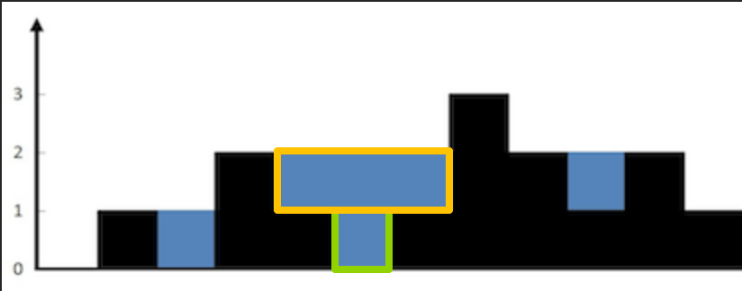

# 42. 接雨水

<!-- 元数据标签（便于AI检索和分类） -->
**标签**：`单调栈` `双指针` `栈` `困难`  
**分类**：栈、数组、双指针  
**难度**：⭐⭐⭐ 困难  
**频率**：🔥🔥🔥 高频

---

## 题目描述

给定 n 个非负整数表示每个宽度为 1 的柱子的高度图，计算按此排列的柱子，下雨之后能接多少雨水。

### 示例 1

```
输入：height = [0,1,0,2,1,0,1,3,2,1,2,1]
输出：6
解释：可以接 6 个单位的雨水（蓝色部分）。
```

### 示例 2

```
输入：height = [4,2,0,3,2,5]
输出：9
```

### 提示

- n == height.length
- 1 <= n <= 2×10^4
- 0 <= height[i] <= 10^5

---

## 📋 面试要点速查（知识卡片）

### 核心思路（两种常见解法）

**解法一：单调栈**  
维护**单调递减栈**（栈内高度从底到顶递减）。弹栈时，栈顶 `idx` 与当前 `i`、弹栈后的新栈顶形成「凹槽」：左壁 `stack[-1]`、底 `height[idx]`、右壁 `i`，该层水量 = (min(左壁, 右壁) - 底) × 宽度。

**解法二：双指针**  
每个位置能接的水 = min(左边最大高度, 右边最大高度) - 当前高度。用左右指针 + 维护 left_max/right_max，一次遍历 O(n) O(1) 完成。

**关键词**：`单调栈` `双指针` `左右最大`

### 复杂度速记
- **单调栈**：时间 O(n)，空间 O(n)
- **双指针**：时间 O(n)，空间 O(1)

### 记忆口诀（单调栈）
「单调递减栈，遇高就弹栈；弹栈算凹槽，左壁栈顶右壁 i，水高取 min 减底再乘宽。」

### 代码模板（单调栈，可直接套用）

```python
# 单调递减栈：弹栈时 [stack[-1], idx, i] 形成凹槽，底为 height[idx]
stack = []
res = 0
for i in range(len(height)):
    while stack and height[stack[-1]] < height[i]:
        idx = stack.pop()
        if not stack:
            break
        h_bottom = height[idx]
        h_left = height[stack[-1]]
        h_right = height[i]
        res += (min(h_left, h_right) - h_bottom) * (i - stack[-1] - 1)
    stack.append(i)
return res
```

---

## 解题思路



### 核心思想

**单调栈角度**：从左到右扫，维护**单调递减栈**。当 `height[i]` 大于栈顶时，栈顶作为「凹槽底部」，当前 i 为右壁，弹栈后的新栈顶为左壁，三者围成一层可接水区域，按 (min(左,右) - 底) × 宽度 累加。

**双指针角度**：位置 i 能接的水 = max(0, min(左边最大值, 右边最大值) - height[i])。用左右指针和 left_max、right_max 可在一遍扫描内 O(1) 空间完成。

**关键点：**
- **单调栈**：栈内下标对应高度递减；弹栈时必须还有左壁（栈非空），否则无法形成凹槽。
- **双指针**：哪边 max 小就先算哪边，保证当前侧的水量由该侧 max 决定。

### 算法步骤（单调栈）

1. 维护单调递减栈（存下标），从左到右遍历 `height`。
2. 当 `height[i] > height[stack[-1]]` 时：
   - 弹出栈顶 `idx`（凹槽底）。
   - 若栈空则无法形成凹槽，跳过。
   - 左壁 = `height[stack[-1]]`，右壁 = `height[i]`，底 = `height[idx]`。
   - 该层水量 += (min(左壁, 右壁) - 底) × (i - stack[-1] - 1)。
   - 重复弹栈直到栈为空或栈顶高度 ≥ height[i]。
3. 将 i 入栈。
4. 返回累加的总水量。

### 为什么选择单调栈？

- **优势**：一次遍历、逻辑清晰，与「下一个更大」类问题一致。
- **适用场景**：需要「以当前为底、左右有更高边界」的区间贡献时。
- **替代方案**：双指针/DP 空间 O(1) 或预处理左右最大值数组，更省空间；单调栈更易与 84、739 等题形成统一套路。

---

## 代码实现

### 单调栈（推荐 ⭐）

```python
from typing import List

class Solution:
    def trap(self, height: List[int]) -> int:
        """
        单调递减栈：弹栈时 [stack[-1], idx, i] 形成凹槽，底为 height[idx]，
        水高 = min(左壁, 右壁) - 底，宽 = i - stack[-1] - 1。
        时间复杂度: O(n)
        空间复杂度: O(n)
        """
        res = 0
        stack = []  # 单调递减栈，存下标
        for i in range(len(height)):
            while stack and height[stack[-1]] < height[i]:
                idx = stack.pop()
                if not stack:
                    break
                h_bottom = height[idx]
                h_left = height[stack[-1]]
                h_right = height[i]
                res += (min(h_left, h_right) - h_bottom) * (i - stack[-1] - 1)
            stack.append(i)
        return res
```

**代码要点**：
- ✅ 弹栈后若栈空则无左壁，不能算水，直接 break。
- ✅ 水量 = (min(左壁, 右壁) - 底) × 宽度；宽度 = i - stack[-1] - 1。
- ✅ 栈内高度单调递减，遇到更高才弹栈形成凹槽。

### 双指针（O(1) 空间）

```python
def trap(self, height: List[int]) -> int:
    """
    双指针：左右各维护最大高度，哪边 max 小就结算哪边，保证该侧水量由该侧 max 决定。
    时间复杂度: O(n)，空间复杂度: O(1)
    """
    if not height:
        return 0
    res = 0
    left, right = 0, len(height) - 1
    left_max = right_max = 0
    while left < right:
        if height[left] < height[right]:
            if height[left] >= left_max:
                left_max = height[left]
            else:
                res += left_max - height[left]
            left += 1
        else:
            if height[right] >= right_max:
                right_max = height[right]
            else:
                res += right_max - height[right]
            right -= 1
    return res
```

### 执行过程示例（单调栈）

以 `height = [0,1,0,2,1,0,1,3,2,1,2,1]` 为例：

- i=0,1：栈 [0]、[1]（1 比 0 大，弹 0 时栈空跳过）。
- i=2：栈 [1,2]。
- i=3：2 > 0，弹 2，左壁=1 右壁=2，水 += (1-0)*(3-1-1)=1；弹 1，栈空跳过；栈 [3]。
- 后续类似：弹栈时用 min(左,右)-底 乘宽度累加，最终 res = 6。

---

## ⚠️ 常见陷阱（面试易错点）

1. **弹栈后栈空**
   - ❌ 不判断直接算 `min(height[stack[-1]], height[i])`，栈空会越界。
   - ✅ 弹栈后 `if not stack: break`，无左壁则不累加。

2. **宽度与高度**
   - ❌ 宽度写成 `i - idx` 或 `i - idx - 1`，左边界应是 stack[-1]（不包含），宽度 = i - stack[-1] - 1。
   - ✅ 水高 = min(左壁, 右壁) - 底（保证非负）；宽度 = i - stack[-1] - 1。

3. **边界情况**
   - 空数组：返回 0。
   - 单调递减/递增：无法形成凹槽，结果为 0。

---

## 复杂度分析

### 时间复杂度
- 单调栈：每个下标最多入栈、出栈各一次，O(n)。
- 双指针：单次 while，O(n)。

### 空间复杂度
- 单调栈：O(n)。
- 双指针：O(1)。

### 复杂度对比表

| 方法           | 时间复杂度 | 空间复杂度 | 备注       |
|----------------|------------|------------|------------|
| 单调栈         | O(n)       | O(n)       | 与 84/739 同套路 |
| 双指针         | O(n)       | O(1)       | 面试常问   |
| DP 预处理左右最大 | O(n)       | O(n)       | 思路直观   |

---

## 关键点

1. **单调栈为何是「递减」？**
   - 要找「当前作为底、左边和右边都有更高的壁」：当前比栈顶高时，栈顶作为底，当前 i 为右壁，弹栈后的栈顶为左壁，形成一层水。

2. **与 84、739 的关系**
   - 84：单调**递增**栈，找左右第一个**更小**（直方图最大矩形）。
   - 739：单调**递减**栈，找右边第一个**更大**（下一个更高温度）。
   - 42：单调**递减**栈，弹栈时用「左壁、底、右壁」算一层水量（接雨水）。

---

## 💬 面试问题（模拟面试场景）

### 基础问题

1. **Q: 这道题有几种常见写法？**
   - A: 单调栈（一次遍历、栈内递减，弹栈算凹槽）；双指针（左右指针 + left_max/right_max，O(1) 空间）；或预处理左右最大值数组再按位置算水。

2. **Q: 单调栈弹栈时为什么要判栈空？**
   - A: 弹栈后栈顶是「左壁」，若栈空说明没有左壁，无法和当前 i 形成凹槽，不能累加水量。

3. **Q: 双指针为什么哪边小就移动哪边？**
   - A: 当前能接的水由 min(left_max, right_max) 决定；若左边更小就说明左边是瓶颈，先算左边并移动左指针，反之亦然，保证每侧水量由该侧 max 正确决定。

### 进阶问题

1. **Q: 相关题目？**
   - A: 84. 柱状图中最大的矩形（单调递增栈）、739. 每日温度（单调递减栈找下一个更大）、11. 盛最多水的容器（双指针，不同含义）。
