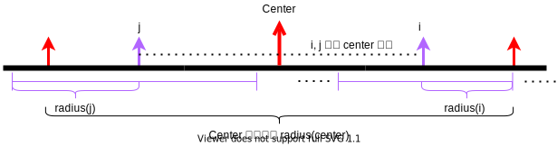

# 5. 最长回文子串

<!-- 对应力扣：https://leetcode.cn/problems/longest-palindromic-substring/ （力扣编号为 5） -->
**标签**：`字符串` `动态规划` `中心扩展` `Manacher` `中等`  
**分类**：字符串、双指针、动态规划  
**难度**：⭐⭐ 中等  
**频率**：🔥🔥🔥 高频

---

## 题目描述

给你一个字符串 `s`，找到 `s` 中**最长的回文子串**。

**回文串**：正读和反读相同的字符串，例如 `"aba"`、`"bb"`。

- 若有多个答案，返回其中**任意一个**即可。

### 示例 1

```
输入：s = "babad"
输出："bab"
解释："aba" 同样是符合题意的答案。
```

### 示例 2

```
输入：s = "cbbd"
输出："bb"
```

### 示例 3

```
输入：s = "a"
输出："a"
```

### 提示

- `1 <= s.length <= 1000`
- `s` 仅由数字和英文字母组成

### 进阶

你能用 **O(n)** 时间复杂度的算法解决本题吗？（Manacher 算法）

---

## 📋 面试要点速查（知识卡片）

### 核心思路

**一句话总结**：以**每个位置作为回文中心**（奇数长度一个中心，偶数长度两个相邻字符为中心）向两侧扩展，记录能扩到的最长回文区间。

**关键词**：`中心扩展` `奇偶中心` `双指针` `O(n²) 面试首选`

### 复杂度速记

- **时间复杂度**：O(n²)（中心扩展 / 基础 DP）— 每个中心最多扩 O(n)。
- **空间复杂度**：O(1)（中心扩展）或 O(n²)（朴素 DP 表）。

### 记忆口诀

「奇中心偶中心，左右相等继续扩；扩不动就停，记下最长段。」

### 代码模板（中心扩展）

```python
def expand(s, l, r):
    while l >= 0 and r < len(s) and s[l] == s[r]:
        l -= 1
        r += 1
    return l + 1, r - 1  # 返回 [l+1, r-1] 这段回文
```

---

## 解题思路

### 核心思想

回文串关于**中心对称**：从左、右两端同时向中间走，字符应始终相等。枚举**所有可能的中心**，向两侧扩展，即可覆盖所有子串是否为回文的判定，并顺便得到最长长度。

**关键点：**

- **奇数长度**：中心是**一个**下标 `i`，初始 `l = r = i`。
- **偶数长度**：中心是**两个**相邻相等字符之间，初始 `l = i, r = i + 1`（且 `s[i] == s[i+1]` 时才有必要扩）。
- 扩展停止条件：`l < 0` 或 `r >= n` 或 `s[l] != s[r]`。

### 算法步骤（中心扩展）

1. 初始化 `start = 0, max_len = 0`（或记录 `(start, end)`）。
2. 对每个下标 `i`：
   - 调用 `expand(i, i)` 处理**奇数**长度回文；
   - 调用 `expand(i, i + 1)` 处理**偶数**长度回文（若 `s[i] != s[i+1]`，内层会立即不满足，可省略一次调用以微优化，但非必须）。
3. 每次扩展结束后，若当前回文长度大于 `max_len`，更新 `start` 与 `max_len`。
4. 返回 `s[start : start + max_len]`。

### 为什么选择这个方法？

- **优势**：实现短、不易写错，面试中最常写；空间 O(1)。
- **适用场景**：`n ≤ 10³ ~ 10⁴` 量级、不要求线性时间时。
- **替代方案**：
  - **DP**：`dp[i][j]` 表示 `s[i..j]` 是否回文，转移清晰，但 O(n²) 空间（可滚成 O(n)）。
  - **Manacher**：O(n) 时间与 O(n) 空间，代码较长，适合进阶/追问。

---

## 代码实现

### 写法一：中心扩展（维护起点与长度，推荐 ⭐）

用 `start` + `max_len` 记录答案，最后做一次切片，避免反复保存子串。

```python
class Solution:
    def longestPalindrome(self, s: str) -> str:
        """
        中心扩展：枚举奇/偶中心，向两侧扩展。
        时间复杂度: O(n^2)
        空间复杂度: O(1)
        """
        n = len(s)
        if n < 2:
            return s

        start, max_len = 0, 0

        def expand(left: int, right: int) -> None:
            nonlocal start, max_len
            while left >= 0 and right < n and s[left] == s[right]:
                left -= 1
                right += 1
            # 循环结束时 [left+1, right-1] 为回文
            length = right - left - 1
            if length > max_len:
                max_len = length
                start = left + 1

        for i in range(n):
            expand(i, i)       # 奇数长度，中心一个字符
            expand(i, i + 1)   # 偶数长度，中心两个字符

        return s[start : start + max_len]
```

**写法一要点**：

- ✅ `expand` 结束后，合法回文为 `[left+1, right-1]`，长度为 `right - left - 1`。
- ✅ 对每个 `i` 同时尝试奇、偶中心，否则会漏掉 `"aa"` 这类偶回文。
- ✅ 边界：`n < 2` 时整个串即答案。

### 写法二：中心扩展（返回回文子串）

扩展函数直接 `return s[l + 1 : r]`，语义即「向两侧能扩多远」；主循环用 **`range(len(s))` 枚举每一个奇中心**，与「每个下标都可能是回文中心」的叙述一致。偶扩展前用 **`i + 1 < len(s)`** 避免越界，并用 `s[i] == s[i + 1]` 跳过不可能产生偶回文的相邻对（小优化）。

```python
class Solution:
    def longestPalindrome(self, s: str) -> str:
        if len(s) < 2:
            return s

        def expand(l: int, r: int) -> str:
            while l >= 0 and r < len(s) and s[l] == s[r]:
                l -= 1
                r += 1
            return s[l + 1 : r]

        res = ""
        for i in range(len(s)):
            odd = expand(i, i) # 奇数
            if len(odd) > len(res):
                res = odd
            if i + 1 < len(s) and s[i] == s[i + 1]:
                even = expand(i, i + 1) # 偶数
                if len(even) > len(res):
                    res = even
        return res
```

**写法二要点**：

- ✅ 循环退出后，最后一次满足条件的区间为 `[l+1, r-1]`，切片 **`s[l+1:r]`**（右端点开区间）正好对应。
- ✅ **`range(len(s))`**：完整枚举奇中心；仅用 `range(len(s) - 1)` 时虽在「求最长长度」上仍成立（最后一个奇中心只能产生长度 1），但叙述上不如写满直观。
- ✅ 与写法一时间、空间复杂度相同；写法一侧重少做字符串比较、写法二更贴「得到回文子串」的口述流程。

### 动态规划（区间布尔 + 记最长，推荐 DP 写法 ⭐）

**状态**：`dp[i][j]` 表示 **`s[i..j]` 这一段子串是否为回文**（布尔值），而不是「区间内的最长回文长度」。  
**转移**：`s[i] == s[j]` 时，若长度 ≤ 2（即 `j - i < 3`）则直接为回文；否则需 **`dp[i+1][j-1]`** 也为真。两端不等则 `dp[i][j] = False`（子串必须连续，不能像子序列那样 `max` 左右子区间）。

**枚举顺序**：`j` 从 `0` 到 `n-1`，`i` 从 `0` 到 `j`，保证算 `dp[i][j]` 时 `dp[i+1][j-1]` 已求出。

**易混警示**：`s[i] != s[j]` 时用 `max(dp[i+1][j], dp[i][j-1])` 那一套是 **[最长回文子序列](https://leetcode.cn/problems/longest-palindromic-subsequence/)**（子序列可跳字符），**不能**用于本题最长回文**子串**。

```python
class Solution:
    def longestPalindrome(self, s: str) -> str:
        """
        dp[i][j] 表示 s[i:j+1] 是否为回文。
        转移：s[i]==s[j] 且 (j-i<3 或 dp[i+1][j-1])。
        时间复杂度: O(n^2)
        空间复杂度: O(n^2)
        """
        n = len(s)
        if n < 2:
            return s

        dp = [[False] * n for _ in range(n)]
        start, max_len = 0, 1

        for j in range(n):
            for i in range(j + 1):
                if s[i] == s[j]:
                    if j - i < 3:
                        dp[i][j] = True
                    else:
                        dp[i][j] = dp[i + 1][j - 1]
                if dp[i][j] and j - i + 1 > max_len:
                    start, max_len = i, j - i + 1

        return s[start : start + max_len]
```

**说明**：本题若只选一个 DP，保留上述即可；空间可滚成一维（按 `j` 递增、内层 `i` 从大到小），仍为 O(n²) 时间、O(n) 空间，面试以二维表更易讲清。

### Manacher（O(n)）

在相邻字符间插入 `#`（并在两端加哨兵 `@`、`$`），将「奇 / 偶长度」统一成奇长度处理；用当前已知最右回文区间 `[center - radius, center + radius]` 的对称性，给未算过的位置一个**半径下界**，再向两侧扩展。下图表示当前 `center`、其对称点 `i` 与 `j`，以及 `radius(i)` 与「center 作用范围」的关系（与代码里 `center` / `right` 对应）。



```python
class Solution:
    def longestPalindrome(self, s: str) -> str:
        if not s:
            return ""

        def manacher(s: str) -> str:
            # 插入 # 统一奇偶；@、$ 边界防止 while 越界
            ns = "@#" + "#".join(s) + "#$"
            # radius[i]：以 ns[i] 为中心，向一侧能扩几步（while 中每次成功 +1）
            radius = [0] * len(ns)
            center = right = 0
            best_center = 0
            best_r = 0
            for i in range(1, len(ns) - 1):
                if right > i:
                    radius[i] = min(right - i, radius[2 * center - i])
                while ns[i + radius[i] + 1] == ns[i - radius[i] - 1]:
                    radius[i] += 1
                if i + radius[i] > right:
                    center, right = i, i + radius[i]
                if radius[i] > best_r:
                    best_r = radius[i]
                    best_center = i
            # 变换串上回文闭区间为 [best_center - best_r, best_center + best_r]，右端点开区间故 +1
            return "".join(ns[best_center - best_r : best_center + best_r + 1].split("#"))

        return manacher(s)
```

**要点**：

- ✅ 时间 O(n)、空间 O(n)；面试若不要求线性，可只讲思路，代码易写长、易错。
- ✅ 取出原串字符用 `split('#')` 再 `join`；切片须包含右端点 **`best_center + best_r`**，即 `ns[L:R+1]` 写法。
- ✅ 与上图一致：`right > i` 时 `radius[i]` 可先取对称点 `2*center - i` 的结果与「到右边界距离」的较小值。

### 版本对比分析

| 对比项 | 中心扩展（写法一/二） | 朴素 DP | Manacher |
|--------|----------------------|---------|----------|
| **时间复杂度** | O(n²) | O(n²) | O(n) |
| **空间复杂度** | O(1) | O(n²) | O(n) |
| **代码复杂度** | 短、直观 | 需注意区间枚举顺序 | 较长，边界与半径语义需写对 |
| **适用场景** | 面试首选 | 与区间 DP / 子序列体系衔接 | 极长串、或追问线性解法 |

### 执行过程示例

以 `s = "babad"` 为例，枚举到中心下标 `1`（字符 `'a'`），奇数扩展：

- 初始 `l=r=1`，`"a"` 是回文；
- 扩到 `l=0,r=2`，`s[0]=='b'`, `s[2]=='b'`，`"bab"` 是回文；
- 再扩 `l=-1,r=3` 停止。得到长度 3，子串 `"bab"`。

---

## ⚠️ 常见陷阱（面试易错点）

1. **只枚举奇数中心**
   - ❌ **错误做法**：只对每个 `i` 做 `expand(i, i)`。
   - ✅ **正确做法**：对每个 `i` 同时做 `expand(i, i)` 与 `expand(i, i+1)`。
   - 💡 **原因分析**：偶数长度回文没有单独「中间字符」，必须用两个相等字符作为初始中心。

2. **扩展后区间写错**
   - ❌ **错误做法**：认为结束时 `l,r` 仍在回文边界上。
   - ✅ **正确做法**：有效区间为 `[l+1, r-1]`，长度为 `r - l - 1`。
   - 💡 **原因分析**：`while` 因不相等退出时，`l,r` 已多走一步。

3. **边界情况**
   - **长度为 1**：应直接返回 `s`。
   - **全相同**：如 `"aaa"`，中心扩展会多次得到长度 3，取最后一次更新的 `start` 即可覆盖。

---

## 优化点说明（可选）

1. **Manacher（线性时间）**
   - **效果**：时间 O(n)，适合极长串或明确追问「能否 O(n)」。
   - **实现**：插入分隔符统一奇偶，用辅助数组记录「以各中心为对称轴的最长半径」，利用对称性跳过已匹配部分；完整代码与示意图见上文 **「Manacher（O(n)）」** 小节及 `image/Manacher.svg`。

---

## 复杂度分析

### 时间复杂度

- **中心扩展 / DP**：最坏 O(n²)；最好情况（每次扩展很快失败）仍可能接近 O(n²) 量级（取决于实现与数据）。
- **Manacher**：O(n)。

### 空间复杂度

- **中心扩展**：O(1) 额外空间。
- **朴素 DP**：O(n²)；滚动数组可降至 O(n)。

### 复杂度对比表

| 方法 | 时间复杂度 | 空间复杂度 | 备注 |
|------|------------|------------|------|
| 中心扩展 | O(n²) | O(1) | 面试推荐 |
| DP | O(n²) | O(n²) 或可优化 | 与区间 DP 体系一致 |
| Manacher | O(n) | O(n) | 进阶 |

---

## 关键点

1. **为什么需要两种中心？**
   - 奇回文对称轴是一个字符；偶回文对称轴在两个相等字符之间，无法用单一 `i` 表示，故需 `expand(i, i+1)`。

2. **与「最长回文子序列」有何区别？**
   - **子串**必须连续，中心扩展 / 区间 DP 直接对连续区间判定。
   - **子序列**可以不连续，通常为 LCS(s, reverse(s)) 或 DP，模型不同。

3. **面试要点**
   - 能口述奇偶中心；能写出 `expand` 的边界与长度公式；能对比 O(n²) 与 Manacher 的取舍。

---

## 💬 面试问题（模拟面试场景）

### 基础问题

1. **Q: 这道题的核心思路是什么？**  
   - A: 枚举每个可能的回文中心，用双指针向两侧扩展，取最长合法区间。

2. **Q: 为什么不是 O(n³) 枚举所有子串再判断？**  
   - A: 可以，但判回文若每次 O(n)，总 O(n³)。中心扩展把「枚举中心 + 扩展」合在一起，总体 O(n²)。

3. **Q: 时间复杂度如何推导？**  
   - A: 共 O(n) 个中心，每个中心扩展最多 O(n) 步，故 O(n²)。

### 进阶问题

1. **Q: 如何实现 O(n)？**  
   - A: Manacher：通过预处理与半径数组 + 对称性将均摊扩展降为线性。

2. **Q: 有哪些变种？**  
   - A: 最长回文子序列、分割成最少回文段、回文对、统计回文子串个数等。

---

## 其他方法（可选）

### 暴力（不推荐）

枚举所有 `O(n²)` 个子串，对每个判断回文 `O(n)`，总 **O(n³)**。

```python
def longestPalindrome_bruteforce(s: str) -> str:
    n = len(s)
    def is_pal(t: str) -> bool:
        return t == t[::-1]
    best = ""
    for i in range(n):
        for j in range(i, n):
            if is_pal(s[i : j + 1]) and j - i + 1 > len(best):
                best = s[i : j + 1]
    return best
```

- **时间复杂度**：O(n³)  
- **空间复杂度**：O(1)（忽略切片）  
- **为什么不推荐**：数据稍大即超时。

---

## 🔗 相似题目对比

| 题目 | 相似点 | 不同点 | 难度 |
|------|--------|--------|------|
| [最长回文子序列](https://leetcode.cn/problems/longest-palindromic-subsequence/) | 都涉及回文 | 子序列可不连续，DP 模型不同 | 中等 |
| [回文子串](https://leetcode.cn/problems/palindromic-substrings/) | 中心扩展同样适用 | 求个数而非最长串 | 中等 |
| [分割回文串](https://leetcode.cn/problems/palindrome-partitioning/) | 需判断子串是否回文 | DFS / 回溯 + 记忆化 | 中等 |

**对比说明**：

- **最长回文子序列**：区间 DP 或 LCS，与「连续子串」约束不同。  
- **回文子串个数**：扩展时计数即可，或 DP 统计 `True` 个数。

---

## 相关题目

### 同类型题目

- [647. 回文子串](https://leetcode.cn/problems/palindromic-substrings/) — 统计个数，中心扩展累加。  
- [5. 最长回文子串](https://leetcode.cn/problems/longest-palindromic-substring/) — 与本题相同（力扣官方编号为 5）。

### 进阶题目

- [516. 最长回文子序列](https://leetcode.cn/problems/longest-palindromic-subsequence/) — 子序列版。  
- [132. 分割回文串 II](https://leetcode.cn/problems/palindrome-partitioning-ii/) — 最少分割段数。

### 变种题目

- [131. 分割回文串](https://leetcode.cn/problems/palindrome-partitioning/) — 输出所有分割方案。

---

## 总结

这是一道经典的**字符串 + 回文**题目，核心是：

1. **奇偶中心**：回文长度为奇或偶时，扩展起点不同，需各处理一次。  
2. **双指针扩展**：相等则继续，否则停止；注意退出后区间为 `[l+1, r-1]`。  
3. **复杂度**：面试写中心扩展 O(n²) 时间、O(1) 空间通常足够。  
4. **进阶**：Manacher 达到 O(n)，作为加分项掌握即可。

**关键技巧**：

- ✅ 先写 `expand(l, r)`，再在外层套奇、偶中心枚举；写法一用 `start/max_len`，写法二让扩展函数返回 `s[l+1:r]` 并比较 `len`。  
- ✅ 奇中心用 `range(len(s))` 枚举完整；偶中心注意 `i + 1 < len(s)` 再访问 `s[i+1]`。  
- ✅ 单独处理 `n < 2`。  
- ✅ 与子序列、子串类题目区分模型。

**面试建议**：

- 🎯 优先流畅写出中心扩展，再补充 DP 或 Manacher 思路。  
- 🎯 主动说明奇偶中心原因，减少追问。  
- 🎯 若时间紧，可略讲 Manacher「线性」结论而不手写全码。
