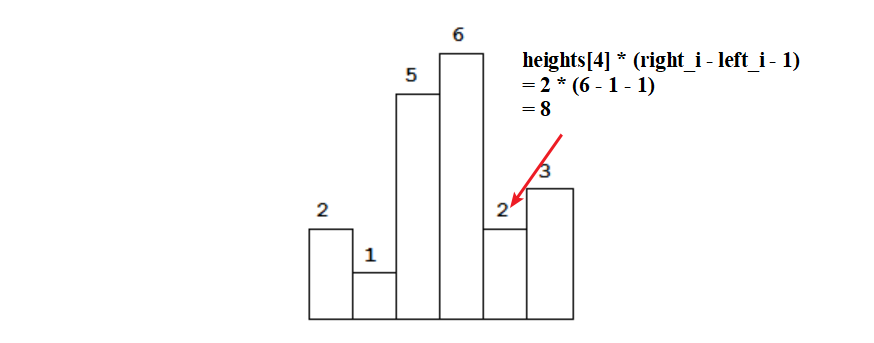

# 84. 柱状图中最大的矩形

<!-- 元数据标签（便于AI检索和分类） -->
**标签**：`单调栈` `栈` `中等`  
**分类**：栈、数组  
**难度**：⭐⭐ 中等  
**频率**：🔥🔥 中频

---

## 题目描述

给定 n 个非负整数，用来表示柱状图中各个柱子的高度。每个柱子彼此相邻，且宽度为 1。  
求在该柱状图中，能够勾勒出来的矩形的最大面积。

### 示例 1

```
输入：heights = [2,1,5,6,2,3]
输出：10
解释：最大的矩形为高度 5、宽度 2 的矩形（下标 2、3），面积为 10。
```

### 示例 2

```
输入：heights = [2,4]
输出：4
解释：最大矩形为高度 2 宽 2 或高度 4 宽 1，面积均为 4。
```

### 提示

- 1 <= heights.length <= 10^5
- 0 <= heights[i] <= 10^4

---

## 📋 面试要点速查（知识卡片）

### 核心思路
**一句话总结**：对每个位置 i，以 `heights[i]` 为矩形高度，向左找第一个小于它的位置 `left_i`，向右找第一个小于它的位置 `right_i`，则该高度下最大面积为 `heights[i] * (right_i - left_i - 1)`；用**单调递增栈**一次遍历得到每个 i 的左右边界。

**关键词**：`单调栈` `左右第一个更小` `以 i 为高`

### 复杂度速记
- **时间复杂度**：O(n) - 每个下标最多入栈、出栈各一次
- **空间复杂度**：O(n) - 单调栈

### 记忆口诀
「单调递增栈，遇小就弹栈；弹栈时算宽，右边界当前 i，左边界新栈顶。」

### 代码模板（可直接套用）

```python
# 单调栈：维护栈内下标对应的高度单调递增
# 首尾加 0 作哨兵，保证所有位置都能被弹出并计算
heights = [0] + heights + [0]
stack = []
res = 0
for i in range(len(heights)):
    while stack and heights[stack[-1]] > heights[i]:  # 当前是栈顶的「右边第一个更小」
        h_idx = stack.pop()
        # 左边界为当前栈顶（第一个更小），右边界为 i；宽度 = (i-1) - (栈顶+1) + 1 = i - 栈顶 - 1
        width = i - stack[-1] - 1
        res = max(res, heights[h_idx] * width)
    stack.append(i)
return res
```

---

## 解题思路



### 核心思想

以**每个位置 i 为矩形的高度**，则该矩形能向左右延伸的边界为：**向左第一个小于 `heights[i]` 的位置 `left_i`** 和**向右第一个小于 `heights[i]` 的位置 `right_i`**（均不包含），因此宽度为 `right_i - left_i - 1`，面积为 `heights[i] * (right_i - left_i - 1)`。枚举每个 i 并取最大值即可。

**关键点：**
- 对每个 i 需要快速得到「左边第一个更小」和「右边第一个更小」的位置。
- **单调递增栈**：栈内存下标，从栈底到栈顶对应的 `heights` 单调递增。当遇到 `heights[i]` 比栈顶小时，栈顶就找到了「右边第一个更小」的位置就是 i；pop 出栈顶后，新的栈顶即为「左边第一个更小」的位置。
- 在数组首尾各加一个高度 0（哨兵），这样所有柱子都会在某个时刻被弹出并参与面积计算，无需单独处理边界。

### 算法步骤

1. 在 `heights` 首尾各加 0，便于用栈统一处理边界。
2. 维护一个**单调递增栈**（存下标），从左到右遍历 `heights`。
3. 当 `heights[i] < heights[stack[-1]]` 时：
   - 栈顶下标 `tmp` 的「右边第一个更小」为 i，「左边第一个更小」为弹出后的新栈顶（若存在）。
   - 以 `heights[tmp]` 为高的矩形宽度 = `i - stack[-1] - 1`，面积 = `heights[tmp] * (i - stack[-1] - 1)`，用其更新答案。
   - 重复弹出直到栈为空或栈顶对应高度 ≤ `heights[i]`。
4. 将 i 入栈。
5. 遍历结束后返回记录的最大面积。

### 为什么选择这个方法？

- **优势**：一次遍历 O(n) 得到每个位置的左右边界，避免对每个 i 暴力往左右找。
- **适用场景**：「左侧/右侧第一个更大/更小」类问题、直方图/矩形面积等。
- **替代方案**：可先两次遍历用单调栈分别预处理 `left_i`、`right_i` 数组，再枚举 i 算面积，逻辑更直观但多一轮遍历和数组。

---

## 代码实现

### 单调栈（推荐 ⭐）

```python
from typing import List

class Solution:
    def largestRectangleArea(self, heights: List[int]) -> int:
        """
        单调递增栈：以 i 为高时，左边界为栈内前一个更小（pop 后的栈顶），右边界为当前 i。
        首尾加 0 作哨兵，保证所有下标都能被弹出并算一次面积。
        时间复杂度: O(n)
        空间复杂度: O(n)
        """
        stack = []
        heights = [0] + heights + [0]
        res = 0
        for i in range(len(heights)):
            while stack and heights[stack[-1]] > heights[i]:
                tmp = stack.pop()
                # 以 heights[tmp] 为高；右边界为 i（不包含），左边界为 stack[-1]（不包含）
                # 宽度 = (i - 1) - (stack[-1] + 1) + 1 = i - stack[-1] - 1
                res = max(res, (i - stack[-1] - 1) * heights[tmp])
            stack.append(i)
        return res
```

**代码要点**：
- ✅ 哨兵 `[0] + heights + [0]`：避免空栈和未弹出柱子的边界讨论。
- ✅ 栈内下标对应高度单调递增，遇到更小的就弹栈并算面积。
- ✅ 宽度为 `i - stack[-1] - 1`（pop 后栈顶为左边界前一个位置）。

### 执行过程示例

以 `heights = [2,1,5,6,2,3]` 为例（加哨兵后为 `[0,2,1,5,6,2,3,0]`）：

- i=0：栈 [0]。
- i=1：2>1，弹 0，宽 = 1-(-1)-1 = 1（栈空时左边界视为 -1 前一个，即 0），面积 0；栈 [1]。
- i=2,3：栈 [1,2]、[1,2,3]。
- i=4：6>2，弹 3，宽 = 4-2-1 = 1，面积 6；弹 2，宽 = 4-1-1 = 2，面积 10 → res=10；栈 [1,4]。
- i=5：栈 [1,4,5]。
- i=6：遇到 0，依次弹 5、4、1 并算面积，其中 2*4=8、5*2=10 等，res 保持 10。
- 返回 10。

---

## ⚠️ 常见陷阱（面试易错点）

1. **宽度计算写错**
   - ❌ 写成 `(i - tmp)` 或 `(i - stack[-1])`，忽略左边界不包含，导致多算一格。
   - ✅ 右边界为 i（不包含），左边界为 pop 后的 `stack[-1]`（不包含），宽度 = `i - stack[-1] - 1`。
   - 💡 区间 [stack[-1]+1, i-1] 长度为 (i-1) - (stack[-1]+1) + 1 = i - stack[-1] - 1。

2. **栈空时栈顶取值**
   - ❌ pop 后直接 `stack[-1]` 未考虑栈空（首哨兵 0 会在 i=1 时把 0 弹出，此时栈可能为空）。
   - ✅ 首部加了 0 后，第一次 pop 时栈内至少还有下标 0（哨兵），不会空；若仍担心，可在取栈顶前判断或保证哨兵存在。
   - 💡 严格写法可先 `heights = [0] + heights + [0]`，这样栈永不会在「需要算宽度」时为空（左边界用 0 位置）。

3. **边界情况**
   - 空数组：加哨兵后长度为 2，不会进入 while，返回 0。
   - 单元素：如 [2]，加哨兵后 [0,2,0]，会弹下标 1，宽 = 2-0-1 = 1，面积 2，正确。

---

## 复杂度分析

### 时间复杂度
- 每个下标最多入栈一次、出栈一次，总操作 O(n)。

### 空间复杂度
- 单调栈最多存 O(n) 个下标。

### 复杂度对比表

| 方法           | 时间复杂度 | 空间复杂度 | 备注     |
|----------------|------------|------------|----------|
| 单调栈（推荐） | O(n)       | O(n)       | 一次遍历 |
| 预处理左右数组 | O(n)       | O(n)       | 两遍单调栈 |

---

## 关键点

1. **为什么是单调「递增」栈？**
   - 我们要找的是「第一个更小」：当当前值比栈顶小，栈顶才找到右边界并弹栈；栈内保持递增，才能保证弹栈时新栈顶是左边界（第一个更小）。

2. **哨兵 0 的作用**
   - 头部 0：保证遍历到第一个真实柱子时栈非空，且可把「左边界」统一为哨兵位置。
   - 尾部 0：保证遍历结束时，栈中剩余下标都会因「遇到更小的 0」而被弹出并参与计算。

---

## 💬 面试问题（模拟面试场景）

### 基础问题

1. **Q: 这道题的核心思路是什么？**
   - A: 以每个位置 i 为矩形高度，向左找第一个更小的位置 left_i，向右找第一个更小的位置 right_i，面积即为 heights[i] * (right_i - left_i - 1)。用单调递增栈一次遍历得到每个 i 的左右边界。

2. **Q: 为什么用单调栈？**
   - A: 单调栈可以在 O(n) 内为每个位置找到「左侧/右侧第一个更小」：栈内保持高度递增，遇到更小的就弹栈，弹栈时栈顶的右边界就是当前 i，左边界就是新的栈顶。

3. **Q: 首尾为什么要加 0？**
   - A: 作为哨兵。头部 0 保证栈不会在需要算宽度时为空（左边界用 0）；尾部 0 保证最后栈里所有下标都会被弹出并算一次面积，不用再单独处理。

### 进阶问题

1. **Q: 若改成「第一个更大」呢？**
   - A: 改为维护单调**递减**栈，逻辑对称：遇到更大的就弹栈，弹栈时当前 i 为栈顶的「右边第一个更大」，新栈顶为「左边第一个更大」。

2. **Q: 相关题目？**
   - A: 42. 接雨水（单调栈或双指针）、739. 每日温度（找右侧第一个更大）、496/503 下一个更大元素等。
