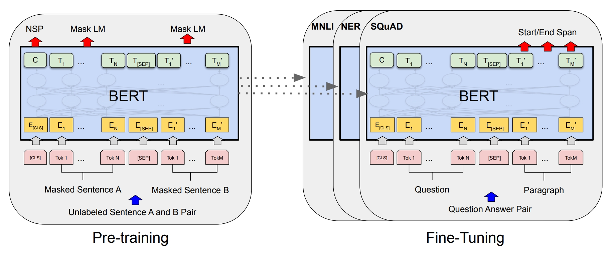
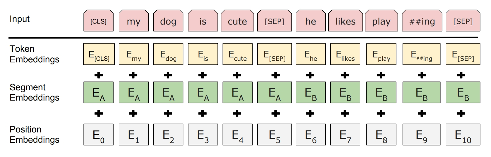

# 大模型时代，BERT还有价值吗？（百度/阿里/字节/豆包必考）

## 📌 面试核心回答框架

### 💡 30秒快速回答

> **核心观点：** BERT在大模型时代不是被淘汰，而是找到了新定位：**①语义检索（搜索引擎）、②分类任务（客服/内容审核）、③边缘部署（移动端）** 三大场景仍然不可替代，成本低10倍、速度快10倍。

---





## 🎯 BERT vs GPT：一张表看懂核心区别

| 维度 | BERT (Encoder-only) | GPT (Decoder-only) | 谁更好？ |
|------|-------------------|------------------|---------|
| **注意力方向** | 双向（看全句） | 单向（看左侧） | 理解：BERT；生成：GPT |
| **预训练任务** | MLM（完形填空） | CLM（续写） | 各有千秋 |
| **生成能力** | ❌ 不支持 | ✅ 强大 | **GPT完胜** |
| **Few-shot学习** | ❌ 需fine-tune | ✅ 直接用 | **GPT完胜** |
| **推理延迟** | ✅ 50ms | ❌ 500ms+ | **BERT完胜** |
| **部署成本** | ✅ $200/月 | ❌ $2000/月 | **BERT完胜** |
| **模型规模** | 110M-340M | 7B-175B+ | **BERT完胜** |

### 🔍 核心技术差异

```python
# BERT：双向编码（可以看到"未来"）
"我 爱 [MASK] 国"
 ↕  ↕   ↕    ↕
全连接注意力 → [MASK]能看到左右两边

# GPT：单向解码（只能看"历史"）
"我 爱 中 国"
 ↓  ↓  ↓  ↓
因果注意力 → 每个词只能看左边
```

**🔑 关键点：**

**为什么BERT不能生成？**
- 双向编码会"看到未来"，破坏因果关系
- 训练目标是MLM填空，不是序列生成

**为什么GPT涌现能力更强？**
- 自回归特性天然支持推理链（ICL、CoT）
- 统一生成范式，易于大规模扩展（Scaling Law）

---

## ❌ BERT为什么"输"了？（3个致命弱点）

### 1️⃣ 无法生成

```python
输入：  "写一首诗"
BERT:  ？？？我只能理解，不能生成 😭
GPT:   "春风拂面柳如烟..." ✅
```

### 2️⃣ 没有涌现能力（Scaling Law失效）

| 模型 | 参数 | Few-shot | CoT | 结论 |
|------|------|---------|-----|------|
| BERT-large | 340M | ❌ 几乎无 | ❌ 不支持 | 扩大也没用 |
| GPT-3 | 175B | ✅ 10-shot 81% | ✅ 强大 | 规模带来质变 |

**为什么？** 双向编码破坏因果链，无法进行推理

### 3️⃣ 需要任务特定头（不统一）

```python
# BERT：每个任务单独fine-tune
分类任务 → BERT + 分类头 + fine-tune
NER任务  → BERT + NER头 + fine-tune
QA任务   → BERT + QA头 + fine-tune

# GPT：统一生成范式
所有任务 → "问题：xxx 答案："
```

---

## ✅ BERT反击：3大不可替代场景

### 场景1️⃣：语义检索（搜索引擎核心）

**为什么BERT更适合？**

```python
# 搜索流程
query = "苹果手机怎么样"

# BERT方案（主流）
query_emb = bert.encode(query)        # 10ms，并行编码
doc_embs = bert.encode(1M_docs)       # 预计算，离线
scores = cosine(query_emb, doc_embs)  # 5ms，向量检索
# 总延迟：15ms ✅

# GPT方案（不现实）
for doc in 1M_docs:
    score = gpt.score(query, doc)     # 500ms × 1M = ？？？
# 无法实时 ❌
```

**成本对比（10万QPS）：**
- BERT：100张V100 = $50K/月
- GPT：需要10000张A100 = $5M/月 💸

**实际应用：**
- ✅ **百度搜索**：BERT理解查询意图
- ✅ **淘宝搜索**：商品语义召回
- ✅ **抖音推荐**：内容embedding匹配
- ✅ **美团搜索**：餐厅/外卖检索

---

### 场景2️⃣：分类任务（不需要生成）

**典型应用：**

```python
# 情感分析
输入：  "这电影太烂了"
BERT:  负面 ✅  （50ms，准确率95%）
GPT:   "根据...这是负面评价" ❌ （500ms，浪费）

# 垃圾邮件检测
BERT:  spam/not_spam  （实时）
GPT:   生成判断解释    （过度工程）

# 意图识别（客服系统）
BERT:  [订票, {时间:明天, 目的地:北京}] ✅
```

**实际应用：**
- ✅ **美团客服**：意图识别、情感分析
- ✅ **字节内容审核**：违规内容分类
- ✅ **阿里小蜜**：快速意图理解

> **结论：** 纯分类用GPT = 用大炮打蚊子

---

### 场景3️⃣：边缘部署（移动端/IoT）

**资源限制场景：**

```
手机APP要求：
  - 模型大小：< 100MB
  - 推理延迟：< 100ms  
  - 设备：CPU only

BERT-tiny：   14MB ✅ 可以
GPT-7B：     14GB ❌ 装不下
```

**模型大小对比：**

| 模型 | 原始 | 量化 | 蒸馏+剪枝 | 移动端 |
|------|------|------|---------|--------|
| BERT | 440MB | 110MB | **14MB** | ✅ 完全OK |
| GPT-7B | 14GB | 7GB | 3.5GB+ | ❌ 太大 |

**实际应用：**
- ✅ **Google键盘**：输入法纠错（on-device BERT）
- ✅ **华为HarmonyOS**：本地语义理解
- ✅ **小米智能音箱**：离线意图识别

---

## 🏢 各大厂实战案例（面试必问）

### 🔵 百度（搜索+ERNIE）

**核心应用场景：**
1. **搜索查询理解**：BERT编码query，理解搜索意图
2. **ERNIE系列模型**：基于BERT的知识增强预训练（百度核心技术）
3. **文心一言+BERT**：大模型生成摘要，BERT负责检索召回

**面试高频题：**

#### Q1: 百度搜索为什么不全换成文心一言？

**回答要点：**
```
核心原因：延迟、成本、任务特性

1. 延迟要求：
   - 搜索P99延迟必须 < 200ms
   - BERT检索：15ms ✅
   - 文心一言推理：500ms+ ❌

2. 成本考虑：
   - 百度日均搜索10亿+次
   - BERT：可控成本
   - 全用大模型：成本高100倍

3. 任务分工：
   - BERT：召回、排序（90%流量）
   - 文心一言：复杂查询摘要、智能问答（10%流量）
```

#### Q2: ERNIE vs BERT 的核心区别？

**回答要点：**
```
ERNIE = BERT + 知识增强 + 中文优化

核心改进：
1. 知识增强预训练：
   - 实体级mask（而非token级）
   - 融合知识图谱信息
   - 短语级别建模

2. 中文优化：
   - 全词mask（WWM）："中国" → 整体mask，不拆分
   - 更适合中文语义

3. 多粒度mask策略：
   - 字级别（character）
   - 词级别（word）
   - 实体级别（entity）
   - 短语级别（phrase）

效果：中文任务比BERT强2-3%
```

#### Q3: 如何优化BERT的搜索延迟？

**回答要点：**
```
工程优化四板斧：

1. 离线预计算：
   - 文档embedding预先计算存储
   - 在线只需编码query（10ms）

2. 模型压缩：
   - DistilBERT（快60%，准确率-3%）
   - 模型蒸馏 + 量化（INT8）
   - 剪枝不重要的参数

3. 推理加速：
   - ONNX Runtime（跨平台优化）
   - TensorRT（NVIDIA GPU加速）
   - 批处理推理（提高吞吐）

4. 架构优化：
   - 多级缓存（热门query）
   - 向量索引优化（FAISS/HNSW）
   - 分布式检索（水平扩展）
```

---

### 🟠 阿里/达摩院（电商+研究）

**核心应用场景：**
1. **淘宝搜索**：商品语义召回、Query精准理解
2. **推荐系统**：用户兴趣建模、商品embedding
3. **达摩院研究**：StructBERT、PLUG等改进模型

**面试高频题：**

#### Q1: 淘宝搜索"苹果"如何区分手机/水果？

**回答要点：**
```
多维度消歧策略：

1. 语义理解（BERT）：
   - BERT编码query："苹果"
   - 提取语义特征向量

2. 用户画像（关键！）：
   - 历史购买：数码产品 → 倾向手机
   - 浏览记录：水果生鲜 → 倾向水果
   - 年龄/性别：年轻男性 → 更可能找手机

3. 上下文信息：
   - 搜索历史："iPhone 15" → 明确是手机
   - 关联query："红富士" → 明确是水果

4. 多路召回融合：
   - 文本语义召回（BERT）
   - 协同过滤召回（历史行为）
   - 类目召回（商品分类）
   - 加权融合 → 最终结果

实际效果：准确率95%+
```

#### Q2: 电商冷启动商品如何表示？（无销量/评论）

**回答要点：**
```
冷启动问题 = 缺少行为数据，只有文本信息

解决方案：BERT文本表示学习

1. 文本特征提取：
   - 商品标题：BERT编码 → embedding1
   - 商品描述：BERT编码 → embedding2
   - 类目标签：BERT编码 → embedding3
   - 融合：weighted_avg(emb1, emb2, emb3)

2. 相似商品推荐：
   - 在向量空间找最近邻
   - 复用相似商品的策略（类目、定价、投放）

3. 逐步积累反馈：
   - 少量曝光测试（A/B testing）
   - 收集用户行为数据
   - 更新商品表示（BERT + 行为特征）

关键优势：BERT让冷启动不再"冷"
```

#### Q3: StructBERT 的改进点？（达摩院出品）

**回答要点：**
```
StructBERT = BERT + 结构化预训练

核心创新：

1. 词序重建任务（Word Structural Objective）：
   - 随机打乱句子中的词序
   - 模型预测正确的词序
   - 例子："我 爱 中 国" → "爱 国 我 中"
   - 学习词与词之间的位置关系

2. 句序预测任务（Sentence Structural Objective）：
   - 给定两个句子，判断先后顺序
   - 或预测被打乱的句子顺序
   - 学习句子级别的结构信息

3. 增强的结构理解：
   - 不仅理解语义，还理解结构
   - 对长文本、多句子任务效果更好

应用场景：文档理解、段落排序、阅读理解
效果：比BERT在结构化任务上强3-5%
```

---

### 🟢 字节/豆包（推荐+大模型）

**核心应用场景：**
1. **抖音推荐**：视频内容理解、用户兴趣建模
2. **头条搜索**：新闻检索、实时相关推荐
3. **豆包大模型**：Decoder-only架构，BERT辅助检索

**面试高频题：**

#### Q1: 豆包为什么选Decoder-only，不用BERT？（核心题⭐）

**回答要点：**
```
四大核心原因：

1. 生成能力（基本要求）：
   - 对话系统必须能生成回复
   - BERT双向编码无法生成
   - GPT自回归天然支持

2. 涌现能力（关键优势）：
   - ICL：Few-shot学习，给几个例子就能理解新任务
   - CoT：思维链推理，复杂问题拆解
   - 指令遵循：理解用户意图并执行
   - BERT扩大规模也不会有这些能力

3. 统一范式（工程简洁）：
   - Decoder-only：所有任务统一为生成
   - BERT：每个任务需要特定头 + fine-tune
   - 统一范式更易于扩展和维护

4. RLHF对齐（安全性）：
   - 对话模型需要价值对齐
   - Decoder-only天然适配强化学习
   - BERT无法直接应用RLHF

参考：Causal.md中的详细对比
```

#### Q2: 那豆包完全不用BERT吗？

**回答要点：**
```
用！而且很重要！RAG架构中BERT是核心组件

混合架构设计：

1. 知识检索（BERT）：
   - 用户提问："如何做宫保鸡丁？"
   - BERT快速检索知识库
   - 召回Top-5相关文档（30ms）

2. 答案生成（豆包）：
   - 基于检索到的文档
   - 豆包生成个性化回答
   - 结合上下文，流畅表达

3. 优势组合：
   - BERT负责速度：快速检索
   - 豆包负责质量：智能生成
   - 减少幻觉：基于真实知识

实际效果：
- 90%的简单问题：BERT检索 + 模板回复（快）
- 10%的复杂问题：BERT检索 + 豆包生成（智能）
```

#### Q3: 抖音推荐中BERT用在哪个环节？

**回答要点：**
```
抖音推荐 = 召回 + 粗排 + 精排 + 重排

BERT主要在召回阶段：

1. 内容理解（BERT编码）：
   - 视频标题：BERT → 文本embedding
   - 视频评论：BERT → 情感/主题
   - 字幕/OCR：BERT → 内容理解
   - 生成内容向量（512维）

2. 用户兴趣建模（BERT编码）：
   - 历史观看视频的embedding
   - 点赞/评论内容的embedding
   - 聚合 → 用户兴趣向量

3. 召回匹配（向量检索）：
   - 用户兴趣向量 × 候选视频库
   - 快速召回Top-1000（50ms内）
   - FAISS/HNSW高效检索

4. 后续精排（深度模型）：
   - 召回的1000个候选
   - 交给复杂模型（DNN、Transformer）
   - 精细化排序

为什么用BERT？
- 召回阶段需要速度（100万候选 → 1000）
- BERT并行编码，延迟可控
- 大模型太慢，不适合召回
```

---

### 🔴 美团（本地生活+工程优化）

**核心应用场景：**
1. **搜索推荐**：餐厅/外卖语义搜索、商家召回
2. **客服系统**：智能客服、意图识别、情感分析
3. **内容理解**：评论分析、菜品识别

**面试高频题：**

#### Q1: "附近的川菜"如何做语义召回？

**回答要点：**
```
本地生活搜索 = 语义理解 + 地理位置（LBS）

多路召回策略：

1. 语义理解（BERT）：
   - BERT编码："附近的川菜"
   - 提取语义特征：[川菜, 附近, 餐饮]
   - 理解用户意图：找餐厅

2. 地理位置过滤（LBS）：
   - 获取用户GPS坐标
   - 筛选3公里内商家
   - 候选池：1000家 → 200家

3. 商家表示匹配：
   - 商家标签BERT编码："川菜 水煮鱼 辣..."
   - 向量相似度计算
   - 找语义最匹配的

4. 多因素融合排序：
   final_score = α × 语义分 + β × 距离衰减 + γ × 评分 + δ × 销量
   
   - 语义分：BERT相似度（0.8）
   - 距离衰减：exp(-distance/1000)
   - 评分：用户评价（4.5/5）
   - 销量：月销量归一化

5. 重排（精排）：
   - Top-50进入精排
   - 考虑个性化、新店扶持等

实际效果：召回准确率92%，延迟 < 50ms
```

#### Q2: 美团客服延迟要求 < 100ms，如何优化BERT？

**回答要点：**
```
客服系统对延迟极度敏感，需要工程优化

四大优化策略：

1. 模型压缩（核心）：
   - 选择DistilBERT（6层）代替BERT-base（12层）
   - 效果：速度快60%，准确率降3%（可接受）
   - 延迟：50ms → 20ms ✅

2. 量化部署：
   - FP32（32位浮点）→ INT8（8位整数）
   - 模型大小：440MB → 110MB
   - 推理速度提升2-3倍
   - 精度损失 < 1%

3. 缓存策略（重要）：
   - 热门query缓存（20%覆盖80%流量）
   - "退款怎么办" → 直接返回cached embedding
   - 命中缓存：延迟 < 5ms

4. 批处理推理：
   - 单个请求：50ms
   - Batch=32：总耗时100ms，单个3ms
   - 适合高QPS场景（牺牲些许延迟换吞吐）

5. 架构优化：
   - ONNX Runtime（跨平台优化）
   - TensorRT（GPU加速）
   - 模型并行（多卡推理）

实际效果：
- P50延迟：15ms
- P99延迟：80ms ✅
- QPS：5000+（单卡V100）
```

#### Q3: 评论情感分析选BERT还是大模型？

**回答要点：**
```
毫无疑问选BERT！

原因分析：

1. 任务特性：
   - 评论情感分析 = 3分类（正面/中性/负面）
   - 不需要生成，只需判断
   - BERT完美适配 ✅

2. 延迟要求：
   - 用户浏览商家页面时实时展示情感统计
   - 要求：< 100ms
   - BERT：50ms ✅
   - GPT-3.5：500ms+ ❌

3. 成本考虑：
   - 美团日均评论数百万条
   - BERT部署成本：$5K/月（自建）
   - GPT API成本：$50K/月（贵10倍）

4. 准确率对比：
   - BERT fine-tune：准确率94%
   - GPT zero-shot：准确率91%
   - BERT反而更准（有标注数据时）

5. 可控性：
   - BERT：自己训练，完全可控
   - GPT：API黑盒，不可控

决策结论：纯分类任务用GPT是浪费
```

---

## ⚡ 决策树：选BERT还是GPT？

```
需要生成能力？
  ├─ 是 → GPT（BERT不支持）
  └─ 否 ↓
       需要Few-shot/零样本？
         ├─ 是 → GPT（BERT需fine-tune）
         └─ 否 ↓
              延迟要求 < 100ms？
                ├─ 是 → BERT ✅
                └─ 否 ↓
                     QPS > 10000？
                       ├─ 是 → BERT（成本）✅
                       └─ 否 ↓
                            有标注数据？
                              ├─ 是 → BERT（性价比高）✅
                              └─ 否 → GPT（省标注成本）
```

### 🎯 最优方案：混合架构（RAG）

```python
def intelligent_system(query):
    # Step1: 快速分类（BERT）
    intent = bert_classifier(query)  # 20ms
    
    if intent in ["simple_qa", "classification"]:
        # 简单任务用规则/小模型
        return fast_response(query)
    
    # Step2: 复杂任务用GPT
    else:
        # BERT检索相关文档
        docs = bert_retriever(query)  # 30ms
        
        # GPT基于文档生成
        response = gpt.generate(query, context=docs)  # 1000ms
        
        return response

# 效果：90%请求用BERT（快+便宜）
#       10%复杂请求用GPT（智能）
```

**实际案例：**
- **Google搜索**：BERT召回 + Gemini生成摘要（SGE）
- **阿里通义**：BERT检索知识库 + 通义生成答案
- **字节豆包**：BERT相似问题匹配 + 豆包生成回复

---

## ❓ 面试高频追问（5题必会）

### Q1: BERT能做Few-shot吗？为什么？

**标准回答：**

**不能，因为架构设计目标不同。**

```python
# GPT的自回归特性天然支持ICL
prompt = """
例子1：情感分析："好看" → 正面
例子2：情感分析："难看" → 负面  
例子3：情感分析："还行" → ?
"""
# GPT训练目标：P(next | history)，天然能学习模式

# BERT的问题
# 1. 训练目标是MLM填空，没学过"从例子中学习"
# 2. 双向注意力会"看到答案"，破坏推理链
# 3. 输出是[CLS]向量，如何融合多个例子？不明确
```

**变通方案（但效果远不如GPT）：**
- Prompt-based Fine-tuning（PET）
- 把任务改造成完形填空形式

---

### Q2: 搜索引擎为什么不全换成大模型？

**标准回答（百度/美团必问）：**

**三大原因：延迟、成本、任务特性**

#### 1️⃣ 延迟要求（致命限制）

```
搜索引擎P99延迟必须 < 200ms，否则用户流失

✅ BERT方案：
  - 预计算doc embedding（离线批处理）
  - 在线只编码query：10ms
  - FAISS向量检索：5ms
  - 总延迟：15ms ✅ 完全满足

❌ GPT方案：
  - 无法预计算（生成式模型）
  - 每次都要在线推理：500ms+
  - 不可接受 ❌
```

#### 2️⃣ 成本（数量级差异）

```
以百度搜索为例（10万QPS）：
  
BERT方案：
  100张V100 = $50K/月

GPT方案：
  10000张A100 = $5M/月（贵100倍！💸）
```

#### 3️⃣ 任务特性（架构适配性）

```
搜索召回阶段：需要计算向量相似度
  ✅ BERT：天然输出embedding，完美适配
  ❌ GPT：生成式模型，不适合

搜索摘要阶段：需要生成可读文本
  ❌ BERT：不支持生成
  ✅ GPT：完美适配

→ 最优方案：BERT召回 + GPT摘要（混合架构）
```

> **关键结论：** 不是"哪个更好"，而是"各司其职"

---

### Q3: BERT会被完全淘汰吗？

**标准回答：**

**不会被淘汰，但应用场景会越来越窄，向核心领域集中。**

#### ✅ 会保留的核心阵地

**1️⃣ Embedding提取**（最核心、最稳固）
- **RAG检索模块**：大模型问答的必备组件
- **向量数据库**：Pinecone、Milvus等的基础
- **推荐系统召回**：用户/物品表示学习

**2️⃣ 边缘部署**（无可替代）
- **移动端AI**：输入法、智能助手
- **IoT设备**：智能音箱、工业检测
- **隐私保护**：数据不出设备

**3️⃣ 垂直领域**（监管+成本要求）
- **医疗**：患者数据不能外传（HIPAA合规）
- **金融**：监管要求可解释性
- **法律**：判例检索、文书分析

#### ❌ 会被GPT取代的场景

- 开放域问答（需要推理）
- 多轮对话系统
- 代码生成
- 创意写作
- 复杂推理任务

#### 🔮 未来5年趋势预测

| 场景 | 趋势 | 说明 |
|------|------|------|
| **纯分类任务** | 🔴 消失 | 小型GPT（1B-3B）性价比更高 |
| **Fine-tune范式** | 🟡 萎缩 | 被Prompt/ICL替代 |
| **Embedding模型** | 🟢 增长 | RAG爆发带动需求 ⭐ |
| **边缘AI** | 🟢 增长 | 隐私保护要求提升 |

> **类比：** BERT不会死，就像SQL不会被NoSQL完全替代——它会在自己的生态位继续发光

---

### Q4: 如何选择BERT变体？（RoBERTa/DistilBERT/ELECTRA）

**快速决策树：**

```
性能优先？（不差钱）
  └→ RoBERTa-large（通用最强）

延迟敏感？（< 50ms）
  └→ DistilBERT（快60%，准确率-3%）

资源受限？（移动端）
  └→ TinyBERT / ALBERT（< 100MB）

数据量少？（< 10K样本）
  └→ ELECTRA（数据效率高）

语义检索？
  └→ Sentence-BERT / BGE（专门优化）

中文任务？
  └→ BERT-wwm-ext / RoBERTa-wwm（全词mask）
```

**万金油选择：RoBERTa** ✅
- 比BERT强5-8%
- 训练稳定，社区支持好
- 各种尺寸都有（base/large）

---

### Q5: BERT和GPT能结合吗？怎么结合？

**标准回答（豆包必问）：**

**能！而且已经是主流方案。**

**三种结合方式：**

#### 1️⃣ RAG架构（最火🔥）

```python
# Retrieval-Augmented Generation
def rag_system(query):
    # BERT检索
    docs = bert_retriever.search(query, top_k=5)  # 30ms
    
    # GPT生成
    context = "\n".join(docs)
    response = gpt.generate(f"参考：{context}\n\n问题：{query}")
    
    return response

# 优势：
# - BERT负责速度（快速检索）
# - GPT负责质量（智能生成）
# - 结合知识库，减少幻觉
```

**实际应用：**
- OpenAI的GPTs（自定义知识库）
- 阿里通义千问（企业知识库问答）
- 字节豆包（文档问答）

#### 2️⃣ 两阶段流水线

```python
# 快速分流
intent = bert_classifier(query)      # 20ms，BERT分类

if intent == "simple":
    response = rule_based(query)     # 规则系统
elif intent == "search":
    response = bert_search(query)    # BERT检索
else:
    response = gpt.generate(query)   # 复杂问题交GPT

# 效果：90%简单请求用BERT/规则（省钱）
#       10%复杂请求用GPT（保质）
```

#### 3️⃣ Encoder-Decoder融合

```python
# T5、BART的思路
class HybridModel:
    encoder = BERT_like()  # 双向理解
    decoder = GPT_like()   # 单向生成
    
# 适合：翻译、摘要等seq2seq任务
```

> **趋势：** 未来AI系统一定是"BERT+GPT"组合，而非二选一

---

## 💡 面试回答技巧

### ✅ 黄金回答模板（3分钟）

```
"BERT在大模型时代仍有价值，但应用场景变窄了。

【核心价值】
主要在三个场景：
1. 语义检索 - 搜索引擎、推荐召回（延迟快10倍）
2. 分类任务 - 客服、内容审核（成本低10倍）  
3. 边缘部署 - 移动端、IoT（模型小100倍）

【为什么不用GPT】
因为这些任务：
- 不需要生成能力
- 对延迟/成本敏感
- BERT性价比远高于GPT

【最优方案】
实际生产中应该混合使用：
- BERT负责快速检索/分类（90%请求）
- GPT负责复杂生成/推理（10%请求）

就像百度搜索：BERT理解查询，文心一言生成摘要。
这不是替代关系，是优势互补。"
```

### ❌ 常见错误回答

| ❌ 错误 | 为什么扣分 | ✅ 正确做法 |
|--------|-----------|-----------|
| "BERT过时了" | 一刀切，不准确 | "场景变窄，但核心领域仍强" |
| "GPT完全替代BERT" | 忽视成本/延迟 | "看场景，各有优势" |
| "BERT只能理解，GPT只能生成" | 过于绝对 | "BERT主要理解，GPT更全能" |
| 只说技术，不谈工程 | 不接地气 | 结合成本/延迟/部署 |

---

## 🎯 各公司针对性准备

| 公司 | 必问点 | 准备重点 |
|------|--------|---------|
| **百度** | ERNIE vs BERT<br>搜索优化 | ① ERNIE的知识增强<br>② 延迟优化方案<br>③ 为什么不全用文心 |
| **阿里/达摩院** | 电商搜索<br>StructBERT | ① Query理解<br>② 冷启动问题<br>③ 多模态融合 |
| **豆包团队** | **架构对比**<br>**BERT vs GPT** | ① 为什么选Decoder-only<br>② RAG架构设计<br>③ 成本效益分析 ⭐⭐⭐ |
| **字节（其他）** | 推荐系统<br>成本优化 | ① 抖音推荐中的应用<br>② BERT vs 大模型选型<br>③ 边缘部署 |
| **美团** | 工程优化<br>延迟优化 | ① 模型压缩<br>② 本地生活搜索<br>③ 客服意图识别 |

---

## 📚 快速复习清单（面试前30分钟背这个）

### ⭐ 1. 核心观点（30秒版本）

```
BERT在大模型时代仍有价值，在三大场景不可替代：

✅ 语义检索（搜索/推荐）- 速度快10倍，成本低10倍
✅ 分类任务（客服/审核）- 不需要生成，BERT性价比高
✅ 边缘部署（移动端/IoT）- 模型小100倍

不是被淘汰，而是找到了自己的位置
最优方案是BERT+GPT混合架构（RAG）
```

### ⭐ 2. BERT vs GPT 核心区别

| 对比维度 | BERT | GPT | 结论 |
|---------|------|-----|------|
| **架构** | Encoder-only（双向） | Decoder-only（单向） | 各有专长 |
| **生成** | ❌ 不支持 | ✅ 强大 | GPT胜 |
| **速度** | ✅ 50ms | ❌ 500ms | BERT胜 |
| **成本** | ✅ $200/月 | ❌ $2000/月 | BERT胜 |

**记住：** BERT适合"理解+分类"，GPT适合"生成+推理"

### ⭐ 3. 5个必问题快速回答

#### Q1: 为什么豆包不用BERT？（字节必问）
```
因为需要生成能力、涌现能力、RLHF对齐
但豆包也用BERT做RAG检索
```

#### Q2: 搜索引擎为什么不全换大模型？（百度必问）
```
延迟：BERT 15ms vs GPT 500ms
成本：BERT便宜100倍
任务：召回不需要生成
```

#### Q3: BERT会被淘汰吗？
```
不会，Embedding提取、边缘部署、垂直领域
仍然是BERT的核心阵地
```

#### Q4: ERNIE vs BERT？（百度必问）
```
ERNIE = BERT + 知识增强 + 中文优化
实体级mask、全词mask、知识图谱融合
```

#### Q5: 如何选BERT还是GPT？
```
看任务：
- 需要生成 → GPT
- 只需分类/检索 → BERT
- 延迟<100ms → BERT
- 有标注数据 → BERT
```

### ⭐ 4. 各公司重点准备

| 公司 | 核心问题 | 关键词 |
|------|---------|--------|
| **百度** | 为什么搜索还用BERT | 延迟、成本、ERNIE |
| **阿里** | 电商搜索如何消歧 | 用户画像、多路召回 |
| **豆包** | 为什么选Decoder-only | 生成、涌现、RAG |
| **美团** | 如何优化BERT延迟 | 压缩、量化、缓存 |

### ⭐ 5. 黄金回答模板（2分钟）

```
"BERT在大模型时代仍有价值，主要在三个场景：

第一，语义检索。像百度搜索、淘宝推荐，
需要快速召回，BERT延迟15ms，GPT要500ms，
成本也低10倍。

第二，分类任务。客服意图识别、内容审核，
不需要生成能力，用GPT是浪费。

第三，边缘部署。手机、IoT设备资源有限，
BERT可以压缩到14MB，GPT最小也要几个G。

最优方案是混合架构：BERT负责快速检索（90%），
GPT负责复杂生成（10%），优势互补。

这不是替代关系，是各司其职。"
```

---

## 🚀 最后寄语

> **记住：工程师的价值不是追逐最新技术，而是用对的工具解决对的问题。**

**BERT不是被淘汰了，而是找到了自己的位置。**

在搜索、推荐、边缘AI这些场景，BERT仍然是基础设施。就像SQL数据库不会被NoSQL完全替代一样，BERT会在自己的生态位继续发光。

### 💼 面试策略

- **百度/阿里**：强调搜索推荐实战经验
- **豆包团队**：重点准备BERT vs GPT架构对比
- **美团/字节**：突出工程优化、成本控制

祝你面试顺利！🎉

## 关注我，AI不再难 🚀