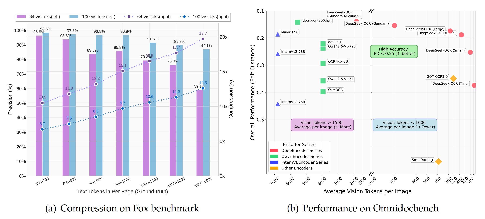
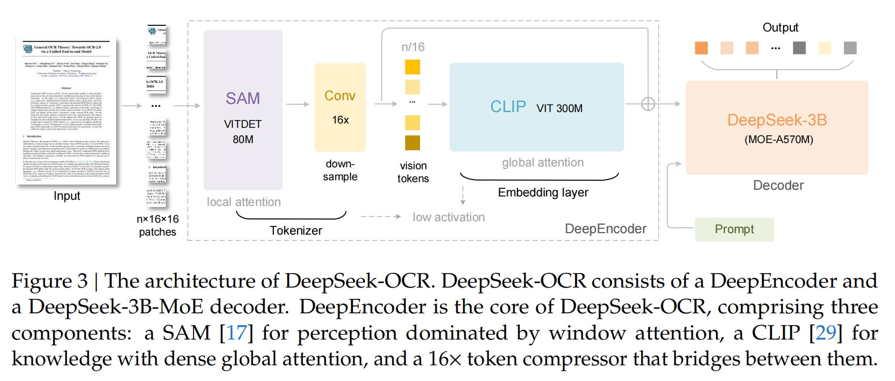
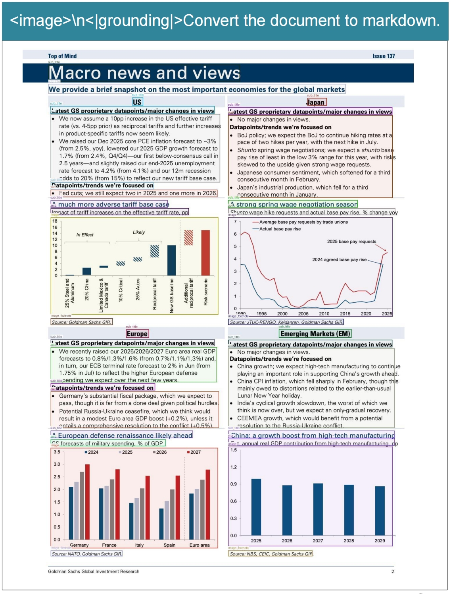
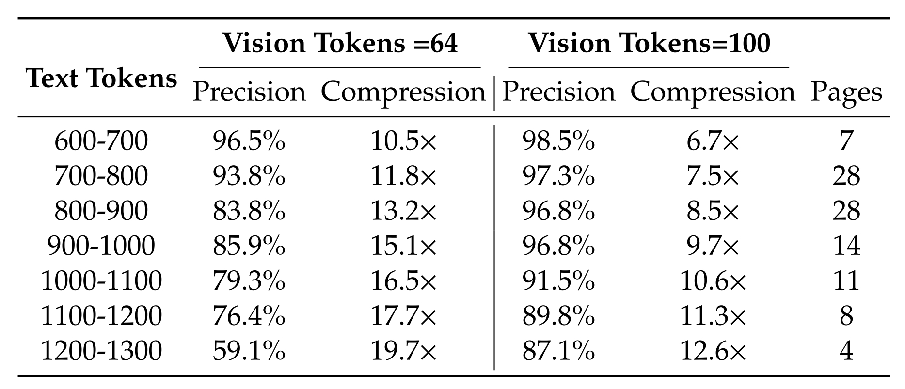
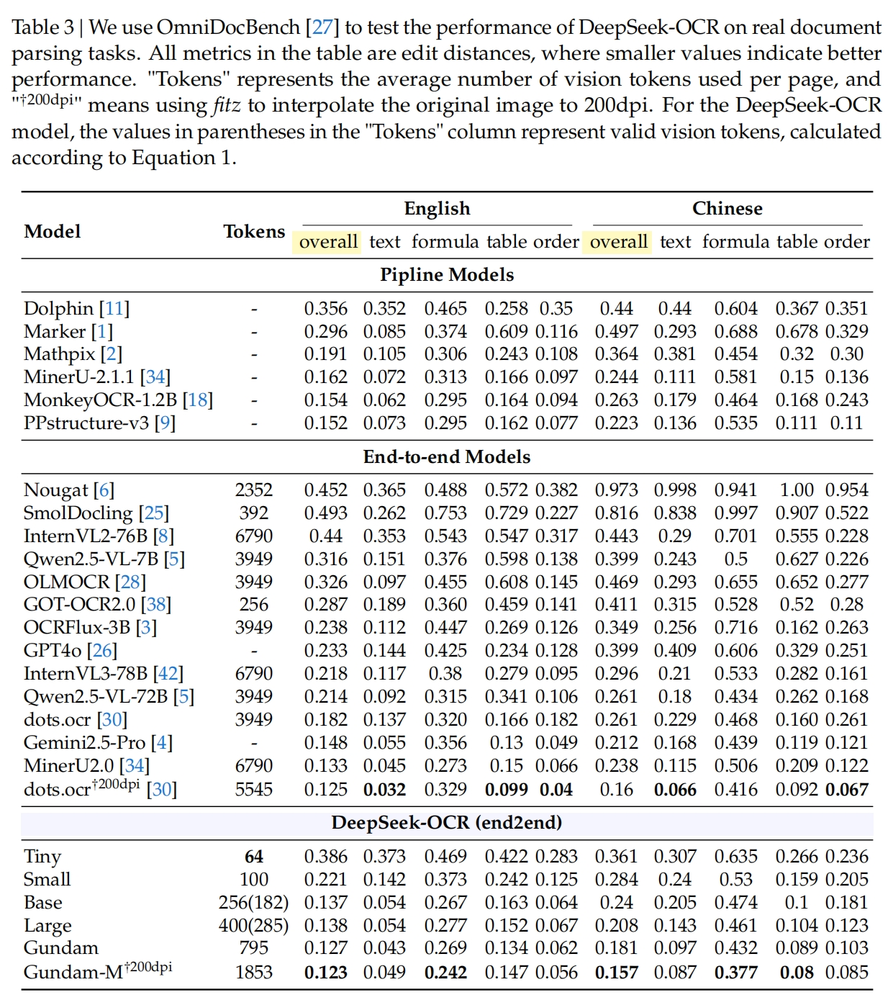

# 🔥 DeepSeek-OCR爆火！把万字长文压缩成一张图，AI长文本瓶颈被这样颠覆

> **从"逐字阅读"到"图像速览"，探索视觉与语言深度融合的新范式**

**本文特色：**
- 🎯 **颠覆性思维** - 用视觉方式压缩一切，一图胜千言
- 📊 **惊人性能** - 10倍压缩比下精度达97%，20倍压缩仍保持60%
- 🔥 **效率革命** - 用不到800个视觉Token超越需要7000个Token的顶尖模型
- 💡 **类人记忆** - 模拟人类记忆遗忘机制，实现无限长上下文架构
- 🚀 **工程友好** - 单张A100-40G日产20万页高质量训练数据

**核心指标：** 压缩比20x | 精度97% | Token数<800 | 模型规模3B



## 📑 快速导航

| 维度 | 传统方法 | DeepSeek-OCR | 性能提升 |
|------|---------|--------------|---------|
| **处理方式** | 逐字转换文本 | 视觉图像理解 | <span style="color:#E63946">**范式转移**</span> |
| **Token消耗** | 10,000字符=10,000+ Token | 10,000字符≈1,000 Token | <span style="color:#06A77D">**10倍压缩**</span> |
| **精度表现** | 追求100%还原 | 97%精度（10x）/ 60%精度（20x） | <span style="color:#F77F00">**效率优先**</span> |
| **上下文能力** | 算力呈二次方爆炸 | 动态分配计算资源 | <span style="color:#2E86AB">**无限扩展**</span> |
| **记忆机制** | 一视同仁 | 近期高清+远期模糊 | <span style="color:#A23B72">**类人智能**</span> |

**核心创新：** <span style="color:#DC2F02">视觉压缩媒介</span> → <span style="color:#F77F00">三阶段编码</span> → <span style="color:#06A77D">动态记忆管理</span>

---

## 🎯 核心原理：上下文光学压缩

### 一句话回答
将<span style="color:#E63946">**海量文本信息压缩进二维视觉空间**</span>，让AI通过<span style="color:#2E86AB">**"看图"而非"读字"**</span>的方式理解内容，实现<span style="color:#06A77D">**指数级计算效率提升**</span>。

### 核心思想
**灵感来源：** 既然一张图片能"装下"成千上万个字，那为什么不把文字信息直接压缩到图片里，让模型通过视觉通路处理？

**与传统OCR的本质区别**
| 维度 | 传统OCR | DeepSeek-OCR |
|------|---------|--------------|
| **目标** | 100%精确还原每个字符（解压缩工具） | 用最少视觉信息承载最大文本语义（压缩工具） |
| **任务** | 字符识别 | 为大模型"减负"，让其"看更多、记更久" |
| **权衡** | 精度第一 | 效率与精度平衡 |

**类比：** 就像优秀的人看书是扫一眼就知道内容，不必一字一句读完才理解。

---

## 🏗️ 技术架构：两大核心组件



### 架构总览
```
输入文档 → DeepEncoder（视觉压缩） → 视觉Token → DeepSeek3B解码器 → 文本输出
   ↓           ↓ 三阶段处理                    ↓ MoE-A570M
图像渲染    SAM→Conv16x→CLIP                 文本重建
```

### 1. DeepEncoder：高效视觉编码器

**核心使命**  
处理高分辨率图像时产生<span style="color:#E63946">**极少量、高信息密度**</span>的视觉Token。

#### 三阶段设计：先局部→再压缩→后全局

**阶段一：局部处理（Local Processing）**
- **模块：** SAM-base模型（80M参数）
- **机制：** 窗口注意力（Window Attention）
- **作用：** 对高分辨率图像进行细粒度局部特征提取
- **特点：** 虽生成大量Token，但窗口注意力保持显存可控

**阶段二：再压缩（Re-compression）**
- **模块：** 16x卷积压缩器（Conv 16x）
- **作用：** 在进入全局注意力前大幅减少Token数量
- **效果：** 1024×1024图像从4096 Token压缩至256 Token
- **关键：** <span style="color:#F77F00">**数量级Token削减**</span>

**阶段三：后全局理解（Post-global Understanding）**
- **模块：** CLIP-large模型（300M参数）
- **机制：** 全局注意力（Global Attention）
- **作用：** 对压缩后的少量Token进行深度语义理解
- **优势：** Token数量少，计算开销可接受

#### 灵活输入模式

| 模式 | 分辨率 | Token数 | 处理方式 | 压缩强度 |
|------|--------|---------|---------|---------|
| **Tiny** | 512×512 | 64 | resize | 极高压缩 |
| **Small** | 640×640 | 100 | resize | 高压缩 |
| **Base** | 1024×1024 | 256 | padding | 中压缩 |
| **Large** | 1280×1280 | 400 | padding | 中低压缩 |
| **Gundam** | 640+1024 | n×100+256 | resize+padding | 自适应 |
| **Gundam-M** | 1024+1280 | n×256+400 | resize+padding | 自适应 |

**核心特性：** 同一模型可根据任务需求<span style="color:#06A77D">**随机应变地调整压缩强度**</span>。

### 2. DeepSeek3B解码器

**模型规格**  
DeepSeek-3B (MoE-A570M) - 混合专家架构

**功能**  
从高度压缩的视觉Token中<span style="color:#2E86AB">**重建文本内容**</span>，支持：
- 常规文档识别
- 金融报表解析
- 化学分子式识别
- 数学几何图形理解
- 100+语言支持



---

## 📊 性能表现：以小博大

### Fox基准测试（压缩性能）



**关键发现：**
- <span style="color:#F77F00">**10倍压缩比下精度高达97%**</span>，足够满足大多数精确信息需求
- <span style="color:#DC2F02">**20倍压缩比下精度约60%**</span>，可用于模拟记忆衰退

### OmniDocBench基准测试（编辑距离，越低越好）

|

**里程碑式突破：**
1. <span style="color:#F77F00">**仅用100个视觉Token**</span>，超越每页使用256个Token的GOT-OCR2.0
2. <span style="color:#F77F00">**使用400个视觉Token**</span>（有效285），与之前SOTA模型表现相当
3. <span style="color:#E63946">**使用不到800个视觉Token**</span>，大大超过平均每页近7000个视觉Token的MinerU2.0

**核心优势：** 在图表中位于<span style="color:#06A77D">**最右侧（最少Token）+ 最下方（最低编辑距离）**</span>，实现真正的"以小博大"。

### 数据生成效率

**工程性能：**
- **硬件需求：** 仅需1张A100-40G GPU
- **日产能：** 20万页+高质量LLM/VLM训练数据
- **成本效益：** <span style="color:#06A77D">**不到十分之一的传统成本**</span>

---

## 🧠 革命性创新：模拟人类记忆机制

### 核心洞察
将<span style="color:#2E86AB">**上下文光学压缩**</span>与<span style="color:#E63946">**人类记忆衰退过程**</span>进行类比，发现二者高度相似。

### 记忆分层架构

**近期记忆（Recent Memory）**
- **类比：** 近处物体，清晰可见
- **实现：** 渲染成<span style="color:#F77F00">**高分辨率图像**</span>
- **Token分配：** 使用较多视觉Token
- **保真度：** 高保真信息保留

**远期记忆（Long-term Memory）**
- **类比：** 远处物体，逐渐模糊
- **实现：** 渐进式缩放成<span style="color:#DC2F02">**更小、更模糊的图像**</span>
- **Token分配：** 使用更少视觉Token
- **效果：** 信息自然遗忘和压缩

### 动态资源分配

**传统AI上下文处理：**
- ❌ 对短期、中期、远期上下文<span style="color:#DC2F02">**一视同仁**</span>
- ❌ 机器味儿十足
- ❌ 计算资源和响应问题相应暴涨

**DeepSeek-OCR新范式：**
- ✅ 处理超长对话/文档时<span style="color:#06A77D">**动态分配计算资源**</span>
- ✅ 为不同时期的上下文分配不同数量的Token
- ✅ 可能构建出<span style="color:#E63946">**无限长上下文架构**</span>

### 遗忘机制的工程意义

**20倍压缩的双重作用：**
1. **高压缩场景（60%精度）：** 看似性能损失，实则可用于<span style="color:#F77F00">**模拟记忆衰退**</span>
2. **理论应用：** 打造真正具备长期记忆、懂得主次之分的AI

**类人智能特征：**
- 🔍 10分钟前的对话 → "高清图像"记忆
- 📷 1小时前的内容 → "标清图像"记忆  
- 🖼️ 1天前的交流概要 → "模糊缩略图"记忆
- 🎯 重要信息保留，不重要细节自然"遗忘"

---

## 🌟 四大革命性突破

### 第一，范式转移（Paradigm Shift）
**从"逐字阅读"到"图像速览"**
- 根本性利用<span style="color:#2E86AB">**AI的视觉通路**</span>
- 绕过<span style="color:#DC2F02">**语言通路的计算瓶颈**</span>
- 核心：把海量文本信息高效压缩进二维视觉空间

### 第二，性能惊人（Amazing Performance）
**数据说话：**
- 10倍压缩比 → 97%解码精度
- 意味着：10,000字符文档，AI只需处理相当于<span style="color:#F77F00">**1,000个字符的"视觉信息"**</span>就能几乎完美理解全文

### 第三，效率碾压（Crushing Efficiency）
**行业公认基准测试：**
- OmniDocBench测试集上
- DeepSeek-OCR用<span style="color:#06A77D">**不到800个视觉Token**</span>（可理解为AI的"关注点"）
- 超越需要近7000个Token的顶尖模型MinerU2.0
- 评价：<span style="color:#E63946">**这是数量级的优化**</span>

### 第四，模拟遗忘（Simulated Forgetting）
**最具想象力的创新：**
- 通过逐步降低历史对话"图片"分辨率
- 模拟人类记忆的<span style="color:#A23B72">**"远事模糊、近事清晰"**</span>
- 为打造真正具备长期记忆、懂得主次之分的AI提供<span style="color:#F77F00">**工程上的可能**</span>

---

## 🎯 核心技术对比

### DeepSeek-OCR vs 传统OCR

| 维度 | 传统OCR | DeepSeek-OCR |
|------|---------|--------------|
| **定位** | 解压缩工具 | 压缩工具 |
| **目标** | 100%精确还原每个字符 | 用最少视觉信息承载最大文本语义 |
| **首要任务** | 字符识别准确性 | 为大模型"减负" |
| **技术路径** | 图像→文字转换 | 文字→视觉压缩→语义理解 |
| **应用场景** | 扫描、识别、归档 | 长文本理解、上下文处理 |

---

## 💡 技术洞察与影响

### 业界评价

**"JPEG时刻"论断（Ray Fernando）：**
> "This is the JPEG moment for AI."  
> "光学压缩不仅使上下文更便宜，还使人工智能记忆架构变得可行。"

**硅谷反响：**
- GitHub发布即获3.3K+ stars
- HuggingFace趋势榜第二名
- 被认为可能是<span style="color:#E63946">**通往AGI的大门之一**</span>

**关于Gemini的猜测：**
- 业界推测Google Gemini可能已采用类似技术
- 可解释其巨大上下文窗口和OCR性能
- 若属实，可能被视为<span style="color:#DC2F02">**重要商业机密**</span>（已被DeepSeek开源）

### 深层意义

**哲学隐喻：**
> "当一条道路看似已达到性能极限时，换一个维度看待和解决问题，也许会打开一片全新天地。"

**技术启示：**
1. <span style="color:#2E86AB">**AI视觉与语言能力深度融合**</span>的巨大潜力
2. 不仅是更强大的文档处理工具
3. 更是一种<span style="color:#F77F00">**重新思考AI架构**</span>的方法论

**未来展望：**
- AI的未来可能远比我们想象的<span style="color:#06A77D">**更"多彩"、更高效**</span>
- 视觉通路可能成为AI处理信息的主要方式
- 记忆管理机制将更接近人类智能

---

## 🚀 实践指南

### 适用场景

| 场景 | 推荐配置 | 理由 |
|------|---------|------|
| **长文档理解** | Base/Large模式 | 平衡精度与效率 |
| **超长上下文对话** | Gundam动态模式 | 自适应压缩强度 |
| **精确信息提取** | Gundam-M高分辨率 | 最高精度 |
| **快速内容浏览** | Tiny/Small模式 | 极致效率 |
| **记忆管理实验** | 多分辨率组合 | 模拟遗忘机制 |
| **训练数据生成** | Base模式批量处理 | 成本最优 |

### 关键参数配置

**分辨率选择：**
- <span style="color:#F77F00">**精度优先：**</span> 1024×1024 或 1280×1280
- <span style="color:#06A77D">**效率优先：**</span> 512×512 或 640×640
- <span style="color:#2E86AB">**平衡模式：**</span> 动态分块（Gundam系列）

**压缩比权衡：**
- <span style="color:#E63946">**10倍压缩：**</span> 97%精度，适合精确任务
- <span style="color:#DC2F02">**20倍压缩：**</span> 60%精度，适合记忆衰退模拟

**Token预算：**
- 资源充足：800+ Token（Gundam）
- 资源受限：64-256 Token（Tiny-Base）
- 极限优化：<100 Token（Small）

### 常见问题

**Q1: 与传统文本输入相比，何时应使用光学压缩？**
- ✅ 文本长度 > 5000字符
- ✅ 需要长期记忆管理
- ✅ 计算资源受限
- ❌ 需要100%字符级精度
- ❌ 短文本任务（<1000字符）

**Q2: 如何选择合适的模式？**
```
Tiny (64 Token)    → 极致效率场景，可接受较低精度
Small (100 Token)  → 快速预览，内容概要理解
Base (256 Token)   → 通用选择，平衡性能
Large (400 Token)  → 高精度需求
Gundam (795 Token) → 自适应优化
Gundam-M (1853 Token) → 最高精度要求
```

**Q3: 如何实现记忆分层？**
1. 近期内容（10分钟内）：使用Large/Gundam模式
2. 中期内容（1小时前）：使用Base模式
3. 远期内容（1天前）：使用Small/Tiny模式
4. 重要信息：固定使用高分辨率，不降级

---

## 📚 参考资源

**论文地址：**
- [DeepSeek-OCR Paper](https://github.com/deepseek-ai/DeepSeek-OCR/blob/main/DeepSeek_OCR_paper.pdf)

**GitHub仓库：**
- [deepseek-ai/DeepSeek-OCR](https://github.com/deepseek-ai/DeepSeek-OCR)
- Stars: 3.3K+ | Issues: 活跃讨论中

**基准测试：**
- OmniDocBench：行业公认文档解析基准
- Fox benchmark：压缩性能评估

**相关技术：**
- SAM (Segment Anything Model)：分割一切：局部特征提取
- CLIP：视觉-语言联合理解
- MoE (Mixture of Experts)：高效模型架构

---

## 🔑 核心要点总结

### 技术层面
1. <span style="color:#E63946">**范式转移：**</span> 从语言通路到视觉通路，绕过计算瓶颈
2. <span style="color:#F77F00">**三阶段编码：**</span> 局部→压缩→全局，逐步提炼信息密度
3. <span style="color:#06A77D">**动态压缩：**</span> 同一模型支持6种模式，灵活适配任务需求
4. <span style="color:#2E86AB">**记忆分层：**</span> 模拟人类遗忘机制，实现无限上下文可能

### 性能层面
1. <span style="color:#DC2F02">**数量级优化：**</span> 800 Token超越7000 Token的SOTA模型
2. <span style="color:#F77F00">**极致压缩：**</span> 10倍压缩保持97%精度，20倍仍有60%
3. <span style="color:#06A77D">**工程友好：**</span> 单卡A100日产20万页训练数据
4. <span style="color:#A23B72">**以小博大：**</span> 3B模型参数，超越数十倍规模模型

### 意义层面
1. 为长上下文问题提供<span style="color:#E63946">**高性价比新范式**</span>
2. 探索AI视觉与语言能力<span style="color:#2E86AB">**深度融合**</span>的可能
3. 可能是<span style="color:#F77F00">**通往AGI的路径之一**</span>
4. 证明"一图胜千言"在AI时代的<span style="color:#06A77D">**颠覆性新含义**</span>

---

## 🤔 思考与展望

**关键问题：**
- 用"看图"解决"阅读"问题，这种方法的边界在哪里？
- 60%精度的"遗忘"能否真正模拟人类记忆机制？
- 视觉通路是否会成为未来AI处理信息的主流方式？

**潜在方向：**
- 多模态融合：视觉+听觉+触觉的联合压缩
- 个性化压缩：根据用户习惯调整记忆衰退曲线
- 跨语言泛化：100+语言的统一视觉表示

**最终愿景：**
想象一个AI助手，能够进行无限对话：
- 用"高清图像"记住你最后10分钟的对话
- 用"标清图像"记住1小时前的内容
- 用"模糊缩略图"记住1天前的交流概要
- 重要信息保留，无关细节自然"遗忘"

这不正是我们期待的、更接近人类智能的记忆机制吗？

---

**DeepSeek-OCR的探索揭示了AI视觉与语言能力深度融合的巨大潜力。**  
**未来的AI，可能远比我们想象的更"多彩"、更高效。** 🚀

## 关注我，AI不再难 🚀
