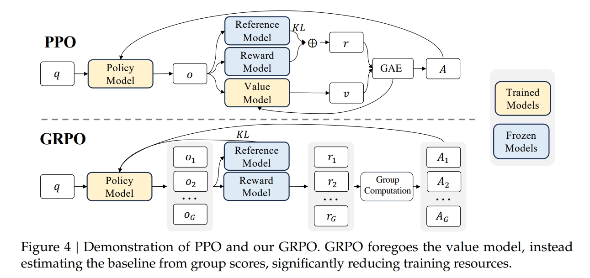
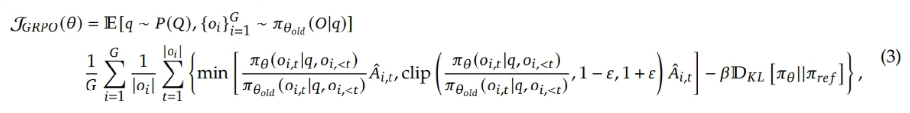
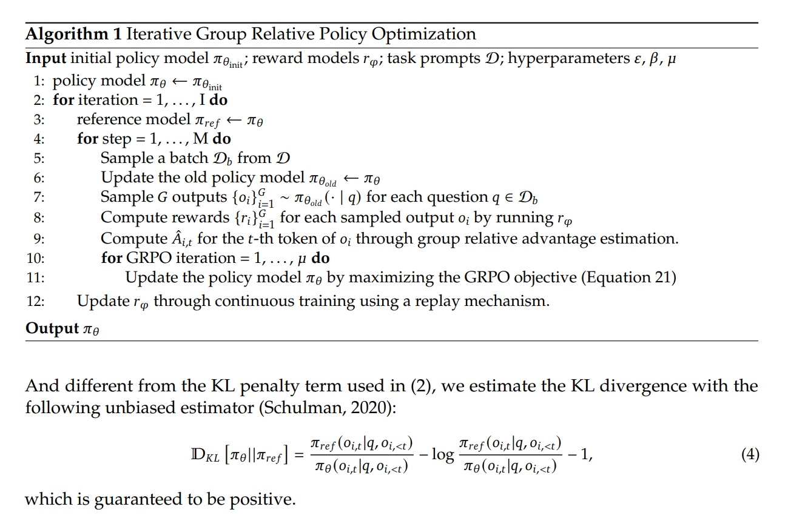

# GRPO：为什么DeepSeek能用更少显存训练更强推理模型？

## 📌 面试核心回答框架

### 💡 一句话回答

> **核心要点：** GRPO（Group Relative Policy Optimization）是 **DeepSeek提出** 的去价值模型强化学习算法，通过 **①群体对比估计优势、②相对奖励归一化、③去除Critic模型** 三个关键技术，实现 **显存降低40%+**，同时在数学推理任务上超越PPO。

---

## 📝 详细回答（3-5分钟）

### 1️⃣ 核心问题（30秒）

**传统RL训练大模型的困境：**

| 维度 | PPO（经典方法） | 问题 |
|------|---------------|------|
| **模型数量** | Actor + Critic + Reference | 3个大模型💥 |
| **显存需求** | ~100GB（7B模型） | 硬件成本高 |
| **训练复杂度** | 需要价值估计、优势函数 | 调参困难 |
| **推理任务表现** | 长链CoT容易崩溃 | 效果受限 |

**📊 实际场景：**
```
训练LLaMA-7B数学推理模型：
❌ PPO：需要3×7B模型，显存100GB+
✅ GRPO：只需2×7B模型，显存60GB
显存节省：40%！🚀
```

---

### 2️⃣ GRPO核心原理（2分钟）

#### ✅ 核心思想：群体对比代替价值估计



**PPO的问题：** 需要训练一个额外的Critic模型来估计状态价值 $V(s)$，用于计算优势函数 $A = Q - V$。

**GRPO的创新：** 对同一问题生成多个回答（如5个），用 **组内平均奖励** 作为基线，直接估计相对优势！

```python
# ❌ PPO：需要Critic模型估计价值
V(state) = Critic(state)  # 需要额外训练一个7B模型
A = reward - V(state)

# ✅ GRPO：群体对比估计优势
group_rewards = [r1, r2, r3, r4, r5]  # 同一问题的5个回答的奖励
baseline = mean(group_rewards)        # 组内平均作为基线
A_i = (r_i - baseline) / std(group_rewards)  # 归一化优势
```

> **关键洞察：** 相对优势比绝对价值更重要——只要知道哪个回答更好，就足以指导学习！

---

### 3️⃣ GRPO的核心优势（2分钟）

#### ✅ 优势一：显存大幅降低

**📊 实测数据（LLaMA-7B）：**

| 方法 | 所需模型 | 显存占用 | 相对节省 |
|------|---------|---------|---------|
| **PPO** | Actor(7B) + Critic(7B) + Ref(7B) | ~105GB | - |
| **GRPO** | Actor(7B) + Ref(7B) | **~63GB** | **40%↓** ⭐ |
| **DPO** | Actor(7B) + Ref(7B) | ~63GB | 40%↓（但性能弱） |

**为什么节省这么多？**
```
Critic模型显存 = 模型参数 + 梯度 + 优化器状态
7B模型的Critic：
  参数：7B × 2 bytes (fp16) = 14GB
  梯度：7B × 2 bytes = 14GB
  优化器（AdamW）：7B × 8 bytes = 56GB
  总计：84GB → GRPO直接省掉！🚀
```

---

#### ✅ 优势二：数学推理任务表现优异

**📊 性能对比（DeepSeek论文数据）：**

| 任务 | PPO | GRPO | GRPO提升 |
|------|-----|------|---------|
| **GSM8K** (数学) | 78.2% | **82.6%** | +4.4% ⭐ |
| **MATH** (竞赛数学) | 41.5% | **45.8%** | +4.3% ⭐ |
| **HumanEval** (代码) | 68.3% | **71.2%** | +2.9% |
| **MMLU** (通用知识) | 83.7% | 83.1% | -0.6% |

**为什么数学任务特别好？**
1. **奖励信号清晰**：答案要么对（r=1），要么错（r=0），群体对比效果最佳
2. **长链推理需要探索**：群体采样天然提供多样性
3. **过程可验证**：每步推理都能检查，群体方差提供细粒度信号

---

#### ✅ 优势三：训练稳定性强

| 问题 | PPO | GRPO |
|------|-----|------|
| **Critic不准** | 价值估计偏差导致训练失败 | ❌ 无Critic，无此问题 |
| **优势方差大** | 需要GAE、价值函数正则化 | ✅ 群体归一化天然稳定 |
| **奖励尺度敏感** | 需要奖励归一化/裁剪 | ✅ 相对奖励天然无偏 |
| **调参复杂** | Critic学习率、GAE-λ等 | ✅ 超参数更少 |

---

### 4️⃣ GRPO vs. 其他方法（1分钟）

#### 📊 架构对比（详见 Figure 4）

**关键差异：**
1. **PPO**：Policy + **Value Model** (训练) + Reference + Reward → 使用GAE计算优势
2. **GRPO**：Policy + Reference + Reward → 使用**Group Computation**计算优势
3. **模型数量**：PPO = 3个模型（2个训练），GRPO = 2个模型（1个训练）

#### 📊 多维度对比

| 维度 | DPO | PPO | GRPO |
|------|-----|-----|------|
| **训练范式** | 监督学习 | 强化学习 | 强化学习 |
| **Critic模型** | ❌ 不需要 | ✅ 需要（Value Model） | ❌ 不需要 |
| **显存占用** | ⭐⭐ 低 | ⭐⭐⭐⭐ 高 | ⭐⭐ 低 |
| **优势估计** | ❌ 无 | GAE（依赖Critic） | Group Computation |
| **推理任务** | ⚠️ 弱 | ✅ 强 | 🔥 最强 |
| **训练稳定性** | 🔥 最稳定 | ⚠️ 需调参 | ✅ 稳定 |
| **适用场景** | 偏好对齐 | 通用RL | 推理+资源受限 |

---

## 📐 核心数学原理

### 1️⃣ GRPO目标函数

**群体优势估计：**

$$\hat{A}_i^{GRPO} = \frac{R(x, y_i) - \frac{1}{G}\sum_{j=1}^G R(x, y_j)}{\text{std}(\{R(x, y_j)\}_{j=1}^G) + \epsilon}$$

其中：
- $G$ 是组大小（通常4~8）
- $R(x, y_i)$ 是第 $i$ 个输出的奖励
- $\epsilon = 10^{-8}$ 防止除零

**完整GRPO目标函数：**


---

### 2️⃣ 为什么群体对比有效？

**理论基础：**

传统优势函数定义：$A(s,a) = Q(s,a) - V(s)$

**GRPO的巧妙替代：**
- $Q(s,a)$：直接用真实奖励 $R(x,y_i)$
- $V(s)$：用组内平均奖励 $\frac{1}{G}\sum_j R(x,y_j)$ 近似

当群体大小 $G$ 足够大时，根据大数定律：
$$\frac{1}{G}\sum_{j=1}^G R(x,y_j) \approx \mathbb{E}_{y \sim \pi}[R(x,y)] = V(s)$$

**数学直觉：**
- Critic模型 = 学习 $V(s) = \mathbb{E}[R(x,y)]$（参数化，需要训练）
- GRPO = 用采样均值估计 $\mathbb{E}[R(x,y)]$（非参数化，无偏估计）

---

### 3️⃣ 群体大小的权衡

优势估计的方差：$\text{Var}(\hat{A}_i) \approx \frac{\text{Var}(R)}{G-1}$

| 组大小 G | 方差 | 计算成本 | 推荐场景 |
|---------|------|---------|---------|
| **G=2** | 高 | 低 | ❌ 估计不稳定 |
| **G=4** | 中 | 中 | ✅ 快速实验 |
| **G=8** | 低 | 中高 | 🔥 生产推荐 |
| **G=16** | 极低 | 高 | ⚠️ 收益递减 |

**DeepSeek实践经验：**
- 小模型（<7B）：G=4 足够
- 中模型（7B-13B）：G=8 最优
- 大模型（>13B）：G=8（再大收益不明显）

---

## 🔧 实现细节

### 1️⃣ 算法伪代码（Algorithm 1）



```
输入：初始策略 π_θ_init、奖励模型 r_φ、数据集 D、超参数 ε, β, μ

1. policy_model π_θ ← π_θ_init

2. for iteration = 1, ..., I do:
   3. reference_model π_ref ← π_θ  # 冻结当前策略
   4. for step = 1, ..., M do:
      5. 采样批次 D_b
      6. 更新旧策略 π_θ_old ← π_θ
      7. 采样 G 个输出 {o_i}_{i=1}^G ~ π_θ_old(·|q)
      8. 计算奖励 {r_i}_{i=1}^G
      9. 计算群体相对优势 Â_{i,t}
      10. for GRPO_iter = 1, ..., μ do:
          11. 最大化 GRPO 目标函数更新 π_θ
      12. 更新奖励模型 r_φ（可选）

输出：π_θ
```

---

### 2️⃣ 核心代码实现

```python
import torch

class GRPO:
    def __init__(self, model, ref_model, config):
        self.model = model
        self.ref_model = ref_model
        self.eps_clip = config.eps_clip  # 0.2
        self.beta_kl = config.beta_kl    # 0.01
        self.group_size = config.group_size  # 4~8
        
    def compute_advantages(self, rewards):
        """群体优势估计"""
        mean = rewards.mean(dim=1, keepdim=True)
        std = rewards.std(dim=1, keepdim=True) + 1e-8
        return (rewards - mean) / std
    
    def compute_loss(self, inputs, outputs, rewards):
        """计算GRPO损失"""
        advantages = self.compute_advantages(rewards)
        
        loss_total = 0
        for g in range(self.group_size):
            logprobs_new = self.model.get_log_probs(inputs, outputs[:, g, :])
            with torch.no_grad():
                logprobs_old = self.ref_model.get_log_probs(inputs, outputs[:, g, :])
            
            ratio = torch.exp(logprobs_new - logprobs_old)
            adv = advantages[:, g].unsqueeze(1)
            
            # PPO裁剪
            surr1 = ratio * adv
            surr2 = torch.clamp(ratio, 1-self.eps_clip, 1+self.eps_clip) * adv
            loss_clip = -torch.min(surr1, surr2).mean()
            
            # KL惩罚
            kl_div = (logprobs_old - logprobs_new).mean()
            loss_total += loss_clip + self.beta_kl * kl_div
        
        return loss_total / self.group_size
```

---

## 💼 面试高频题

### ❓ 问题1：GRPO和PPO的本质区别是什么？

**标准答案：**

**核心区别：** PPO用神经网络Critic估计价值函数，GRPO用群体采样的蒙特卡洛方法估计。

**详细展开：**
1. **优势函数估计：**
   - PPO: $\hat{A}_t = R_t + \gamma V(s_{t+1}) - V(s_t)$ （需要Critic）
   - GRPO: $\hat{A}_i = r_i - \text{mean}(r_1,...,r_G)$ （群体对比）

2. **模型需求：**
   - PPO: Actor + Critic + Reference = 3个模型
   - GRPO: Actor + Reference = 2个模型

3. **适用场景：**
   - PPO: 通用RL，需要精确价值估计
   - GRPO: 推理任务，奖励信号稀疏但准确

---

### ❓ 问题2：为什么GRPO在数学推理上比PPO好？

**标准答案：**

**三个关键原因：**

1. **奖励信号特点匹配**：数学题奖励稀疏（对/错）但准确，群体对比能充分利用这种"硬标签"，Critic反而可能引入噪声

2. **探索效率更高**：群体采样天然提供多样性，每个问题同时探索G条路径

3. **训练更稳定**：相对奖励对尺度不敏感，群体归一化自动平衡不同难度的题目

**实证数据：** DeepSeek在GSM8K上GRPO比PPO高4.4%。

---

### ❓ 问题3：GRPO的组大小G怎么选？

**标准答案：**

**理论分析：** 方差 ∝ 1/(G-1)，但计算成本 ∝ G

| 场景 | 推荐G | 理由 |
|------|------|------|
| **快速实验** | G=4 | 足够估计，迭代快 |
| **生产训练** | G=8 | 最佳性价比（DeepSeek默认）|
| **高方差任务** | G=8~16 | 需要更稳定的估计 |
| **资源受限** | G=4 | 减少推理开销 |

**不推荐：**
- G=2：方差太大，训练不稳定
- G>16：收益递减，浪费算力

---

### ❓ 问题4：GRPO有哪些局限性？如何改进？

**标准答案：**

**核心局限：粗粒度信用分配** ⚠️

- GRPO对整个序列使用统一的优势值
- 无法区分哪些token/步骤真正重要
- 长链推理中，关键推理步骤和填充词得到相同的梯度

**改进方向：**

1. **DAPO（ByteDance）**：Token级损失 + Clip-Higher，AIME性能比GRPO提升66%
2. **GTPO**：Token级熵加权，高熵token获得更高奖励
3. **GRPO-S**：序列级熵加权，平衡粒度与效率
4. **Tree-GRPO**：Step级树搜索，以Agent步骤为单位优化

---

### ❓ 问题5：如何判断GRPO训练是否正常？

**标准答案（监控指标）：**

1. **奖励统计：**
   - `mean_reward`: 应逐步上升
   - `reward_std`: 组内方差，初期高（探索），后期降低
   - `max_reward`: 最好样本的奖励，应持续增长

2. **优势分布：**
   - `adv_mean`: 应接近0（归一化特性）
   - `adv_std`: 应在1左右

3. **策略变化：**
   - `kl_divergence`: 与参考模型的KL散度
   - 太大(>0.1): 策略偏离过快，降低学习率
   - 太小(<0.001): 学习停滞，增加学习率

4. **裁剪比例：**
   - `clip_fraction`: 被裁剪的样本比例，理想范围10%-30%

---

## 🎯 实战建议

### 1️⃣ 推荐超参数（LLaMA-7B + GSM8K）

```python
config = {
    "group_size": 8,           # 组大小
    "eps_clip": 0.2,           # PPO裁剪范围
    "beta_kl": 0.01,           # KL惩罚系数
    "learning_rate": 1e-6,     # 学习率（RL对LR很敏感）
    "warmup_steps": 100,
    "max_grad_norm": 1.0,
    "temperature": 0.7,        # 采样温度
    "top_p": 0.9,
    "max_new_tokens": 512,
    "batch_size": 16,          # 实际样本数 = 16 * 8 = 128
}
```

**分阶段训练策略：**
- 阶段1（0-10%）：温度1.0，β=0.001（高温探索，宽松约束）
- 阶段2（10%-80%）：温度0.7，β=0.01（平衡探索）
- 阶段3（80%-100%）：温度0.5，β=0.05（低温利用，严格约束）

---

### 2️⃣ 常见陷阱及解决方案

#### 🚨 陷阱1：熵崩溃

**现象：** 训练后期所有输出高度相似，多样性丧失。

**解决方案：**
```python
# 方法1：熵正则化
loss_total = loss_clip + loss_kl - beta_entropy * entropy.mean()

# 方法2：温度退火
temperature = max(0.3, 1.0 - 0.7 * (step / total_steps))
```

---

#### 🚨 陷阱2：长回答失控

**现象：** 模型生成4000+ token的冗长、重复回答。

**解决方案：**
```python
# 软长度惩罚
def compute_reward(answer, target, max_len=512):
    correctness = check_answer(answer, target)
    length_penalty = min(1.0, max_len / len(answer))
    return correctness * length_penalty
```

---

#### 🚨 陷阱3：奖励Hack

**现象：** 模型找到捷径，钻奖励函数的空子。

**解决方案：**
```python
# 严格的奖励函数
def compute_reward_robust(answer, ground_truth):
    pred = extract_answer(answer)  # 提取数值答案
    correct = (pred == ground_truth)  # 精确匹配
    length_score = 1.0 / (1.0 + 0.001 * len(answer))  # 长度正则
    format_bonus = 0.1 if has_reasoning_steps(answer) else 0.0
    return float(correct) + format_bonus * length_score
```

---

#### 🚨 陷阱4：初期不稳定

**现象：** 训练前100步loss剧烈波动，甚至NaN。

**解决方案：**
```python
# Warmup + 梯度裁剪
scheduler = get_linear_schedule_with_warmup(
    optimizer, num_warmup_steps=100, num_training_steps=total_steps
)
torch.nn.utils.clip_grad_norm_(model.parameters(), max_norm=1.0)

# 奖励缩放
rewards_scaled = rewards / (rewards.std() + 1e-8)
```

---

### 3️⃣ 性能优化技巧

**推理加速：**
```python
# 批量生成G个回答
outputs = model.generate(
    inputs.repeat(group_size, 1),
    do_sample=True, temperature=0.7
).view(batch_size, group_size, -1)

# 使用vLLM/SGLang
from vllm import LLM
llm = LLM(model_path, tensor_parallel_size=2)
outputs = llm.generate(prompts, sampling_params=SamplingParams(n=8))
```

**显存优化：**
```python
# 梯度检查点 + 混合精度
model.gradient_checkpointing_enable()
from torch.cuda.amp import autocast, GradScaler
scaler = GradScaler()

with autocast():
    loss = compute_loss(...)
scaler.scale(loss).backward()
scaler.step(optimizer)
```

---

## 📊 核心知识点速查

| 知识点 | 核心内容 | 面试要点 |
|-------|---------|---------|
| **核心创新** | 群体对比代替Value Model | 去Critic，显存↓40% |
| **架构** | Policy + Reference（2个模型） | PPO需要3个模型 |
| **优势估计** | $A_i = (r_i - \bar{r})/\sigma$ | Group Computation代替GAE |
| **KL估计器** | 无偏估计器（Schulman 2020） | 保证正值，无需额外前向传播 |
| **目标函数** | PPO Clip + 群体优势 + KL正则 | KL散度直接加入损失函数 |
| **适用场景** | 推理任务+资源受限 | 数学/代码，奖励稀疏但准确 |
| **组大小G** | 4~8（推荐8） | 方差∝1/(G-1) |
| **超参数** | ε=0.2, β=0.01, μ（迭代次数） | 双重循环结构 |
| **vs PPO** | 去Value Model，用群体对比 | 显存更低，推理任务更强 |
| **核心局限** | 粗粒度信用分配 | 改进→DAPO/GTPO（Token级） |
| **DeepSeek实践** | GSM8K: 82.6%（+4.4%） | 数学推理SOTA |

---

## 🔗 进阶阅读

**核心论文：**
1. **DeepSeek-Math (2024)** - GRPO原始论文，GSM8K/MATH基准
2. **DeepSeek-R1 (2025)** - GRPO大规模应用，多阶段RL策略

**改进方法：**
1. **DAPO (ByteDance)** - Token级 + Clip-Higher
2. **GTPO** - Token级熵加权
3. **GRPO-S** - 序列级熵加权

**开源实现：**
- **OpenRLHF**：生产级GRPO实现
- **TRL**：HuggingFace官方RL库
- **DeepSpeed-Chat**：支持GRPO的分布式训练

---

## 关注我，AI不再难 🚀
