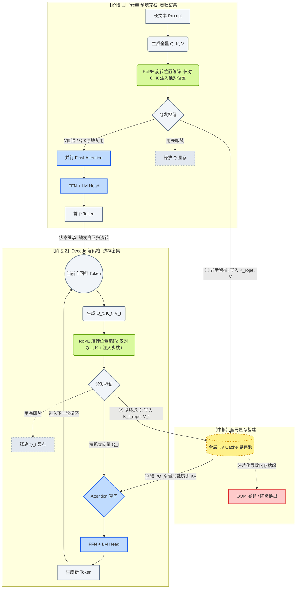

# KV Cache

---

## 🎯 工业架构图

---

## 🧮 架构背后的硬核考量 (Design Philosophy)

1. **RoPE 旋转位置编码的精准隔离**
   - **坑点：** 如果把 V (Value) 也拿去旋转，会导致模型“逻辑暴毙”输出乱码。
   - **极致优化：** RoPE 的 $\sin/\cos$ 运算极吃 CPU/GPU 时钟周期。工业界必须在生成 K 后、存入 Cache 前，就先完成 RoPE 旋转。存入 Cache 的是 `K_rope`。这能避免 Decode 阶段每次都需要把历史 K 读出来重新算一遍三角函数的巨大开销。
2. **状态存储与计算资源的彻底解耦**
   - **坑点：** 如果将 KV Cache 约束在某个具体的计算生命周期内，多用户并发就无从谈起。
   - **真实物理：** KV Cache 是显卡上的 HBM 物理全局显存，它游离于 Prefill（算力核心密集）与 Decode（访存总线密集）之外。只有解耦，才能支持 **Continuous Batching（动态批处理）**。
3. **极客级的张量显式回收 (用完即焚)**
   - 无论是在长文本的 Prefill 还是单步的 Decode 中，Q (Query) 代表的是“当前的疑问”，是绝对的临时变量。一旦与 K 算完内积，必须显式释放（在图里标注为虚线）。在 7x24 小时的大厂基建里，哪怕是 1KB 张量的不对称回收，都会导致致命的内存泄漏。

---

## 💥 硬件剥削与访存墙灾难 (The Memory Wall)

在 Decode 阶段，生成新 Token 时的数学操作，悄悄发生了降维打击：
- 计算从计算密集型的 **GEMM（矩阵乘矩阵）** 退化成了访存密集型的 **GEMV（矩阵乘向量）**。
- **算术强度 (Arithmetic Intensity) 极低。** GPU ALU 核心有 90% 的时间在苦苦等待几 GB 的 KV Cache 数据通过极慢的 HBM（显存）总线运送过来。
- **结论：KV Cache 根本不是算力问题，是纯粹的 I/O 吞吐灾难。** 谁能压榨显存带宽，谁就能掌握真正的推理吞吐。

---

## 🦅 巨头博弈与底层脏活 (Dirty Hacks & Moats)

大厂之所以能把按 Token 计费的 API 做到极度廉价，正是因为他们在处理上述图纸的边角处动用了几把极其暴力的“手术刀”：

1. **解决显存碎片与刺穿 (PagedAttention)：** 
   朴素追加机制会导致高达 60%-80% 的 VRAM 因为长度未知而产生碎片化。借鉴操作系统的“虚拟内存分页”，把连续的 KV Cache 切成定长 Block，显存浪费率瞬间暴降到 4% 以下。
2. **削减 I/O 物理体积 (MQA/GQA & 量化)：** 
   让多个 Q 强行共享同一组 K 和 V (GQA)，将 Cache 体积物理砍掉 7/8；同时使用 FP8 / INT4 量化强行压榨数据体积。哪怕损失一丝推理精度，也要把 I/O 压力降下来。
3. **跨越总线的算子融合 (Kernel Fusion / FlashDecoding)：** 
   不改一行 Python 前端代码，在底层的 Triton / CUDA 编译器中，将图纸里的投影、存入 Cache、计算 Attention 强行熔铸成一个黑盒。数据直接在 SRAM（片上高速内存）里流转完再回写，彻底避免频繁读写 HBM。

> **高管金句 (Talk Track)：**
> "KV Cache 表面上是一个通过空间换时间的算法优化，但其本质是解决大模型在解码阶段从 Compute-bound 退化为 Memory-bound 的 I/O 灾难。现代推理引擎的护城河，已经从纯粹的模型结构，转移到了对显存碎片的高维治理（如 PagedAttention）和对访存带宽的极限压榨（如 GQA 与 INT8 量化）上。一张精确的架构，就是一场内存与算力博弈的物理沙盘。"