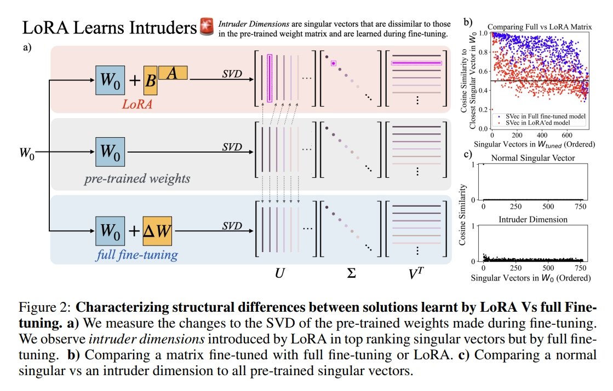
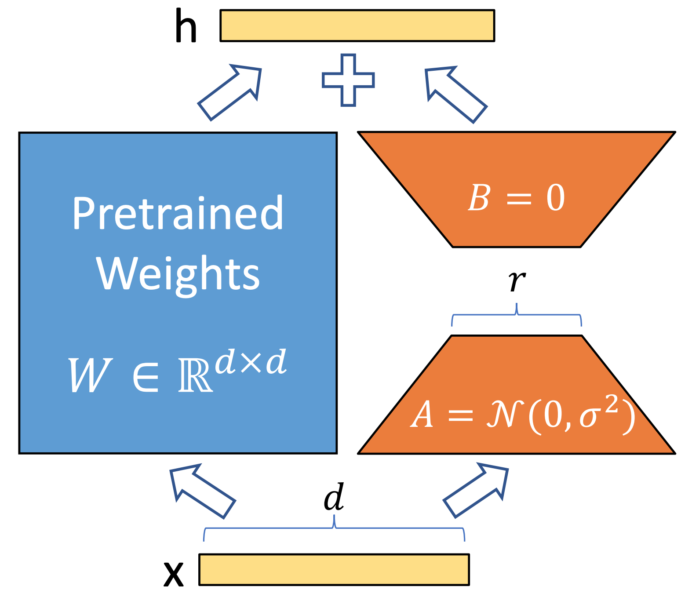

# 为什么LoRA能用极少参数微调大模型？

## 📌 面试核心回答框架

### 💡 一句话回答

> **核心要点：** LoRA通过 **①低秩矩阵分解、②冻结原参数、③只训练小矩阵** 三个关键技术，实现用不到1%的参数量达到全量微调90%以上的效果，同时显存占用降低3倍以上。

---

## 📝 详细回答（3-5分钟）

### 1️⃣ 核心问题（30秒）

**大模型微调的困境：**

| 维度 | 全量微调 | 问题 |
|------|---------|------|
| **参数量** | 7B模型=70亿参数 | 显存爆炸💥 |
| **显存需求** | ~28GB（fp32） | 普通GPU跑不动 |
| **存储成本** | 每个任务一份完整模型 | 难以管理 |

**📊 实际场景：**
```
100个任务
全量微调：100个7B模型 = 700GB
LoRA微调：1个基座 + 100个适配器 = 10GB
存储节省：98.6%！
```

---

### 2️⃣ LoRA核心原理（2分钟）

#### ✅ 核心思想：低秩假设


预训练模型的权重矩阵 $W \in \mathbb{R}^{d \times k}$ 在微调时的变化量 $\Delta W$ 是**低秩**的。

```python
# ❌ 全量微调
W_new = W + ΔW  # ΔW是全尺寸矩阵，需要更新d×k个参数

# ✅ LoRA微调
ΔW = B @ A     # B: d×r, A: r×k, 其中 r << min(d,k)
W_new = W + B @ A  # 只需更新 r×(d+k) 个参数！
```



**参数量对比：**
```
原始矩阵：4096 × 4096 = 16,777,216 参数
LoRA (r=8)：(4096×8) + (8×4096) = 65,536 参数
压缩比：256倍！🚀
```

> **关键洞察：** 神经网络权重矩阵虽大，但本质信息维度（内在秩）远低于矩阵维度

---

#### ✅ 实现细节：巧妙的工程设计

```python
# 原始Transformer层
Q = x @ W_q  # W_q: d×d (冻结❄️)

# ✅ LoRA改造后
Q = x @ W_q + lora_B_q(lora_A_q(x)) * (α/r)
    ↑           ↑
  冻结路径    可训练路径
```

**🎯 三个关键设计：**

1. **冻结原始权重** - 保留预训练知识
2. **旁路注入** - 通过加法引入任务特定知识  
3. **零初始化B** - 训练开始时LoRA输出为0，不影响原模型

---

### 3️⃣ LoRA的核心优势（2分钟）

#### ✅ 优势一：极致的参数效率

**📊 实证数据（GPT-3 175B）：**

| 方法 | 可训练参数 | 参数占比 | 性能 |
|------|-----------|---------|------|
| **全量微调** | 175B | 100% | 100% |
| **Prefix-Tuning** | 3.5M | 0.002% | ~92% |
| **LoRA (r=8)** | 4.7M | 0.003% | **96.4%** ⭐ |
| **LoRA (r=64)** | 37.7M | 0.02% | **98.2%** 🔥 |

**不同模型的压缩比：**
- LLaMA-7B：420万参数，压缩**1667倍**
- LLaMA-13B：800万参数，压缩**1625倍**
- GPT-3 175B：5000万参数，压缩**3500倍**

---

#### ✅ 优势二：显存占用大幅降低

```python
# 全量微调 LLaMA-7B
参数：7B × 4 bytes = 28GB
梯度：7B × 4 bytes = 28GB
优化器：7B × 8 bytes = 56GB
激活值：~10GB
总计：~122GB ❌

# LoRA微调 LLaMA-7B (r=8)
参数（冻结）：28GB
LoRA参数：4M × 4 bytes = 16MB
LoRA梯度+优化器：48MB
激活值：~10GB
总计：~38GB ✅

显存节省：68%！
```

---

#### ✅ 优势三：推理无额外开销

```python
# 训练时：旁路结构
output = W @ x + (B @ A) @ x

# 推理时：合并权重
W_merged = W + B @ A  # 预先计算
output = W_merged @ x  # 和原模型一样快！

# 🎯 推理延迟：0增加，显存：0增加
```

**多任务快速切换：**
- 1个基座常驻显存
- 动态加载不同LoRA（3-10MB）
- 切换时间：<10ms
- 💎 一个基座服务100个任务！

---

#### ✅ 优势四：模块化与可组合性

```python
# 多个LoRA可以叠加
output = W @ x + (B1@A1 + B2@A2 + B3@A3) @ x

# 实际应用：领域+任务+风格
lora_medical = load_lora("medical.bin")    # 医疗领域
lora_qa = load_lora("qa.bin")              # 问答任务
lora_formal = load_lora("formal.bin")      # 正式风格

output = model(input, loras=[lora_medical, lora_qa, lora_formal])
```

---

### 4️⃣ 技术细节

#### 🔍 秩r的选择

| 任务类型 | 推荐秩r | 理由 |
|---------|--------|------|
| **简单分类** | r=4~8 | 任务简单 |
| **问答、摘要** | r=8~16 | 中等复杂度 |
| **对话、代码生成** | r=16~64 | 需要更强表达能力 |
| **领域大幅迁移** | r=64~128 | 需要学习更多新知识 |

---

#### 🎯 应用到哪些层？

```python
# 策略1：Q和V加LoRA（推荐）⭐
W_q + LoRA_q ✅
W_k          ❌
W_v + LoRA_v ✅
# 参数：2个LoRA，效果：90%+，性价比最高

# 策略2：所有注意力矩阵
W_q/W_k/W_v/W_o 都加LoRA
# 参数：4个LoRA，效果：95%+，追求极致性能
```

---

#### ⚙️ 关键超参数

```python
r = 8           # 秩（通用起点）
α = 16          # 缩放因子（固定值，常用）
# 或 α = r      # 使得 α/r = 1（也很常用）
dropout = 0.1   # 防止过拟合
lr = 1e-4       # 学习率（5倍于全量微调）
```

**关于缩放因子α：**
- LoRA输出 = (B @ A @ x) × (α / r)
- **α = 16**：固定值，HuggingFace默认
- **α = r**：动态值，使缩放因子=1
- 两者都常用，α=16更稳定

---

### 5️⃣ LoRA变体

| 方法 | 核心改进 | 优势 | 适用场景 |
|------|---------|------|---------|
| **LoRA** | 低秩分解 | 简单高效 | 通用 ⭐ |
| **QLoRA** | 量化+LoRA | 显存再降50% | 资源极限 |
| **AdaLoRA** | 动态调整秩 | 自适应分配 | 复杂任务 |

---

#### 🚀 QLoRA：极致的参数效率

```python
# QLoRA = 4bit量化 + LoRA微调
W_frozen = quantize_4bit(W)  # 7B × 0.5 bytes = 3.5GB
lora = init_lora(r=8)        # 保持16bit精度
```

**惊人效果：**
```
LLaMA-65B：
- 全量微调：~780GB ❌
- LoRA：~90GB ⚠️
- QLoRA：~48GB ✅ 单卡A100可跑！
性能：99%+
```

---

#### 📐 AdaLoRA：动态秩分配

```python
# ❌ 标准LoRA：所有层r=8
# ✅ AdaLoRA：动态调整
layer1: r=16  # 重要层
layer2: r=4   # 次要层
layer3: r=12
# 总参数相同，分配更合理
```

**效果：** 同等参数下性能提升1-2%

---

### 6️⃣ 实战应用场景

#### 🎯 场景一：多任务部署

**问题：** 公司有100个AI任务，都基于LLaMA-7B

**对比维度1：存储成本**

| 方案 | 存储需求 | 成本（按$0.1/GB/月） |
|------|---------|---------------------|
| 全量微调 | 100×14GB = 1400GB | $140/月 |
| LoRA | 14GB + 100×10MB = 15GB | $1.5/月 |
| **节省** | **98.9%** | **99%** |

**对比维度2：推理部署（假设峰值10个任务并发）**

| 方案 | 显存需求 | GPU需求 | 成本（云服务） |
|------|---------|---------|---------------|
| 全量微调 | 10×14GB = 140GB | 2×A100-80G | ~$6/小时 |
| LoRA | 14GB + 10×10MB ≈ 15GB | 1×A100-40G | ~$2/小时 |
| **节省** | **89%** | **67%** | **67%** |

**核心优势：**
- ✅ 存储：节省98.9%
- ✅ 显存：同等并发下节省89%  
- ✅ 成本：云服务费用节省67%
- ✅ 灵活性：可快速切换任务

---

#### 🎯 场景二：个性化对话

- 每个用户专属LoRA（~2MB）
- 快速训练（10分钟）
- 100万用户 = 2TB存储（可行）
- vs 100万个完整模型（14PB）

---

#### 🎯 场景三：持续学习

- 每次学习新任务训练新LoRA
- 冻结已有LoRA
- 选择性激活/组合
- **解决灾难性遗忘**

---

### 7️⃣ LoRA的局限性

| 局限 | 问题 | 解决方案 |
|------|------|---------|
| **大幅领域迁移** | 英文→中文效果差 | 先全量微调语言，再LoRA任务 |
| **多模态任务** | 视觉-语言对齐弱 | 增大秩r或视觉编码器也加LoRA |
| **极小数据集** | 训练不稳定 | 使用小秩(r=2~4) + 大dropout |

---

### 8️⃣ 代码实现

#### 🔨 核心实现（30行）

```python
import torch.nn as nn

class LoRALayer(nn.Module):
    def __init__(self, in_features, out_features, rank=8, alpha=16):
        super().__init__()
        self.rank, self.alpha = rank, alpha
        self.lora_A = nn.Linear(in_features, rank, bias=False)
        self.lora_B = nn.Linear(rank, out_features, bias=False)
        
        nn.init.kaiming_uniform_(self.lora_A.weight)
        nn.init.zeros_(self.lora_B.weight)  # 关键！
        
    def forward(self, x):
        return self.lora_B(self.lora_A(x)) * (self.alpha / self.rank)

class LinearWithLoRA(nn.Module):
    def __init__(self, in_features, out_features, rank=8):
        super().__init__()
        self.linear = nn.Linear(in_features, out_features)  # 冻结
        self.lora = LoRALayer(in_features, out_features, rank)
        
    def forward(self, x):
        return self.linear(x) + self.lora(x)
```

---

#### 🛠️ HuggingFace PEFT（推荐）

```python
from transformers import AutoModelForCausalLM
from peft import get_peft_model, LoraConfig, TaskType

model = AutoModelForCausalLM.from_pretrained("meta-llama/Llama-2-7b-hf")

lora_config = LoraConfig(
    r=8,
    lora_alpha=16,
    target_modules=["q_proj", "v_proj"],
)

model = get_peft_model(model, lora_config)
# 训练...
model.save_pretrained("./lora_adapter")
```

---

## ⏱️ 简洁版回答（1分钟）

**"LoRA通过低秩矩阵分解实现参数高效微调：**

**1️⃣ 核心思想**  
$\Delta W = B \times A$，其中 $r \ll \min(d,k)$

**2️⃣ 参数效率**  
LLaMA-7B只需420万参数（压缩1600倍），达到全量微调90%+效果

**3️⃣ 显存优化**  
训练显存降低68%（122GB→38GB）

**4️⃣ 推理无损**  
推理时合并权重 $W_{new} = W + BA$，延迟和显存都无增加

**工程价值：** 1个基座+100个适配器 vs 100个完整模型，存储节省98%"

---

## ❓ 高频追问

### Q1: LoRA为什么有效？

**理论基础：内在维度假设**

神经网络参数空间虽高维（7B参数），但实际优化发生在**低维子空间**中。

```
优化：θ_t = θ_0 + Δθ_t
关键：rank(Δθ) << dim(θ)

实验：GPT-3的PCA分析
- 前100个主成分解释95%变化
- 总参数1750亿，有效维度~10万
```

**为什么预训练模型更明显？**
1. 预训练已在好位置
2. 微调是小幅调整
3. 任务相关性高

---

### Q2: LoRA和其他PEFT方法区别？

| 方法 | 参数 | 推理开销 | 优势 |
|------|------|---------|------|
| **LoRA** | 0.01-0.1% | ✅ 无 | 平衡最佳 |
| **Adapter** | 0.5-5% | ❌ +15% | 模块化 |
| **Prefix** | 0.01-0.1% | ⚠️ 小 | 参数极少 |

**LoRA更流行原因：**
1. 性能最好
2. 推理无损（可合并）
3. 实现简单
4. 工程友好

---

### Q3: 秩r怎么选？

**经验法则：**
- 简单任务：r=4~8
- 中等任务：r=8~16
- 复杂任务：r=16~64
- 跨领域：r=64~128

**实验方法：**
```python
for r in [4, 8, 16, 32]:
    score = train_eval(r)
# 选择拐点，平衡性能与参数
```

**💡 推荐起点：r=8**

---

### Q4: QLoRA显存能降低多少？

**LLaMA-7B对比：**
```
全量微调：122GB ❌
LoRA：    38GB  ⚠️
QLoRA：   13GB  ✅ (节省89%)
```

**关键技术：**
- NF4量化（4bit）
- 双重反量化
- 分页优化器

**效果：** 65B模型达到全量微调99.3%性能

---

### Q5: 多个LoRA可以组合吗？

**可以！线性可加：**

```python
output = W @ x + (B1@A1 + B2@A2 + B3@A3) @ x

# 应用：分层知识
loras = [medical, qa, formal]
weights = [1.0, 1.0, 0.5]
```

**场景：**
- 领域+任务+风格
- 多语言混合
- A/B测试

---

## 💡 面试技巧

### 5步回答法

```
1️⃣ 一句话总结（15秒）
   "低秩分解，0.01%参数达95%效果"
   ↓
2️⃣ 核心原理（1分钟）
   低秩假设 + 旁路注入 + 零初始化
   ↓
3️⃣ 关键数据（30秒）
   参数0.01-0.1%，显存降68%，性能90-99%
   ↓
4️⃣ 工程价值（30秒）
   多任务部署、快速迭代
   ↓
5️⃣ 变体与限制（如有时间）
   QLoRA、AdaLoRA、适用场景
```

---

### 高分要点

| 要点 | 示例 |
|------|------|
| **数学直觉** | "内在维度远低于参数维度" |
| **具体数据** | "420万参数，压缩1600倍" |
| **对比说明** | "推理无损是LoRA独特优势" |
| **工程视角** | "1个基座服务100任务" |
| **诚实局限** | "大幅迁移效果有限" |

---

## 🎓 知识速查

```
┌─────────────────────────────────────┐
│ LoRA 核心三要素                      │
├─────────────────────────────────────┤
│ 1️⃣ 低秩分解：ΔW = B @ A            │
│ 2️⃣ 冻结基座：保留预训练知识          │
│ 3️⃣ 旁路注入：output = W@x + BA@x    │
└─────────────────────────────────────┘

┌─────────────────────────────────────┐
│ 关键数据（必背）                     │
├─────────────────────────────────────┤
│ • 参数：0.01-0.1% (压缩1000-10000倍)│
│ • 性能：90-99% vs 全量微调           │
│ • 显存：节省60-70%                   │
│ • 推理：0额外开销                    │
│ • 存储：3-50MB/任务                  │
└─────────────────────────────────────┘

┌─────────────────────────────────────┐
│ 超参数推荐                           │
├─────────────────────────────────────┤
│ • r = 8 (通用起点)                   │
│ • α = 16 (固定值) 或 α = r          │
│ • dropout = 0.1                     │
│ • lr = 1e-4 (5倍全量微调)           │
│ • 应用层：Q + V                     │
└─────────────────────────────────────┘
```

---

## 📚 参考资料

**核心论文：**
- **LoRA** (2021) - 原始论文 ⭐⭐⭐⭐⭐
- **QLoRA** (2023) - 量化+LoRA ⭐⭐⭐⭐
- **AdaLoRA** (2023) - 自适应秩 ⭐⭐⭐

**开源实现：**
- HuggingFace PEFT: https://github.com/huggingface/peft
- Microsoft LoRA: https://github.com/microsoft/LoRA
- LLaMA-Factory: https://github.com/hiyouga/LLaMA-Factory

---

## 🎓 记住三点

> 1. **核心原理**：低秩分解 + 冻结基座 + 旁路注入
> 2. **关键数据**：0.01-0.1%参数，90-99%性能，68%显存节省
> 3. **工程价值**：多任务部署、快速迭代、推理无损

## 祝面试顺利！

## 关注我，AI不再难 🚀
