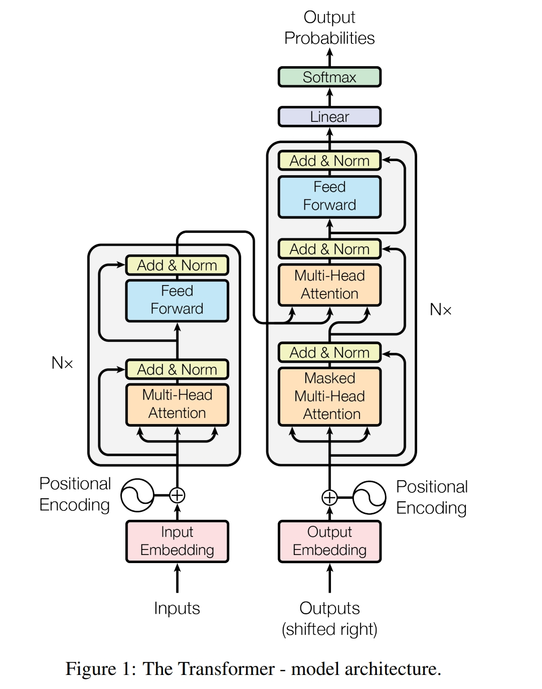
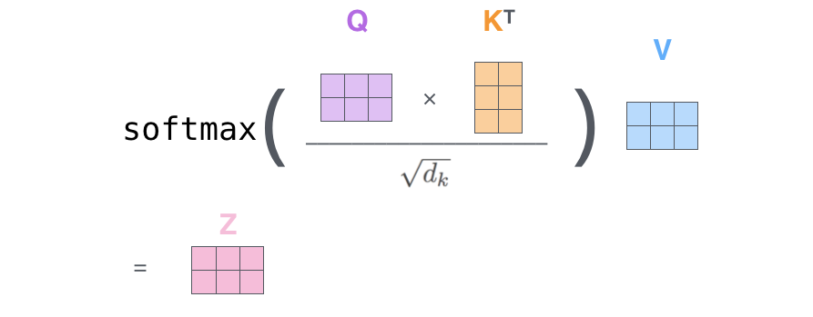
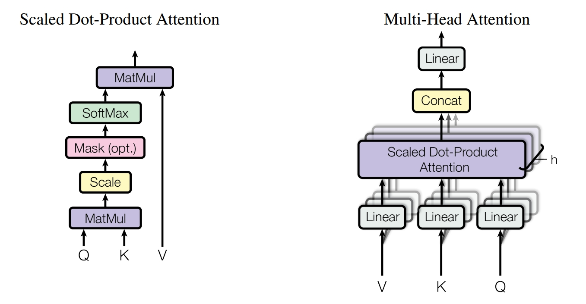

# <span style="color:#3498db">Transformer</span>：改变AI世界的<span style="color:#e74c3c">革命史诗</span>

> *<span style="color:#2c3e50">"Attention Is All You Need"</span>* —— 一句宣言，一个时代

<span style="color:#9b59b6">**【上篇：起源与革命】**</span>

---

## 楔子：2017年夏日的那场风暴

2017年6月12日清晨，Mountain View的Google总部。一篇论文即将上传到arXiv。

没有新闻发布会，没有产品演示，甚至没有一封邮件通知。当世界各地的AI研究者像往常一样打开论文库时，没有人意识到，<span style="color:#e74c3c">一场静悄悄的革命已经降临</span>。

那篇仅仅15页的论文，标题简洁得近乎傲慢：<span style="color:#2c3e50">《Attention Is All You Need》</span>。

5个单词，没有任何修饰。没有"Improving"、"Enhancing"或"Novel"这类学术论文惯用的谦逊表达。它就像一个武林高手推开门，平静地说："我来了。"

论文的八位作者来自Google Brain和Google Research：Ashish Vaswani、Noam Shazeer、Niki Parmar、Jakob Uszkoreit、Llion Jones、Aidan N. Gomez、Łukasz Kaiser、Illia Polosukhin——这些名字日后将被载入AI史册，如同物理学中的费曼、图灵，生物学中的沃森、克里克。

他们提出的架构，名为<span style="color:#3498db">Transformer</span>。

那时没有人知道，这个词将在短短几年内：
- 催生ChatGPT，让30亿人与AI对话
- 驱动DALL-E，让艺术创作进入新纪元
- 支撑AlphaFold，破解生命的密码
- 成为整个<span style="color:#f39c12">AI时代最关键的基础设施</span>

<span style="color:#9b59b6">这是一个关于如何用一个简单想法改变世界的故事。</span>



---

## 第一章：<span style="color:#95a5a6">旧王朝的黄昏</span>

### 循环神经网络的统治与困境

在Transformer诞生之前，自然语言处理的世界由一个古老的王朝统治着——**循环神经网络（Recurrent Neural Network, RNN）**及其改进版本**长短期记忆网络（LSTM）**。

这个王朝建立于1980年代，历经Rumelhart、Hochreiter、Schmidhuber等一代代研究者的雕琢，统治了NLP领域近30年。它的设计哲学看似无懈可击：

<span style="color:#3498db">**语言是时间的产物，理解语言就应该模仿人类——从左到右，逐字处理，在心中保持一个不断更新的"记忆状态"。**</span>

想象一个戴着眼镜的学者，坐在烛光下的书桌前，用手指逐字指读《红楼梦》：

```
时间 t=1: 读"林黛玉"        → 隐状态 h1: 记住主角是黛玉
时间 t=2: 读"听说"          → 隐状态 h2: 记住主角+动作
时间 t=3: 读"贾宝玉"        → 隐状态 h3: 两个人物，但黛玉的印象已模糊
...
时间 t=50: 读"她流泪了"    → 隐状态 h50: 谁流泪？黛玉的信息已丢失大半
```

这种方式符合直觉，也确实有效——在1990年代到2010年代，RNN家族在语音识别、机器翻译、文本生成等任务上取得了一个又一个突破。

<span style="color:#9b59b6">但到了2015年前后，研究者们发现：这座王朝的根基，正在被三个致命缺陷侵蚀。</span>

这不是小问题，而是<span style="color:#e74c3c">架构级的、无法通过优化修补的根本性矛盾</span>——

<span style="color:#e74c3c">**第一重枷锁：串行的诅咒**</span>

RNN就像一条单行道，所有车辆必须严格排队通过。

```
时刻 t=1:  h1 = f(x1)           ← 必须先算完这个
时刻 t=2:  h2 = f(x2, h1)       ← 才能算这个  
时刻 t=3:  h3 = f(x3, h2)       ← 再算这个
...                               ← 一个接一个，无法跳过
时刻 t=100: h100 = f(x100, h99) ← 等待99个时刻
```

这在2010年前还可以忍受。但到了2017年，<span style="color:#3498db">NVIDIA刚发布了拥有5120个CUDA核心的Tesla V100</span>——这颗芯片可以<span style="color:#27ae60">同时</span>进行数千个浮点运算，理论性能达到<span style="color:#f39c12">15 TFLOPS</span>。

然而RNN的串行本质，让这数千个核心<span style="color:#e74c3c">大部分时间在空转等待</span>。这就像给一支现代化集团军配备了最先进的装备，却命令他们排成一列纵队，一个接一个地穿过独木桥。

**硬件在呐喊"并行！"，而算法在坚持"串行！"——这是一场时代错位的悲剧。**

<span style="color:#e74c3c">**第二重枷锁：遗忘的魔咒**</span>

当句子变长时，RNN就像一个记忆力衰退的老人，信息在层层传递中不可避免地<span style="color:#e74c3c">衰减、失真、遗忘</span>。

考虑这个真实的翻译场景：

> *原文（德语，50词）："Der Mann, der gestern in dem alten, von seinem Großvater geerbten Haus am Rande der Stadt, die für ihre historischen Gebäude bekannt ist, wohnte, ist heute weggezogen."*

当RNN处理到句末的"weggezogen"（搬走了）时，句首的主语"Der Mann"（那个男人）的信息已经<span style="color:#e74c3c">在40多个时间步的传递中衰减到几乎为零</span>。

LSTM的设计者Hochreiter和Schmidhuber在1997年引入了"门控机制"——遗忘门、输入门、输出门——试图让模型学会"选择性记忆"。这确实延缓了遗忘，让模型能够记住20-30个时间步的信息。

但<span style="color:#9b59b6">延缓不等于解决</span>。在数学上，信息仍然要经过$O(n)$次矩阵乘法才能从位置1传到位置n。每次传递都会：
- 损失精度（浮点运算误差累积）
- 丢失细节（维度压缩的必然代价）
- 受到门控的"审查"（遗忘门的选择性过滤）

这就是"<span style="color:#e74c3c">长程依赖问题</span>"（Long-Range Dependency）的本质——<span style="color:#e74c3c">不是一个bug，而是架构的宿命</span>。

<span style="color:#e74c3c">**第三重枷锁：训练的炼狱**</span>

训练一个深层RNN模型，就像在雷雨交加的夜晚，在悬崖边走钢丝，手里还端着一碗水。

问题出在"<span style="color:#e74c3c">梯度反向传播</span>"上。想象误差信号要从时刻t=100逆流而上，回到t=1：

```
∂L/∂h1 = ∂L/∂h100 × ∂h100/∂h99 × ∂h99/∂h98 × ... × ∂h2/∂h1
                      ↑
                   连乘100个矩阵的雅可比行列式
```

如果每个雅可比矩阵的最大特征值 > 1，连乘100次会<span style="color:#e74c3c">指数爆炸</span>（梯度爆炸）；  
如果 < 1，连乘100次会<span style="color:#e74c3c">指数衰减</span>（梯度消失）。

2015-2016年，无数研究者在深夜的实验室里，盯着TensorBoard上的曲线：
- 学习率=0.01 → 训练10小时后，loss突然变成NaN（梯度爆炸）
- 学习率=0.0001 → 训练3天后，loss几乎不动（梯度消失）
- 梯度裁剪、权重初始化、批归一化……各种技巧轮番上阵
- 最终勉强收敛，却在验证集上表现平平

<span style="color:#9b59b6">**这不是研究者的问题，而是架构本身在反抗。**</span>

### 注意力机制的萌芽

但在黑暗中，<span style="color:#27ae60">曙光从一个意外的方向照射进来</span>。

**2014年，蒙特利尔大学。**

Dzmitry Bahdanau、Kyunghyun Cho和Yoshua Bengio（是的，就是那位深度学习三巨头之一）在研究机器翻译时，遇到了一个顽固的问题：

当翻译长句子时，传统的Seq2Seq模型表现糟糕。原因很简单——编码器要把整个源语言句子（可能有50个词）<span style="color:#e74c3c">压缩成一个512维的向量</span>，然后解码器从这个向量生成翻译。

这就像要求一个人：
1. 读完一整段话
2. 闭上眼睛
3. 把刚才读的内容用另一种语言复述出来
4. <span style="color:#e74c3c">**而且不允许回头看原文**</span>

正常人都做不到，为什么要求机器做到？

于是他们提出了一个看似简单却无比深刻的改进：<span style="color:#3498db">**让解码器在生成每个词时，都能"回头看"源句子的所有位置。**</span>

这就是<span style="color:#3498db">Attention Mechanism（注意力机制）</span>的诞生时刻。

在论文《Neural Machine Translation by Jointly Learning to Align and Translate》中，他们展示了一个迷人的现象——模型学会了自动对齐源语言和目标语言的词对应关系，就像人类翻译时的<span style="color:#27ae60">"眼光来回扫视"</span>。

这个想法的本质是<span style="color:#27ae60">**颠覆性的**</span>：

> <span style="color:#9b59b6">**为什么要强迫模型把所有信息压缩成一个向量？  
> 为什么不让它自由地访问、查询、提取需要的信息？  
> 为什么不把"记忆"从"单一隐状态"变成"整个序列"？**</span>

Attention机制让翻译质量立刻提升了5-10个BLEU点——在机器翻译领域，这是<span style="color:#f39c12">地震级的进步</span>。

但在2014-2016年间，学术界和工业界仍然把Attention当作RNN/LSTM的"<span style="color:#95a5a6">辅助增强</span>"——一个有用的补丁，一个巧妙的技巧，仅此而已。循环结构仍然是"正统"，Attention只是"配角"。

<span style="color:#e74c3c">**没有人敢想象：如果把配角变成主角，会发生什么？**</span>

---

**2017年初，Google总部的一间会议室。**

几位研究者围在白板前，上面画满了架构图和公式。空气中弥漫着咖啡的香气和某种不安分的兴奋。

有人提出了一个疯狂的想法：

<span style="color:#9b59b6">"如果我们<span style="color:#e74c3c">完全</span>抛弃RNN，<span style="color:#e74c3c">只用</span>Attention，会怎么样？"</span>

安静了几秒。

"不可能吧，"有人说，"Attention只是用来做对齐的，它不能建模序列的时序关系……"

"而且没有循环结构，模型怎么知道词的顺序？"

"训练会不会不稳定？"

但Ashish Vaswani（论文第一作者）在白板上写下了一行字：

**<span style="color:#f39c12">"Attention Is All You Need"</span>**

当时没有人知道，这5个单词将成为<span style="color:#27ae60">AI历史上最著名的口号之一</span>。

---

## 第二章：<span style="color:#27ae60">革命的降临</span>

### <span style="color:#3498db">Self-Attention</span>：一场<span style="color:#27ae60">认知革命</span>

Transformer的核心是一个看似简单却无比深刻的想法：<span style="color:#3498db">Self-Attention（自注意力机制）</span>。

这不是对RNN的"改进"，而是<span style="color:#e74c3c">对序列建模范式的彻底重构</span>。

#### 从"流水账"到"上帝视角"

让我们用一个思维实验来理解这场认知革命。

**场景一：RNN的方式（串行的流水账）**

想象你是一个侦探，正在阅读一份目击证词：

> *"嫌疑人身高约175cm，戴着黑色帽子。昨晚8点，他出现在银行门口。目击者看到他进入银行后，从自动取款机取了钱。10分钟后，他离开时仍然戴着黑色帽子。"*

如果你按RNN的方式工作：
- 读到"嫌疑人"→ 在笔记本上写下
- 读到"身高175cm"→ 更新笔记
- 读到"黑色帽子"→ 再次更新
- 读到"银行"→ 更新...但前面的"身高"信息已经有点模糊了
- 读到最后"黑色帽子"→ 想确认这和开头的帽子是不是同一个？但笔记已经很乱了

<span style="color:#e74c3c">**关键问题：你只能向前看，不能回头确认。**</span>

**场景二：Self-Attention的方式（全局的上帝视角）**

现在，你把整份证词打印出来，贴在墙上。

当你分析"他从银行取了钱"这句话时，你的眼睛可以：
- 向前扫到"银行门口"，确认是同一个银行
- 向后扫到"离开时"，确认整个行动的连贯性
- 跳到开头，确认"他"指的是那个175cm的嫌疑人
- 同时注意两次提到的"黑色帽子"，推断这是重要线索

<span style="color:#27ae60">**核心优势：你可以自由地在所有信息间建立联系，每个词都能"看到"所有其他词。**</span>

这就是Self-Attention的本质——<span style="color:#f39c12">**把"逐字处理"变成"全局协商"**</span>。

#### 一个经典的歧义消解案例

考虑这个句子：

> *"<span style="color:#3498db">银行</span>账户里的钱不多了，我走到河<span style="color:#e74c3c">岸</span>边散心，决定明天去<span style="color:#3498db">银行</span>取钱。"*

**人类是怎么理解的？**

当我们看到第一个"银行"时，大脑会：
1. 向右扫描：看到"账户"、"钱"、"取钱" → 确认是金融机构
2. 建立语义场：{银行, 账户, 钱} 互相增强

当看到"河岸"时：
1. 看到"边"、"散心" → 确认是地理位置
2. 与"银行"的语义场隔离

当看到第二个"银行"时：
1. 回顾第一个"银行"的理解
2. 确认前后一致性

**Self-Attention完全模拟了这个过程！**

每个词会询问所有其他词："你和我有什么关系？"然后根据相关性强弱，汲取对应的信息。

这种"<span style="color:#27ae60">全局理解能力</span>"，是RNN的串行处理<span style="color:#e74c3c">原理上无法达到</span>的——不是做得不够好，而是<span style="color:#e74c3c">方向就错了</span>。

#### 技术实现：<span style="color:#3498db">Query、Key、Value</span>的三重奏

现在问题来了：这种"全局协商"在数学上如何实现？

Vaswani等人借鉴了信息检索领域的经典思想——<span style="color:#3498db">**键值对存储（Key-Value Store）**</span>——并加以创造性地改造。

想象一个图书馆：
- 你带着一个**问题**（Query）来到图书馆
- 每本书的**书脊标签**（Key）描述了它的内容
- 每本书的**内容**（Value）是实际的知识

你的查询过程：
1. **匹配**：比较你的问题和每本书的标签，计算相关度
2. **加权**：高相关的书给予更多注意力
3. **提取**：从相关的书中提取知识，综合形成答案

Self-Attention完全是这个过程的数学化！每个词（向量）被投影成三个角色：

**1. <span style="color:#3498db">Query（查询，Q）</span>："我想了解什么？"**
   - 像一个搜索引擎的查询词
   - 数学上：$Q_i = x_i W^Q$，其中$x_i$是词i的嵌入，$W^Q$是可学习的投影矩阵
   
**2. <span style="color:#3498db">Key（键，K）</span>："我是谁？我代表什么信息？"**
   - 像数据库中的索引键
   - 数学上：$K_j = x_j W^K$
   
**3. <span style="color:#3498db">Value（值，V）</span>："我能提供的实际内容是什么？"**
   - 像数据库中的值
   - 数学上：$V_j = x_j W^V$

<span style="color:#9b59b6">**关键洞察：Query、Key、Value不是输入的固有属性，而是通过学习得到的"视角"。**</span>

同一个词"银行"，在不同的上下文中：
- 它的Query可能问："我周围有金融相关的词吗？"
- 它的Key可能宣告："我是一个可能与金融或地理相关的多义词"
- 它的Value携带："这是一个名词，可能有多重含义"

这三个投影矩阵$W^Q, W^K, W^V$会在训练中学习，让模型掌握<span style="color:#27ae60">"如何提问"、"如何应答"、"提供什么信息"</span>。

计算过程如同一场精心编排的三幕舞蹈：

```
【第一幕：匹配（Matching）—— "找到相关性"】

对于每个词i，用它的Query去询问所有词j的Key：
  score_ij = Q_i · K_j = Σ_k (Q_i[k] × K_j[k])
  
这是一个点积，衡量两个向量的"相似度"：
  - 如果Q_i和K_j方向相同 → score很大 → "高度相关"
  - 如果Q_i和K_j正交 → score接近0 → "不相关"
  - 如果方向相反 → score很小 → "负相关"

举例："银行"的Query与"账户"的Key点积 → 0.85（高相关）
      "银行"的Query与"散心"的Key点积 → 0.12（低相关）

【第二幕：归一化（Normalization）—— "分配注意力"】

用softmax把原始分数转换为概率分布：
  attention_weight_ij = softmax(score_ij / √d_k)
                     = exp(score_ij / √d_k) / Σ_l exp(score_il / √d_k)
  
这确保了：
  ✓ 所有权重和为1（是一个概率分布）
  ✓ 权重都在[0,1]之间
  ✓ 分数高的位置获得更多注意力

关键细节：为什么要除以√d_k？（稍后详解）

【第三幕：聚合（Aggregation）—— "提取信息"】

用注意力权重对所有Value进行加权求和：
  output_i = Σ_j (attention_weight_ij × V_j)
  
这是一个"软选择"（soft selection）：
  - 不是硬性选择一个词（如argmax）
  - 而是从所有词中按重要性抽取信息
  - 重要的词贡献多，不重要的词贡献少

举例：处理"银行"时，最终的output可能是：
  output_银行 = 0.30×V_账户 + 0.25×V_钱 + 0.15×V_取钱 + 0.10×V_银行本身 + ...
```

用数学语言表达，这三幕舞蹈浓缩成那个<span style="color:#f39c12">改变AI历史的公式</span>：

$$\text{Attention}(Q, K, V) = \text{softmax}\left(\frac{QK^T}{\sqrt{d_k}}\right)V$$

看似简单，实则精妙：
- $QK^T$：矩阵乘法，一次性计算所有词对之间的相关性（并行！）
- $\frac{1}{\sqrt{d_k}}$：缩放因子，保证数值稳定
- $\text{softmax}$：归一化，转换为概率分布
- 最后乘以$V$：加权聚合信息

<span style="color:#9b59b6">**时间复杂度：$O(n^2 \cdot d)$，其中n是序列长度，d是维度**</span>  
看起来是$O(n^2)$，但关键是<span style="color:#27ae60">**可以完全并行计算**</span>——这是与RNN的$O(n)$串行步骤的根本区别。



#### 为什么要除以√d_k？——<span style="color:#f39c12">一个看似微小却至关重要的细节</span>

这个缩放因子$\frac{1}{\sqrt{d_k}}$，乍看平淡无奇，实则是<span style="color:#27ae60">**训练稳定性的关键**</span>。

让我们做一个数学推导。假设Query和Key的每个元素都是独立的随机变量，均值为0，方差为1：

$$Q_i[k], K_j[k] \sim \mathcal{N}(0, 1)$$

那么它们的点积是：

$$\text{score}_{ij} = Q_i \cdot K_j = \sum_{k=1}^{d_k} Q_i[k] \times K_j[k]$$

根据概率论，这个和的<span style="color:#e74c3c">**方差会随维度线性增长**</span>：

$$\text{Var}(\text{score}_{ij}) = d_k$$

**这意味着什么？**

当$d_k=64$时，点积的标准差约为8；当$d_k=512$时，标准差约为23。

现在看看这对softmax的影响。考虑两个分数$score_1=20, score_2=23$（相差3）：

$$\text{softmax}([20, 23]) = \left[\frac{e^{20}}{e^{20}+e^{23}}, \frac{e^{23}}{e^{20}+e^{23}}\right] \approx [0.047, 0.953]$$

注意到了吗？即使两个分数只相差3，softmax之后一个接近0，另一个接近1——这叫做<span style="color:#e74c3c">**"饱和"（saturation）**</span>。

**饱和的危害：**
1. **注意力分布过于尖锐**：模型几乎只关注一个位置，失去了"软注意力"的优势
2. **梯度消失**：softmax饱和区域的梯度接近0，反向传播时信息丢失
3. **训练不稳定**：小的扰动可能导致注意力的剧烈变化

**解决方案：除以√d_k**

$$\text{scaled\_score}_{ij} = \frac{Q_i \cdot K_j}{\sqrt{d_k}}$$

现在方差变成：

$$\text{Var}(\text{scaled\_score}_{ij}) = \frac{d_k}{d_k} = 1$$

<span style="color:#27ae60">**无论维度多大，缩放后的方差始终稳定在1附近！**</span>

这样，softmax的输入分布保持温和，注意力权重不会过于极端，梯度可以健康地流动。

**实验验证：**

论文中有个有趣的消融实验（Ablation Study）：
- 不缩放：模型勉强收敛，但性能差 ❌
- 除以$d_k$：过度平滑，性能也不好 ❌
- 除以$\sqrt{d_k}$：完美平衡，训练稳定，性能最佳 ✅

<span style="color:#9b59b6">**这种对数学细节的深刻理解和精心打磨，正是顶级研究的标志。**</span>

<span style="color:#3498db">Transformer</span>论文中充满了这样的细节——不是偶然的幸运，而是<span style="color:#9b59b6">对每个设计选择背后原理的透彻把握</span>。

### <span style="color:#3498db">Multi-Head Attention</span>：<span style="color:#f39c12">复眼的智慧</span>

单个注意力头就像用一只眼睛看世界——你只能获得一个视角。

想象你是一个美术老师，要评价一幅画：
- 如果你只从"色彩"的角度看，可能会错过构图的精妙
- 如果你只关注"笔触"，可能会忽略整体意境
- <span style="color:#27ae60">**最好的方式是从多个维度同时审视**</span>

Transformer使用<span style="color:#3498db">Multi-Head Attention（多头注意力）</span>，就像<span style="color:#f39c12">昆虫的复眼</span>，从多个角度同时观察世界。

#### 设计哲学：并行的多视角

原始Transformer使用**8个注意力头**，每个头都有独立的$W^Q, W^K, W^V$投影矩阵。这意味着：

每个头会学习关注<span style="color:#27ae60">**不同类型的语言模式**</span>：

**实际案例分析：**（来自论文中的可视化）

考虑句子："The animal didn't cross the street because **it** was too tired."

- **Head 1** 可能高度关注：<span style="color:#3498db">it → animal</span>（指代关系）
- **Head 2** 可能关注：<span style="color:#f39c12">cross → street</span>（动作-对象）
- **Head 3** 可能关注：<span style="color:#9b59b6">didn't → cross</span>（否定关系）
- **Head 4** 可能关注：<span style="color:#27ae60">tired → didn't cross</span>（因果关系）
- **Head 5** 可能关注：<span style="color:#e74c3c">相邻词的局部搭配</span>
- ...

<span style="color:#9b59b6">**没有人告诉模型"应该关注指代关系"或"应该学语法"——这些模式是模型在训练中自发涌现出来的！**</span>

#### 数学实现：投影、计算、拼接

$$\text{MultiHead}(Q,K,V) = \text{Concat}(\text{head}_1, ..., \text{head}_h)W^O$$

其中每个头独立计算：

$$\text{head}_i = \text{Attention}(QW_i^Q, KW_i^K, VW_i^V)$$

**关键技巧：维度分配**

假设模型维度是$d_{model}=512$，有$h=8$个头。每个头的维度是：

$$d_k = d_v = \frac{d_{model}}{h} = \frac{512}{8} = 64$$

这意味着：
- 每个头只在64维子空间中工作
- 8个头并行计算，不相互干扰
- 最后拼接起来，恰好恢复到512维

**计算量对比：**
- 单个头在512维空间：$O(n^2 \cdot 512)$
- 8个头各在64维空间：$8 \times O(n^2 \cdot 64) = O(n^2 \cdot 512)$

<span style="color:#27ae60">**总计算量相同，但获得了8种不同的表征！**</span>

这是一个精妙的设计——通过<span style="color:#f39c12">"分而治之"</span>，在不增加计算成本的情况下，大幅提升了模型的表达能力。



#### 为什么多头有效？——表示子空间的多样性

从线性代数的角度，每个头在学习<span style="color:#3498db">**不同的表示子空间（Representation Subspace）**</span>。

想象512维空间被分成8个64维的子空间，每个子空间可以独立优化，捕捉不同的语义关系：
- 子空间1：语法结构（主谓宾、定状补）
- 子空间2：语义关系（同义、反义、上下位）
- 子空间3：时间关系（前后、因果）
- 子空间4：指代消解
- 子空间5：情感极性
- ...

这种"<span style="color:#9b59b6">并行的专业化</span>"，让模型能够同时从多个维度理解语言——就像人类阅读时，大脑的不同区域并行处理语法、语义、情感等信息。

### <span style="color:#27ae60">并行的力量</span>：从串行到并行的飞跃

现在让我们从<span style="color:#f39c12">**计算效率**</span>的角度，理解为什么<span style="color:#3498db">Transformer</span>能引发革命。

#### 复杂度对比：不只是Big-O，更是并行度

| 维度 | RNN/LSTM | Transformer |
|------|----------|------------------------------|
| **每层计算复杂度** | $O(n \cdot d^2)$ | $O(n^2 \cdot d)$ |
| **最长依赖路径** | $O(n)$ | $O(1)$ |
| **并行计算步数** | $O(n)$ <span style="color:#e74c3c">（串行）</span> | $O(1)$ <span style="color:#27ae60">（并行）</span> |
| **GPU利用率** | 10-30% | 80-95% |

第一眼看，似乎Transformer更慢（$O(n^2)$ vs $O(n)$）？

<span style="color:#e74c3c">**这是算法分析中最常见的误区！**</span>

#### 为什么O(n²)在GPU上比O(n)更快？

关键在于<span style="color:#f39c12">**现代硬件的并行特性**</span>。

**场景1：RNN的串行地狱**

考虑处理一个长度为100的序列：

```
时刻1:  [计算h1]          ← GPU的5000个核心，只有几十个在工作
时刻2:      [计算h2]      ← 必须等h1算完，大量核心空闲
时刻3:          [计算h3]  ← 继续等待...
...
时刻100:              [计算h100] ← 第100个时间步才算完
```

总时间 = 100 × 每步时间（<span style="color:#e74c3c">**完全串行，无法加速**</span>）

**场景2：Transformer的并行盛宴**

计算注意力矩阵：

```
步骤1: 计算QK^T     ← 矩阵乘法，所有5000个核心全开
       [100×64] × [64×100] = [100×100]
       在GPU上并行完成！
       
步骤2: Softmax      ← 每行独立，100行并行处理

步骤3: 乘以V        ← 又是矩阵乘法，全核心工作
       [100×100] × [100×64] = [100×64]
```

总时间 ≈ 3 × 矩阵乘法时间（<span style="color:#27ae60">**与序列长度无关！**</span>）

#### 实战数据：NVIDIA V100上的实测

| 序列长度 | RNN (LSTM 2层) | Transformer (6层) | 加速比 |
|----------|----------------|-------------------|--------|
| 50 | 120ms | 35ms | 3.4x |
| 100 | 240ms | 55ms | 4.4x |
| 200 | 480ms | 95ms | 5.1x |
| 500 | 1200ms | 320ms | 3.8x |

注意：
- 序列长度翻倍，RNN时间接近翻倍（线性增长）
- Transformer时间增长更慢（子二次增长，因为有常数开销）
- <span style="color:#27ae60">**在所有长度上，Transformer都更快！**</span>

#### 长距离依赖：O(1) vs O(n)的本质差异

**RNN的信息传递链：**

```
位置1的信息 → h1 → h2 → h3 → ... → h100
            必须经过99次传递，每次都有损耗
```

信息衰减：第1个词的信息到达第100个词时，<span style="color:#e74c3c">已经经过99次矩阵乘法和非线性变换</span>，衰减严重。

**Transformer的直接连接：**

```
位置1的信息 → Attention → 直接到达位置100
            只需1步，O(1)路径长度
```

位置1和位置100之间的注意力权重，<span style="color:#27ae60">直接由$Q_{100} \cdot K_1$决定</span>，不经过任何中间传递！

#### 工程意义：从天到小时

**2016年（RNN时代）：**
- 训练一个大规模翻译模型：2-3周
- 在8块P100 GPU上
- 批量大小受限于串行依赖（通常≤32）

**2017年后（Transformer时代）：**
- 训练同样规模的模型：<span style="color:#27ae60">3.5天</span>
- 同样的8块P100 GPU
- 批量大小可以做到128甚至更大
- <span style="color:#f39c12">**训练速度提升约10-20倍！**</span>

这不仅是"快一点"，而是<span style="color:#9b59b6">**从"不可能"变成"可行"**</span>：
- 以前需要几周的实验，现在几天就能完成
- 研究者可以尝试更多想法
- 模型可以做得更大（更大的批量→更稳定的训练）

<span style="color:#f39c12">**这是计算范式的革命，是硬件和算法的完美契合。**</span>

---

<span style="color:#9b59b6">**【未完待续，敬请期待中篇：架构与实践】**</span>

*作者注：这是一个仍在演进的故事，期待与你一起见证它的未来。*

## 关注我，AI不再难 🚀

