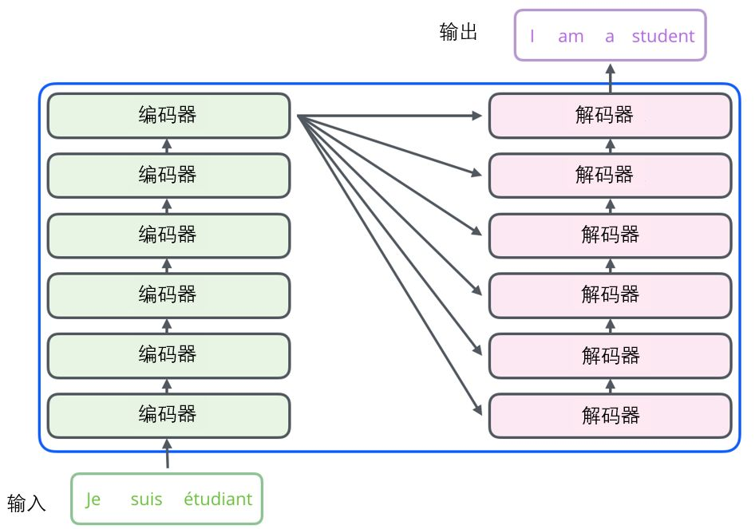

# Transformer：改变AI世界的革命史诗

> *"Attention Is All You Need"* —— 一句宣言，一个时代

**【中篇：架构与实践】**

---

## 第三章：架构的奥秘

### Encoder-Decoder：双塔的协奏曲

完整的Transformer架构由两座"塔"组成：Encoder（编码器）和Decoder（解码器）。

#### Encoder：理解的艺术

Encoder负责理解输入，将原始文本转换为丰富的语义表征。

每个Encoder层包含两个子层：

1. **Multi-Head Self-Attention**
   - 让每个词与句子中所有词互动
   - 捕捉全局依赖关系

2. **Feed-Forward Network（前馈网络）**
   - 两层全连接网络：d_model → 4·d_model → d_model
   - 激活函数通常是ReLU或GELU
   - 作用：对每个位置独立进行非线性变换

原始Transformer堆叠了**6层Encoder**，每层都会对表征进行一次精炼和抽象。

#### Decoder：生成的艺术

Decoder负责生成输出，它比Encoder多了一个子层：

1. **Masked Multi-Head Self-Attention**
   - 与Encoder的Self-Attention类似，但加了"掩码"
   - 生成第i个词时，只能看到前i-1个词（因为未来的词还不存在）

2. **Cross-Attention（交叉注意力）**
   - Query来自Decoder，Key和Value来自Encoder
   - 让生成过程能"回顾"输入信息
   - 这是连接理解和生成的桥梁

3. **Feed-Forward Network**
   - 与Encoder相同

同样堆叠**6层Decoder**。

#### Residual Connection：安全绳机制

每个子层都使用残差连接（Residual Connection）：

$$\text{output} = \text{LayerNorm}(x + \text{Sublayer}(x))$$

这个技巧来自2015年的ResNet论文。它的作用是：

- **梯度流动**：让梯度可以直接"跳过"子层，缓解梯度消失
- **训练稳定**：相当于在网络中建立了"快捷通道"
- **恒等映射**：如果某层学不到有用特征，可以选择"什么也不做"（输出≈输入）

想象在攀登一座高山，残差连接就像是在山体上安装的安全绳和扶手，让攀登者（梯度）能更安全地到达顶峰（模型收敛）。

#### Layer Normalization：稳定器

在每个残差连接之后，都会进行**层归一化（Layer Normalization）**：

$$\text{LayerNorm}(x) = \gamma \cdot \frac{x - \mu}{\sigma} + \beta$$

其中μ和σ是该层激活值的均值和标准差，γ和β是可学习参数。

Layer Norm的作用是：
- 稳定激活值的分布
- 加速训练收敛
- 减少对学习率的敏感度

### Positional Encoding：时间的印记

等一下！我们刚才说Self-Attention允许"每个词都能看到所有词"，而且是并行计算的。

这时一个严重的问题浮现出来：

**模型怎么知道词的顺序？**

对Self-Attention来说，这三个句子完全一样：
- "我 爱 你"
- "你 爱 我"
- "爱 你 我"

因为它只看到了词之间的关系，而**丢失了时间序列信息**！

这是Transformer的"阿喀琉斯之踵"——它的最大优势（并行计算），也带来了最大劣势（没有顺序感）。

#### 问题的本质：置换不变性

Self-Attention的计算是**置换不变的（Permutation Invariant）**：

如果你把输入序列的顺序打乱，Attention的计算结果会随之打乱，但每个位置的输出本质是相同的。这就像把一副扑克牌洗牌——牌之间的关系不变，但失去了原本的顺序。

RNN不需要担心这个问题，因为它天生就是按顺序处理的。但Transformer必须**显式地**告诉模型：位置0在位置1之前，位置1在位置2之前……

#### 设计约束：位置编码的四个要求

一个好的位置编码需要满足：

1. **唯一性**：每个位置有独特的编码
2. **有界性**：编码值不能过大（避免数值不稳定）
3. **泛化性**：能处理比训练时更长的序列
4. **相对性**：模型能感知相对距离（如"相邻"、"相隔3个词"）

最直观的方案是什么？用整数索引：0, 1, 2, 3, ...

❌ 问题：无界性——序列越长，编码值越大，导致梯度不稳定

那归一化到[0,1]？位置$pos$编码为$pos/n$（n是序列长度）

❌ 问题：不同长度的序列，同一个相对位置的编码不同——模型无法泛化

#### Transformer的优雅解决：正弦位置编码

Vaswani等人选择了一个看似奇特、实则精妙的方案——**正弦和余弦函数**：

$$PE_{(pos, 2i)} = \sin\left(\frac{pos}{10000^{2i/d_{model}}}\right)$$

$$PE_{(pos, 2i+1)} = \cos\left(\frac{pos}{10000^{2i/d_{model}}}\right)$$

其中：
- $pos$：位置索引（0, 1, 2, ...）
- $i$：维度索引（0, 1, 2, ..., d_{model}/2-1）
- 偶数维度用sin，奇数维度用cos

**为什么是这个公式？三个精妙之处：**

**1. 多频率编码——不同维度关注不同的"时间尺度"**

注意到$10000^{2i/d_{model}}$这个项：
- 当$i=0$（第一维）：周期 = $2\pi \times 10000^0 = 2\pi$（变化最快）
- 当$i=255$（最后一维，假设$d_{model}=512$）：周期 ≈ $2\pi \times 10000$（变化最慢）

这就像音乐中的和弦——低音（低频）编码长距离模式，高音（高频）编码短距离模式。

**2. 相对位置的线性表示**

这是最巧妙的地方！根据三角恒等式：

$$PE_{(pos+k)} = A \cdot PE_{(pos)} + B \cdot PE'_{(pos)}$$

可以证明，位置$pos+k$的编码可以表示为位置$pos$的编码的线性组合。这意味着：
- **模型可以学习到"向前/向后k步"的概念**
- 不需要显式训练每个绝对位置，而是学习相对关系

**3. 天然的外推能力**

正弦函数是周期性的，即使$pos$超过训练时见过的最大值，编码仍然有意义（不会爆炸或消失）。

#### 实现细节：加性融合

位置编码会直接**加到**词嵌入上：

$$\text{Input} = \text{TokenEmbedding} + \text{PositionalEncoding}$$

为什么是加法而不是拼接？
- **维度不变**：保持$d_{model}$维，不增加参数
- **信息融合**：位置信息和语义信息在同一空间混合
- **简洁优雅**：没有额外的投影层

这个设计有个有趣的哲学：**词的意义 = 内容 + 位置**。"银行"这个词的表征，同时编码了"我是银行"和"我在句子的第5个位置"。

#### 后续改进：可学习位置编码 vs 相对位置编码

Transformer的固定正弦编码是一个起点，后续研究提出了改进：

- **可学习位置编码**（BERT）：把位置编码当参数，训练时学习
  - 优点：更灵活，适应特定任务
  - 缺点：无法外推到更长序列
  
- **相对位置编码**（T5, RoPE）：不编码绝对位置，而是编码相对距离
  - 优点：更好的泛化性和外推能力
  - 在长序列任务上表现更好

但原始的正弦编码，仍然是**理解Transformer的关键**——它体现了对问题本质的深刻理解，用最简单的方式解决了最根本的问题。

---

## 第四章：涌现的智慧

### 训练的艺术

训练Transformer不是简单的"投入数据，等待收敛"。论文中使用了几个关键技巧：

#### 1. 特殊的学习率调度

学习率不是固定的，而是遵循"warmup + decay"策略：

$$lrate = d_{model}^{-0.5} \cdot \min(step^{-0.5}, step \cdot warmup\_steps^{-1.5})$$

- 前warmup_steps步（通常4000步），学习率线性增加
- 之后按步数的平方根衰减

这种策略让模型在初期"稳健探索"，后期"精细调优"。

#### 2. Label Smoothing

不使用one-hot标签，而是将真实标签的概率设为0.9，其余类别均分0.1。

这能防止模型过度自信，提高泛化能力。

#### 3. Dropout无处不在

在注意力权重、残差连接、词嵌入等多处使用Dropout（率0.1），防止过拟合。

### 实验结果：横扫榜单

论文在机器翻译任务（WMT 2014）上测试了Transformer：

**英德翻译：**
- Transformer (big): 28.4 BLEU
- 之前最佳（集成模型）: 26.4 BLEU
- 提升：2.0 BLEU（相当巨大）

**英法翻译：**
- Transformer (big): 41.8 BLEU（单模型新纪录）

更重要的是训练成本：
- Transformer训练3.5天（8块P100 GPU）
- 之前最佳模型需要几周时间

这不仅是性能的胜利，更是效率的革命。

---

**【未完待续，敬请期待下篇：扩张与未来】**

*作者注：这是一个仍在演进的故事，期待与你一起见证它的未来。*

## 关注我，AI不再难 🚀
