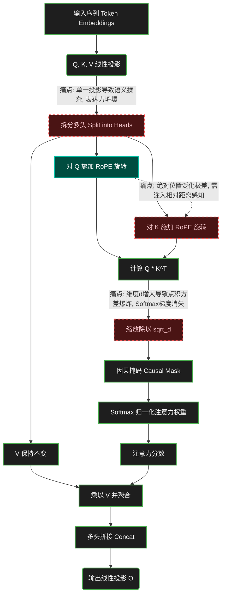
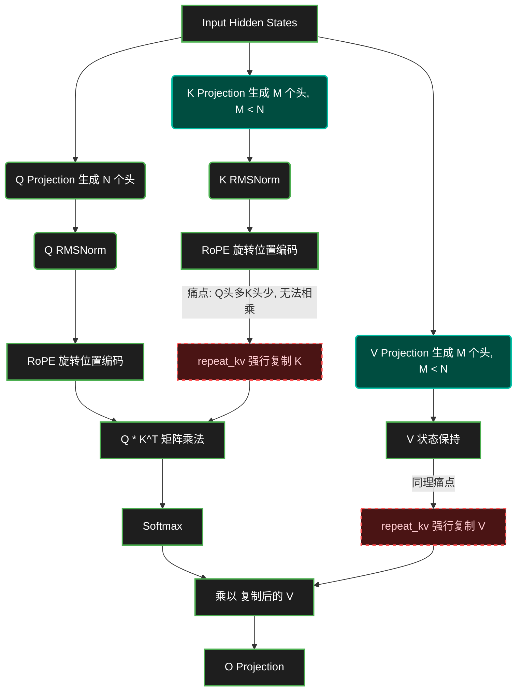

# 全息升维拆解：从标准 MHA 到工业级 GQA 架构演进

> **编者按**：本文档整合了关于大模型底层注意力机制（Attention）的两次深度推演。从标准 MHA 与 RoPE 的第一性原理出发，一路打穿到工业级生产环境下的 GQA 源码级妥协与硬件榨取。

---

## 第一部分：标准 MHA 多头注意力与 RoPE 的底层剖析

### 🧅 L1: 第一性原理与直觉层 (First Principles & Intuition)

**核心矛盾：语义捕捉 vs. 序列秩序 vs. 计算复杂度 的“不可能三角”**
语言是有方向的河流，但传统的 Transformer 却把字词当成了无序的沙石。我们需要模型既能“纵览全局（长上下文）”，又能“听懂言外之意（多重语义）”，还要“明确谁先谁后（位置关系）”。

**打破黑话心智模型：跨国重案组（Multi-Head）与智能罗盘（RoPE）**
- **单头注意力（Single-Head）**就像一个侦探试图同时听取 100 个人的证词，最后脑子里只剩下一团浆糊。
- **多头注意力（MHA）**则是成立了一个跨国重案组：Head 1 专门盯着作案时间（语法），Head 2 专门分析人物动机（实体），Head 3 捕捉情绪变化（情感）。大家各司其职，最后拼图。
- **旋转位置编码（RoPE）**不是给每个证人发一个固定的座位号（绝对位置编码），而是给每个人发一个**智能罗盘**。无论你们坐在哪里，只要看看罗盘上的夹角，就能瞬间知道“你离我有多远”。它把相对距离的物理感知，直接内嵌到了语义向量的旋转矩阵中。

### 🕸️ L2: 拓扑架构与流转层 (Topology & Data Flow)

下面是 MHA + RoPE 的流转拓扑。节点间的**红色痛点连线**，正是逼迫架构演进的根本动力。



### 🧮 L3: 极客深潜层 (Math, Code & Hardware)

**Show me the Code：大厂标准版 MHA + RoPE 核心片段**
```python
def apply_rotary_pos_emb(q, k, freqs_cos, freqs_sin):
    # 核心公式: q_rotated = q * cos(θ) + rotate_half(q) * sin(θ)
    def rotate_half(x):
        x1, x2 = x[..., ::2], x[..., 1::2]
        return torch.stack((-x2, x1), dim=-1).flatten(-2)

    q_out = (q * freqs_cos) + (rotate_half(q) * freqs_sin)
    k_out = (k * freqs_cos) + (rotate_half(k) * freqs_sin)
    return q_out, k_out
```

**🩸 硬件剥削视角 (The Hardware Bloodsucker)：内存墙 (Memory Wall)**
MHA 是极其典型的 **Memory-Bound（访存密集型）** 算子。计算 `Softmax(Q * K^T)` 时，GPU 必须把庞大的 $O(N^2)$ 矩阵在 HBM（显存）和 SRAM（片上缓存）之间来回搬运。上下文拉长到 128K 时，算力没跑满，显存带宽就已经被抽干。长文本场景下标准 MHA 的显存占用会瞬间撑爆 H100。

### 💥 L4: 极限失效与混沌层 (Edge Cases & Dirty Hacks)

**阿喀琉斯之踵：外推性坍塌与 OOM 死亡螺旋**
1. **长度外推崩溃 (Extrapolation Failure)：** 推理时强行喂给超过训练长度的文本，未见过的高频旋转角度会导致注意力分数瞬间崩坏。
2. **KV Cache 显存爆炸：** 一个 70B 模型在 100K 上下文时，单用户的 KV Cache 就能吃掉上百 GB 显存。

**大厂的工程脏活 (Dirty Hacks)：**
- **强行插值与 NTK-Aware：** 把未知的长距离强行“压缩”回已知的短距离里，骗过模型的大脑（如 YaRN）。
- **丢车保帅的 MQA/GQA：** 砍掉大量 K 和 V，让多个 Q 共享同一组 KV，强行压缩显存。
- **FlashAttention 熔断 HBM 墙：** 用 Tiling（分块）技术，把 QKV 切成小块塞进 SRAM 算完死活不写回 HBM，速度飙升 3 倍。

### 🦅 L5: 巨头博弈与基建哲学 (The Meta-Game & Moats)

Meta 在 LLaMA 中标配 **标准MHA/GQA + RoPE + SwiGLU** 是为了建立**开源生态垄断**。RoPE 具备极高的工程可扩展性。当底层基建（vLLM, TensorRT-LLM）都在死磕其优化时，它就不再是算法，而是不可撼动的**行业标准 API**。巨头的真正护城河在于其集群层面的 **Ring Attention** 和 **PagedAttention KVCache 调度**，谁能把 $O(N^2)$ 的成本压成伪线性，谁就能在 API 价格战中发起降维打击。

---

## 第二部分：工业级源码剖析——从 MHA 到 GQA 的妥协与极致

### 🧅 L1: 第一性原理与直觉层 (First Principles & Intuition)

**一针见血的结论：** 现代开源模型代码骨子里是纯正的 **GQA (Grouped-Query Attention)** 架构，但在代码上向下兼容了 MHA 和 MQA。

**核心矛盾：算力富裕 vs. 显存刺客 的“不可能三角”**
- **MHA (极度奢华):** 32考官(Q)，配32书记员(K)和32资料库(V)。**痛点**：KV Cache 爆炸。
- **MQA (极度寒酸):** 32考官(Q)，全场共享1个书记员(K)和资料库(V)。**痛点**：模型表达能力严重坍塌。
- **GQA (终极妥协):** 32考官分8组，每4考官共享1个书记员和资料库。**完美平衡**：保住80%的省流效果，维持99%的模型智商。

### 🕸️ L2: 拓扑架构与流转层 (Topology & Data Flow)

注意拓扑中的 `repeat_kv` 节点，这是代码兼容 MHA/GQA 的核心枢纽。



### 🧮 L3: 极客深潜层 (Math, Code & Hardware)

**铁证 1：GQA 的分组扩展逻辑**
```python
self.num_key_value_groups = config.num_attention_heads // config.num_key_value_heads
# Eager 模式下调用：
key_states = repeat_kv(key, module.num_key_value_groups)
```

**铁证 2：极其昂贵的物理广播 (Hardware Bloodsucker)**
`repeat_kv` 函数使用了 `expand` 和 `reshape`。在底层 Eager 模式下，这会在 GPU 显存里**真实地复制出几份一模一样的 KV 张量**，仅仅为了让 Q 和 K 的维度对齐以进行矩阵乘法。这是一种极其暴力的显存榨取，会引发显存碎片化灾难。

### 💥 L4: 极限失效与混沌层 (Edge Cases & Dirty Hacks)

**大厂的工程脏活 (Dirty Hacks)：**
1. **FlashAttention Native GQA (幽灵算子):** 真正的工业界绝对不会在生产环境调用 `repeat_kv`。底层的 C++/CUDA 算子通过**内存索引映射（Stride映射）**，让多个 Q 在 SRAM 直接读取同一块 K 显存，实现**物理上 0 复制**。
2. **QK-Norm 强行镇压梯度爆炸:** 为 Q 和 K 加 Norm（`self.q_norm = RMSNorm(...)`）是新一代大模型（如 Qwen2、Gemma）的标志性 Hack。当序列极长时，点积可能变为天文数字导致注意力死锁。加入 RMSNorm 强行压平方差，虽破坏了数学分布，但在工程上能救命。

### 🦅 L5: 巨头博弈与基建哲学 (The Meta-Game & Moats)

GQA 并不是纯粹的学术突破，它是**被商业报表逼出来的产物**。为了成倍压缩 KV Cache 的体积，提高单卡并发量。KV Cache 小了 4 倍，Batch Size 就能开大 4 倍，**单位 Token 的推理成本直接暴降 75%**。这就是当今大模型的基建哲学：用组级共享压缩“显存刺客”，打破内存墙。

---
### 🕵️ 盲区探测总结 (Blind Spot Detection)
1. **数值不稳定性 (Numerical Instability)：** FP16 下高频旋转角度易下溢出，故常见转 FP32 逻辑。
2. **精度陷阱 (`to(torch.float32)`)**：Softmax 强制转型 FP32 防止长文本累加下溢。
3. **架构混血基因 (`sliding_window`)**：现代 GQA 常结合 Mistral 式滑动窗口，截断超长计算图。

> **高管金句 (Executive Talk Track)**
> "现代大模型多头注意力的演进，表面上是算法的推陈出新，底层实则是一场**带宽与显存的生死时速**。从 RoPE 对相对位置的优雅表达，到 GQA 用组级共享成倍压缩 KV Cache，再到底层 FlashAttention 的片上融合计算，所有的演进都在指向一个目的：打破内存墙限制，将 $O(N^2)$ 的物理成本压至极低。未来的大模型之战，比拼的永远是异构算力环境下的极致 IO 榨取能力与 Serving 吞吐量边际成本。"