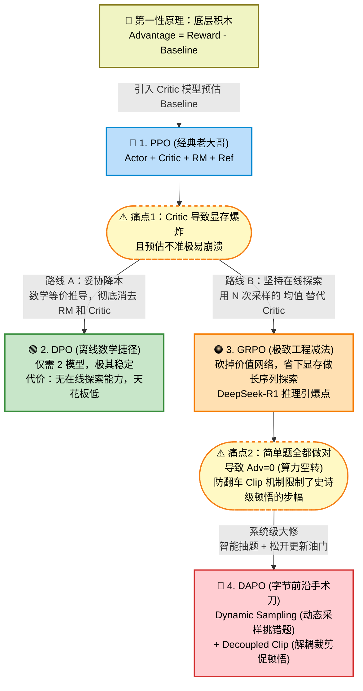

# 🏆 顶级大厂 LLM RL 终极面试指南：从底层数学到巨头商业基建

## 🌟 开篇心法：大模型 RL 的“不可能三角”
在面试开始时，抛出这个宏观视角，将立刻定下你 Senior 的基调：
> “大模型强化学习的所有算法演进，本质上都是在**① 显存占用 (Memory)、② 探索天花板 (Exploration/Sample Efficiency)、③ 训练稳定性 (Stability)** 这个‘不可能三角’中寻找最优解。从 PPO 到 DPO，再到 GRPO 和 DAPO，算法的变迁就是一部对抗算力与工程瓶颈的血泪史。”

---

## 🗺️ 第一章：核心知识图谱 (DAG) 与演进脉络

在推导任何算法前，请在脑海中（或白板上）构建这幅大模型 RL 演进全景图。所有的算法创新，都是被**上一个算法的工程痛点（图中虚线框）**逼出来的。

---

## 🚀 第二章：四大核心算法演进与 Loss 函数拆解

面试官杀手锏：**“Talk is cheap, show me the Loss.”**
通用目标：**总目标 = 🎯 鼓励超常发挥 (Advantage) - 🛡️ 防止走火入魔 (KL) ➕ 📉 辅助预估 (Critic)**

### 1. PPO (Proximal Policy Optimization)：经典与堆料的老大哥
*   **架构：** Actor（厨师） + Ref（老菜谱） + RM（评委） + **Critic（预期评估师）**
*   **Loss 函数：** $$J_{PPO} = \mathbb{E} [ \min(r_t A, \; \text{clip}(r_t, 1-\epsilon, 1+\epsilon) A) ] - c_1 L_{value} - \beta D_{KL}$$
    *   *翻译：* 提升高优势答案的概率（加了 Clip 防暴走），同时用 $$L_{value}$$ 训练 Critic 模型，并减去 KL 散度。
*   **致命痛点：** $$L_{value}$$ 需要额外维护一个极其庞大的 Critic 模型，导致**显存灾难**。且 Clip 机制导致极好答案的**梯度消失**。

### 2. DPO (Direct Preference Optimization)：降本增效的离线捷径
*   **架构：** 仅需 2 个模型：Actor + Ref（彻底砍掉 Critic 和 RM）。
*   **Loss 函数：** $$L_{DPO} = - \mathbb{E} \left[ \log \sigma \left( \beta \log \frac{\pi_\theta(y_w|x)}{\pi_{ref}(y_w|x)} - \beta \log \frac{\pi_\theta(y_l|x)}{\pi_{ref}(y_l|x)} \right) \right]$$
    *   *翻译：* 直接把大模型当成自己的奖励模型，做离线“对比阅读”。拉大好坏回答的概率差（Margin）。
*   **致命痛点：** 只能死记硬背离线数据（缺乏在线探索），无法在环境中自己“试错和顿悟”，做不了长逻辑推理（Reasoning）。

### 3. GRPO (Group Relative Policy Optimization)：大道至简的工程减法
*   **架构：** Actor + Ref + 规则判题器。
*   **Loss 函数：** 彻底删除了 $$L_{value}$$。优势计算变为：$$A_i = \frac{r_i - \text{mean}(r_1...r_N)}{\text{std}(r_1...r_N)}$$
    *   *翻译：* 同一道题连做 6 遍，把这 6 遍的平均分和标准差作为 Baseline。高于均分奖励，低于惩罚。
*   **极高价值：** 用大数定律平替了神经网络预估，省下的海量显存全部用来扩大序列长度，完美契合 DeepSeek 路线。

### 4. DAPO (Decoupled Clip & Dynamic Sampling)：突破极值的字节手术刀
*   **架构：** 针对 GRPO 的数学与系统级大修，压榨 GPU 效率。
*   **核心改进机制：**
    1.  **动态采样 (Dynamic Sampling)：** 实时监控题目方差。屏蔽全对/全错的“僵尸题”（此时 Adv=0，算力白费），专门挑模型“似懂非懂”的错题进行训练。
    2.  **解耦裁剪 (Decoupled Clip)：** 将“更新步长”和“优势大小”数学解绑。遇到极高奖励时**临时取消强硬的 clip 截断**，允许大幅更新参数，加速“顿悟”。

---

## 🌪️ 第三章：硬核深潜 1 —— “熵崩溃”危机与缓解之道

面试官问：“GRPO 极易发生熵崩溃，本质原因是什么？怎么解决？”

*   **病理诊断：** 当模型偶然吃到甜头后，变得极度自负，概率分布缩成尖刺，翻来覆去只输出同一段话。因为 GRPO 依赖**组内标准差 (std)**，当输出完全一样时，$$std = 0$$，最终导致 $$Advantage = 0$$。**梯度瞬间归零，模型彻底卡死。**
*   **DAPO 的特效药 (治标)：** DAPO 的调度器一旦发现某道题组内方差趋近 0，就**不再给模型做这道题了**。这属于高明的工程兜底，用数据调度绕开了参数死锁。
*   **真正的治本：** 纯算法无法治愈，必须引入**显式的熵正则化 (Entropy Bonus)**，或者走向过程奖励（PRM）。

---

## ⚖️ 第四章：硬核深潜 2 —— PRM vs ORM 的巅峰对决 (推理的未来)

面试官问：“解决推理长逻辑，PRM 是目前的唯一解吗？”

*   **直觉比喻：** ORM (结果奖励) 就像只看最终答案的高考阅卷；PRM (过程奖励) 就像按步骤给分的竞赛教练。
*   **派系 A：OpenAI (o1 路线 - 严谨的导师)**
    *   坚守 PRM。给思维链的每一步打分，结合蒙特卡洛树搜索 (MCTS) 步步为营。逻辑严密，但标注成本极高，且易诱发模型骗分 (Reward Hacking)。
*   **派系 B：DeepSeek (R1 路线 - 极限的顿悟)**
    *   明确**放弃 PRM**，退回规则 ORM。用极致精简的 GRPO 砍掉冗余网络，把算力砸向长序列盲端探索。硬生生靠纯 RL 环境逼出了大模型的反思能力。性价比极高。

---

## 🦅 第五章：高管级视野 —— 公司基建与护城河决定算法选型

面试收尾，抛出“大局观 Talk Track”绝杀全场：

> “其实，跳出公式来看，算法选型最终是由一家公司的**资金、算力基因与数据护城河**决定的。目前行业的三足鼎立完美印证了这一点：
>
> 1. **OpenAI（资本与人才的暴力美学）：** 资金充足，敢于死磕最难落地的 **PRM 路线**，靠专家微操雕刻思维树。
> 2. **DeepSeek（极客精神与效率至上）：** 追求极限性价比，选择 **GRPO + ORM**。砍掉 Critic，用数学规律逼迫模型顿悟。DAPO 等算法也是沿着这条路把工程效率推向极致。
> 3. **Google DeepMind（数据垄断与搜索霸主）：** 拥有百亿日活和最强搜索引擎，所以 Gemini 走 **ReST (蒸馏自训练) + 树搜索** 路线。
>     * **Google Search 就是最强免费 PRM 裁判 (Grounding)。**
>     * **百亿用户的点击与采纳，就是最海量的 DPO 偏好数据对。**
>     * 他们用 AlphaGo 基因，通过 MCTS 暴力生成最优解，再用离线 RL 固化。
>
> **总结而言：OpenAI 教模型思考，DeepSeek 逼模型顿悟，而 Google 用真实世界的全网数据直接灌顶。** 我们在工程中选择算法，本质上是在评估团队当前的**显存预算、数据获取成本以及业务复杂度**，做出最聪明的工程妥协。”
