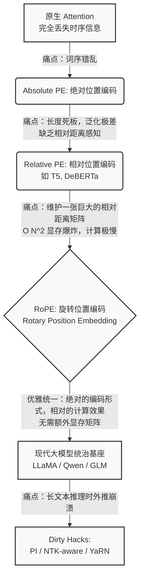
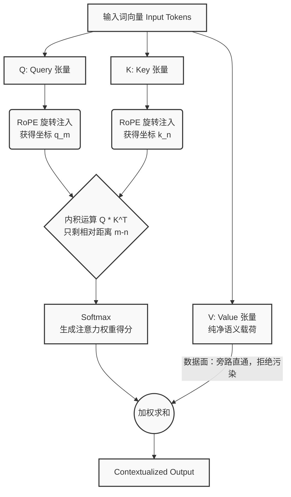
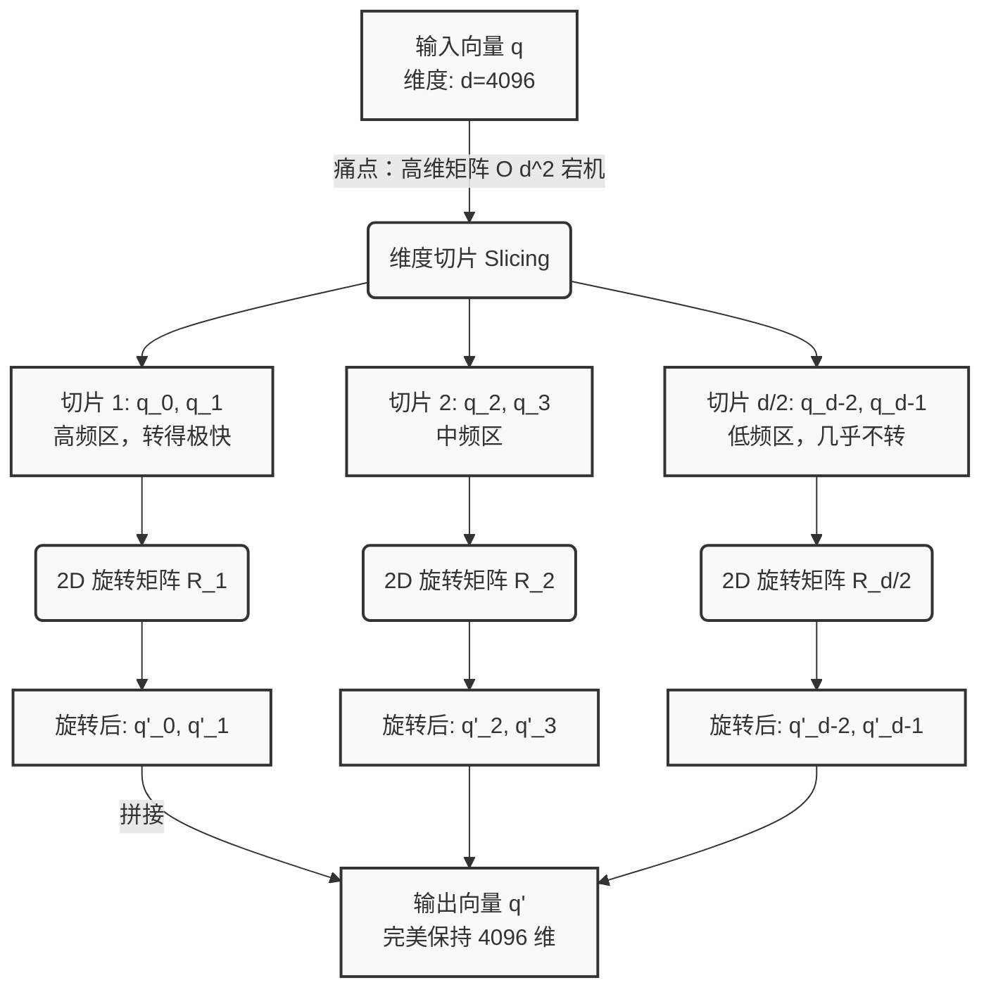

# RoPE (Rotary Position Embedding) 全息深度拆解笔记

*本文档由【全息升维拆解器】生成，包含宏观架构推演及两次分形递归（微观虫洞）拆解。*

---

## 模块一：RoPE 宏观架构打穿 —— 从物理直觉到长文本基建博弈

### 🧅 L1: 第一性原理与直觉层
**核心矛盾定位：Transformer 的“路痴”本能 vs 人类语言的“相对时空观”**
Transformer 架构的 Self-Attention 机制天生是一个“词袋”（Bag of Words），完全不知道词的先后顺序。为了引入位置编码，存在“不可能三角”：表达力（相对距离）、泛化性（长文本外推）、计算效率（显存和算力开销）。

**打破黑话：时钟的指针与相对夹角**
把词汇表里的每一个词想象成一根**时钟的指针**。
RoPE 的物理直觉：把每一个词放在一个多维的时钟表盘上。当词出现在第 $m$ 个位置时，我们就把这根指针**旋转 $m$ 个刻度**。当计算两个词的相关性时，两根指针在表盘上的相对夹角，只与它们相差的刻度数（$m-n$）有关！
RoPE 实现了：**“披着绝对位置的外衣，干着相对位置的活儿。”**

### 🕸️ L2: 拓扑架构与流转层

### 🧮 L3: 极客深潜层
**Show me the Math：一根复数轴上的魔法**
$q_m = q \cdot e^{im\theta}$， $k_n = k \cdot e^{in\theta}$
$\langle q_m, k_n \rangle = \text{Re}(q \cdot k^* \cdot e^{i(m-n)\theta})$
绝对位置 $m$ 和 $n$ 在内积相乘的瞬间被抵消了，只剩下了相对距离 $(m-n)$。

**硬件剥削视角：** 
RoPE 是一次**“用廉价算力换取昂贵显存”**的精妙操作。无需像传统相对位置编码那样维护 $N \times N$ 的距离矩阵，直接在张量上做算术操作，省下了极其珍贵的 HBM 显存带宽。

### 💥 L4: 极限失效与混沌层
**阿喀琉斯之踵：长文本外推灾难**
推理时遇到没见过的角度，Attention 分布会瞬间雪崩。

**工程脏活 (Dirty Hacks)：**
1. **PI (线性插值)：** 把没见过的长长度硬生生压缩到训练长度里（降低分辨率）。
2. **NTK-Aware Interpolation：** 改变 RoPE 的 Base 值（赋予自适应齿轮），极少微调即可强行解锁 128K 上下文。

### 🦅 L5: 巨头博弈与基建哲学
如今不管是 LLaMA 还是 Qwen，几乎全系标配 RoPE。RoPE 的统一使得底层的算力基建（CUDA kernels、Triton scripts）可以直接复用，这是一种**标准垄断**。掌握 RoPE 的长文本无损扩展（如 RingAttention 结合），就掌握了“大模型长文本垄断权”。

---

## 模块二：微观分形 —— 为什么 RoPE 绝不作用于 V（Value）？

### 🧅 L1: 第一性原理与直觉层
**核心矛盾定位：寻址系统 vs 内容载荷**
用“图书馆借书”模型映射：
- **Q**：寻书需求（寻址）。
- **K**：书架上的定位标签（寻址）。
- **V**：书里的知识内容（载荷）。
拿到书后，不需要把书里的文字跟着书架的位置“旋转”。位置信息绝不该污染语义本体。

### 🕸️ L2: 拓扑架构与流转层

### 🧮 L3: 极客深潜层
如果在 V 上加了 $R_i$，输出会变成被各种绝对位置扭曲后的混合体，这是数学灾难。硬件层面，V 不参与耗时的内积寻路，保持纯净可以极大程度方便对 V 进行内存对齐和无损量化压缩（KV Cache）。

### 💥 L4: 极限失效与混沌层
**灵魂拷问：如果 V 也旋转，坐标系坍塌灾难**
强行给 V 加 RoPE，FFN 网络（位置无关特性）会像瞎子面对不断旋转的魔方一样，无法学到稳定语义，Loss 停止下降。
但 V 的极端“放养”也会引发巨量异常值（Massive Outliers），逼迫部署工程师使用 SmoothQuant 把飙升的 V 值“拍平”。

### 🦅 L5: 巨头博弈与基建哲学
**基建命脉：控制面与数据面的解耦**
Q 和 K 是控制面（怎么流），V 是数据面（流什么）。只有严苛解耦，才能诞生像 **GQA** 这样的机制（多个 Q 共享同一组纯净的 K 和 V）。纯净的 V 更是 vLLM 在 PagedAttention 中进行显存块级别疯狂复用的前提。

---

## 模块三：微观分形 —— 硬件剥削：从复数公式到三角函数查表

### 🧅 L1: 第一性原理与直觉层
**数学优雅 vs 冯·诺依曼架构的粗暴**
硬件中没有虚数 $i$。要在 4096 维的高维空间里旋转向量，计算复杂度 $O(d^2)$ 直接宕机。
应对直觉：把 4096 维的向量，两两一组切成 2048 个“二维平面的披萨”。在每片上独立使用 2D 旋转矩阵。

### 🕸️ L2: 拓扑架构与流转层

### 🧮 L3: 极客深潜层
分块对角矩阵被拆解成了 Element-wise（逐元素）运算。
**硬件剥削视角：** Triton 工程师绝不会实时算 $\sin/\cos$，而是预先生成显存缓存池 `cos_cache` / `sin_cache` 进行“查表”。同时通过 **Kernel Fusion (算子熔断)** 避免内存读写延迟。

### 💥 L4: 极限失效与混沌层
**当 $m \times \theta$ 极大时，长文本的浮点数灾难**
半精度(FP16)下算大刻度的 $\cos/\sin$ 会彻底丧失精度。
**工程脏活：**
1. **FP32 续命**：RoPE Cache 必须死守单精度（FP32），直到最后计算才转为 BF16，保住坐标系。
2. **交错存储 (`rotate_half`)**：为了适配 GPU 向量化访存指令，将前一半和后一半维度组合旋转，大幅提升物理执行吞吐量。

### 🦅 L5: 巨头博弈与基建哲学
从复数到实数三角函数，让“位置”变成了分布式集群中可以被**全局缓存 (Global Cache)** 的静态常量池，彻底规避了网络间的位置矩阵通信。巨头通过深厚的 CUDA C++ 功底，将 RoPE 隐藏在 FlashAttention 拥挤的 SRAM 调度流水线中，这种对硅原子的极致压榨构成了最深的护城河。